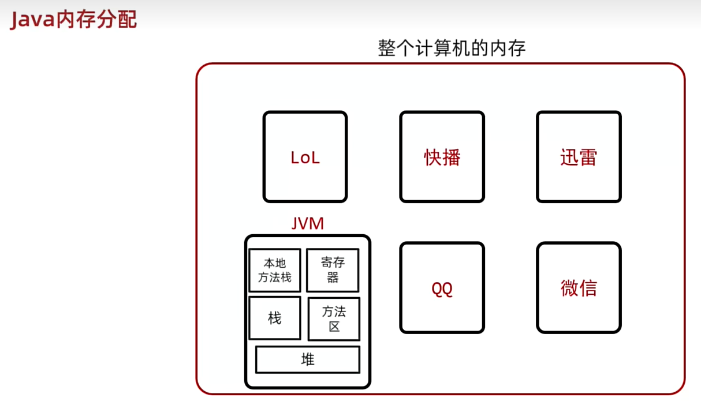
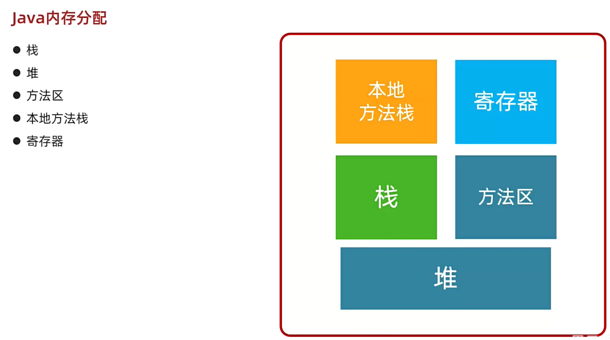
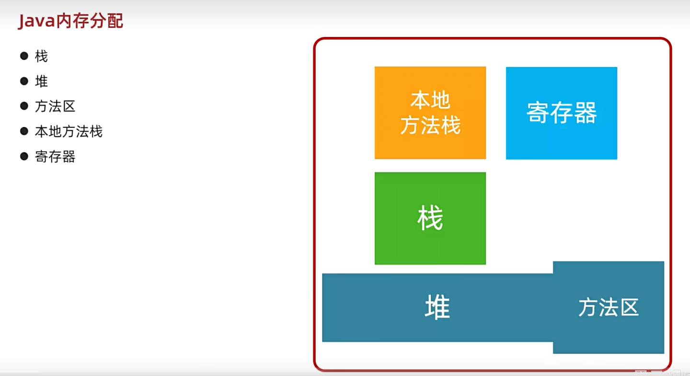
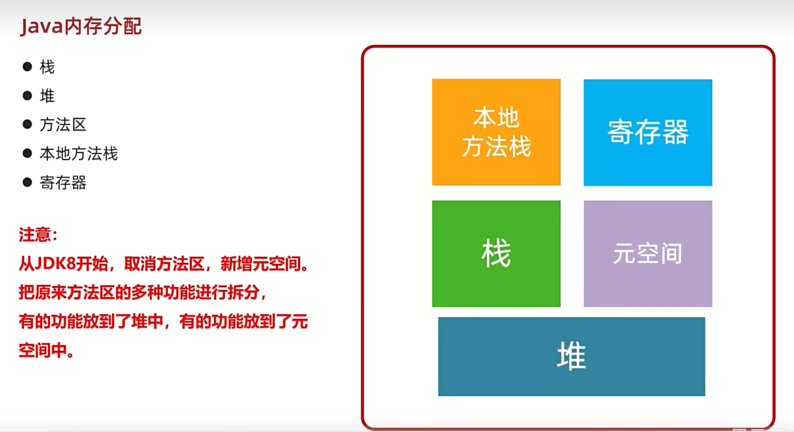
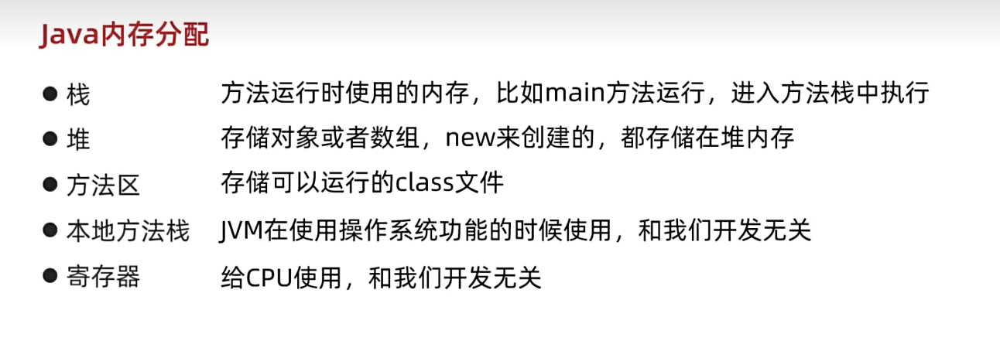
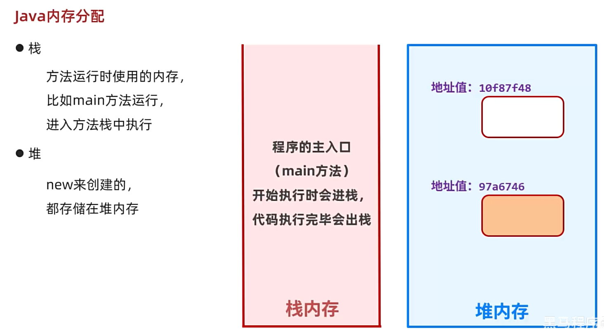
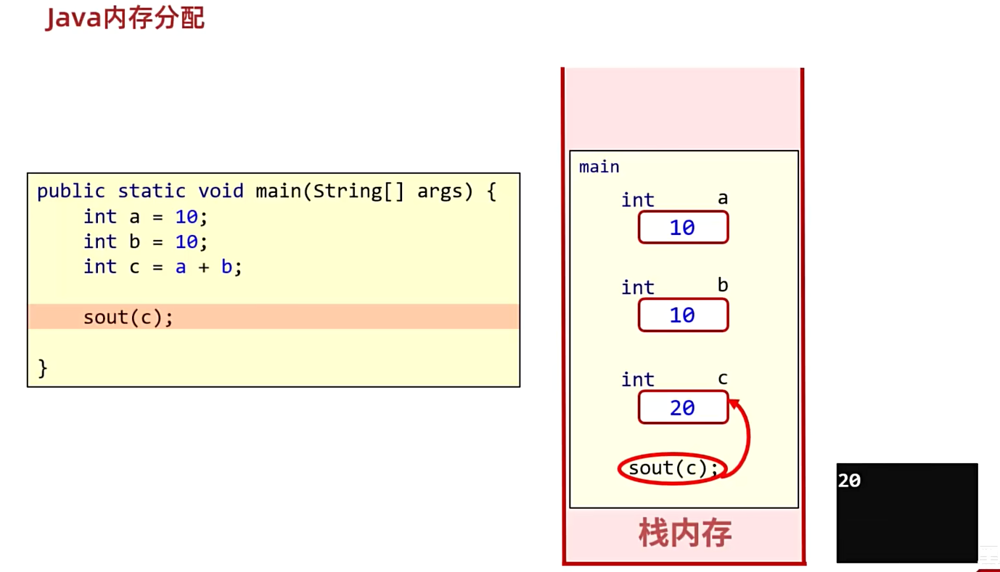
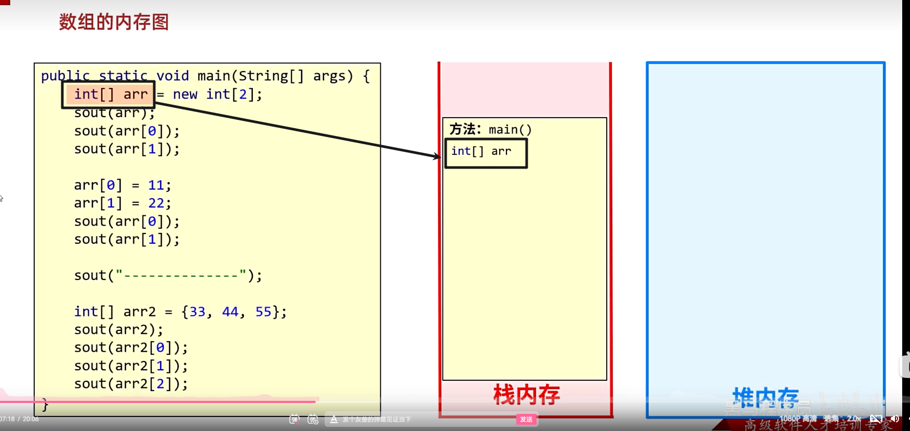
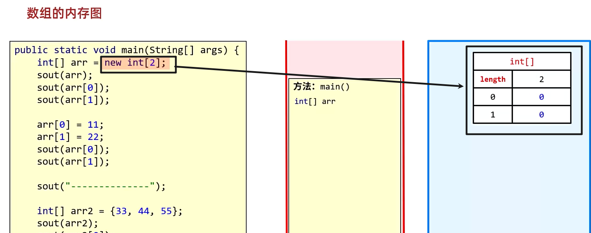
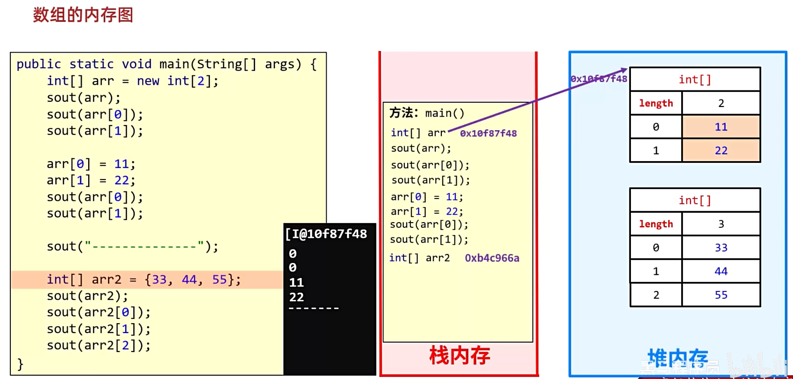

# 数组的操作

数组的常见操作：

1.   求最值

2.   累加求和

3.   求平均数

4.   统计数据

5.   对调数组
     ```java
     int[] array = {1, 2, 3, 4, 5};
     
     // 对调数组
     int beginOffset = 0;
     int endOffset = array.length - 1;
     
     for (int i = beginOffset; i < (beginOffset + endOffset) / 2; i++) {
         int temp = array[i];
         array[i] = array[array.length - i - 1];
         array[array.length - i - 1] = temp;
     }
     
     for (int item : array) {
         System.out.print(item + " ");
     }
     ```

6.   打乱数组
     ```java
     public static void main(String[] args) {
         int[] array = {1, 2, 3, 4, 5, 6, 7, 8, 9};
         Random rd = new Random();
         for (int i = 0; i < array.length; i++) {
             int random = rd.nextInt(array.length);
             int temp = array[random];
             array[random] = array[i];
             array[i] = temp;
         }
         System.out.println(Arrays.toString(array));
     }
     ```

# java内存分配





下面是java7以前的内存图：









## 1.1 内存分配



数组的内存图






...




