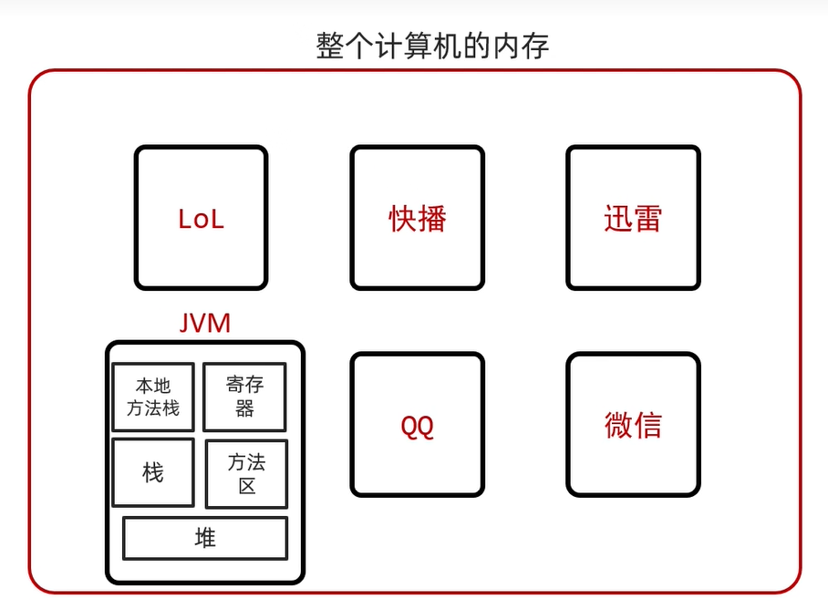
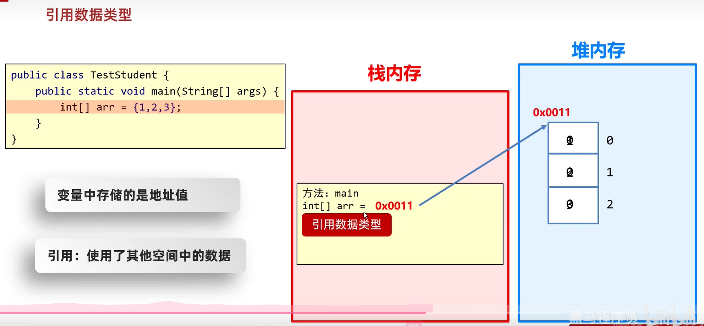
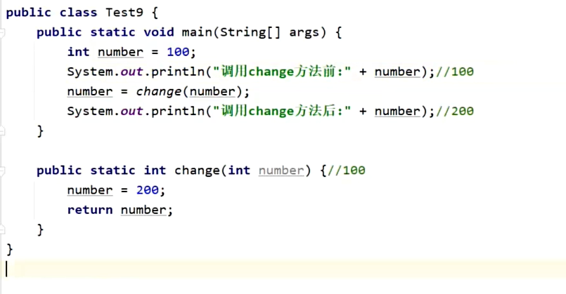
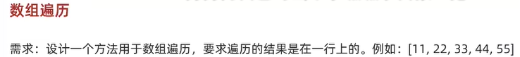
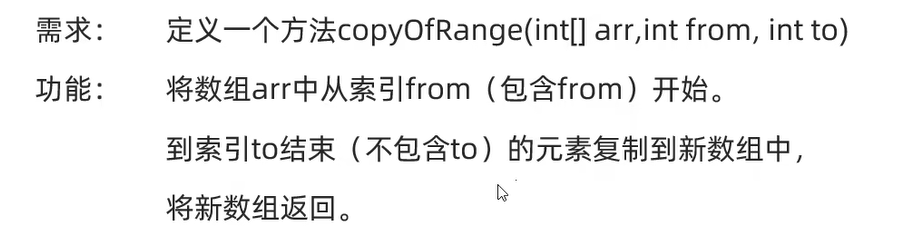

<h1 style="text-align: center; font-family: 'Menlo'">05.方法</h1>

[TOC]

# 1 什么是方法

方法是程中最小的执行单元。


# 2 方法的作用


# 3 方法的格式


```java
/*
 * @Author     : wephiles@20866
 * @CreateTime : 16:06
 * @ProjectName: base_code_1
 * @PackageName: com.jinyu.method
 * @FileName   : com.jinyu.method/MethodDemo.java
 * @ClassName  : MethodDemo
 */

package com.jinyu.method;

public class MethodDemo {
    public static void main(String[] args) {
        // 调用方法
        playGame();
    }

    // 定义方法
    public static void playGame() {
        System.out.println("打游戏...");
    }
}

```


# 4 方法小结


# 5 方法的重载

>   同一个类中，参数不同(参数个数、类型、顺序不同)、方法名相同 --方法重载


```java
/*
 * 定义函数遍历数组 -- 方法重载
 * @Author     : wephiles@20866
 * @CreateTime : 2024-07-14 16:55
 * @ProjectName: base_code_1
 * @PackageName: com.jinyu.test
 * @FileName   : com.jinyu.test/MethodTraverse.java
 * @ClassName  : MethodTraverse
 */

package com.jinyu.test;

public class MethodTraverse {
    public static void main(String[] args) {
        int[] array = {15, 5, 9, 125, 23, 25};
        traverse(array);

        double[] newArray = {10.5, 2.3, 5.2, 6.6};
        traverse(newArray);
    }

    public static void traverse(byte[] array) {
        System.out.print("[");
        for (int i = 0; i < array.length; i++) {
            if (i != array.length - 1) {
                System.out.print(STR."\{array[i]}, ");
            } else {
                System.out.println(STR."\{array[i]}]");
            }
        }
    }

    public static void traverse(short[] array) {
        System.out.print("[");
        for (int i = 0; i < array.length; i++) {
            if (i != array.length - 1) {
                System.out.print(STR."\{array[i]}, ");
            } else {
                System.out.println(STR."\{array[i]}]");
            }
        }
    }

    public static void traverse(int[] array) {
        System.out.print("[");
        for (int i = 0; i < array.length; i++) {
            if (i != array.length - 1) {
                System.out.print(STR."\{array[i]}, ");
            } else {
                System.out.println(STR."\{array[i]}]");
            }
        }
    }

    public static void traverse(long[] array) {
        System.out.print("[");
        for (int i = 0; i < array.length; i++) {
            if (i != array.length - 1) {
                System.out.print(STR."\{array[i]}, ");
            } else {
                System.out.println(STR."\{array[i]}]");
            }
        }
    }

    public static void traverse(double[] array) {
        System.out.print("[");
        for (int i = 0; i < array.length; i++) {
            if (i != array.length - 1) {
                System.out.print(STR."\{array[i]}, ");
            } else {
                System.out.println(STR."\{array[i]}]");
            }
        }
    }

    public static void traverse(float[] array) {
        System.out.print("[");
        for (int i = 0; i < array.length; i++) {
            if (i != array.length - 1) {
                System.out.print(STR."\{array[i]}, ");
            } else {
                System.out.println(STR."\{array[i]}]");
            }
        }
    }

    public static void traverse(boolean[] array) {
        System.out.print("[");
        for (int i = 0; i < array.length; i++) {
            if (i != array.length - 1) {
                System.out.print(STR."\{array[i]}, ");
            } else {
                System.out.println(STR."\{array[i]}]");
            }
        }
    }

    public static void traverse(char[] array) {
        System.out.print("[");
        for (int i = 0; i < array.length; i++) {
            if (i != array.length - 1) {
                System.out.print(STR."\{array[i]}, ");
            } else {
                System.out.println(STR."\{array[i]}]");
            }
        }
    }
}

```

# 6 方法的内存图


## 6.1 基本内存原理




## 6.2 方法传递基本数据类型








# 7 方法 -- 练习

## 7.1 数组遍历

题目：



```java
public class TraverseArray {
    public static void main(String[] args) {
        int[] array = {12, 5, 6, 7, 51, 59, 6, 2};
        traverse(array);
    }

    public static void traverse(int[] arr) {
        System.out.print("[");
        for (int i = 0; i < arr.length; i++) {
            if (i == arr.length - 1) {
                System.out.print(arr[i]);
            } else {
                System.out.print(arr[i] + ", ");
            }
        }
        System.out.println("]");
    }
}
```

## 7.2 求最大值

题目：


```java
// 求数组最大值
public static int getMax(int[] arr) {
    int max = arr[0];
    for (int i = 1; i < arr.length; i++) {
        if (arr[i] > max) {
            max = arr[i];
        }
    }
    return max;
}
```

## 7.3 判断是否存在

题目：


```java
// 判断是否存在
public static boolean numInArray(int number, int[] arr) {
    for (int j : arr) {
        if (number == j) {
            return true;
        }
    }
    return false;
}
```

## 7.4 复制数组

题目：



```java
public static void main(String[] args) {
    // 复制数组
    int[] newArray = copyArray(array);
    traverse(newArray);
}

// 复制数组 -- 全部
public static int[] copyArray(int[] arr) {
    int[] newArray = new int[arr.length];
    for (int i = 0; i < arr.length; i++) {
        newArray[i] = arr[i];
    }
    return newArray;
}

// 复制数组 -- 范围
public static int[] copyOfRange(int[] arr, int from, int to) {
    if (from < 0 || to >= arr.length || to < 0 || from > to) {
        return new int[]{};
    }
    int newLength = to - from + 1;
    int[] newArray = new int[newLength];
    for (int i = from; i < to + 1; i++) {
        newArray[i - from] = arr[i];
    }
    return newArray;
}
```


