[TOC]


# 1 初识`linux`

## 1.1操作系统概述

硬件和软件：计算机由硬件和软件组成。


软件：用户和硬件之间的接口/桥梁os 就是软件。

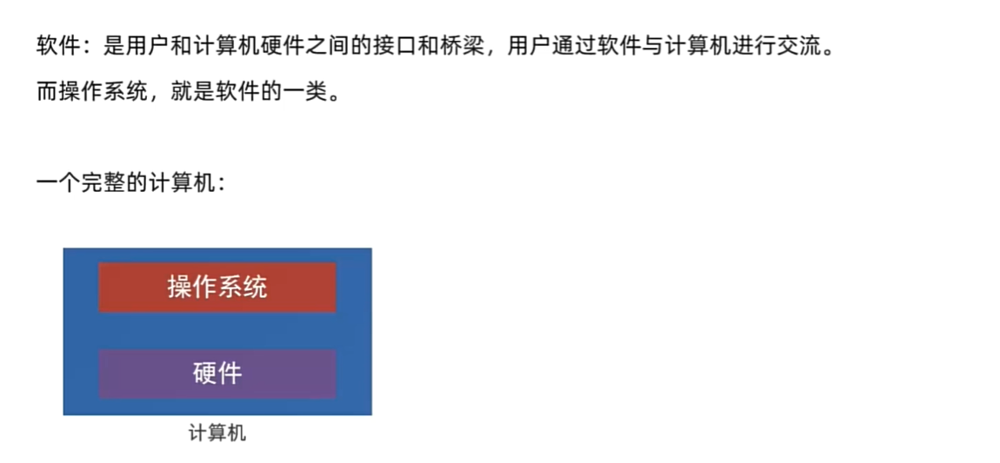


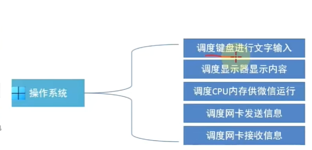

操作系统:

`windows `操作系统

`macos `操作系统

`linux`操作系统

`harmonyOS`操作系统

...

## 1.2 初始`Linux`

1. `linux `的诞生

2. `linux `组成

- `linux`系统内核：免费和开源的 任何人都能拿到内核和源代码 
  - `linux`发行版：有很多发行版发行版就会调用`linux`内核 我们选择：`ubuntu`和`centoS`

- 系统级应用程序

## 1.3 虚拟机介绍`linux`不太适合日常办公。

## 1.4 远程连接`Linux`操作系统

图形化--`linux`下面不好用，不稳定

命令行--在`linux`下面开发使用命令行的形式去使用linux

借助第三方软件来使`vmware`和`windows`之间进行连接,更好的进行交互。

### 1.4.1 安装`finalshell`

```text
http://www.hostbuf.com/?install_fs
```

### 1.4.2 使用 `finalshell`

在`VMware`中下载安装的`linux`中,打开终端,输入下面命令:

```text
$ ifconfig
```

如果显示:

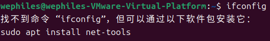

我们按照提示下载安装即可.

下载安装好以后,我们再使用下面命令

```text
$ ifconfig
```

点击回车之后,在`ens33`里面找`inet6`后面哪个`ip`地址,我的是:`192.168.70.128`,这个就是虚拟机的`IP`地址了.

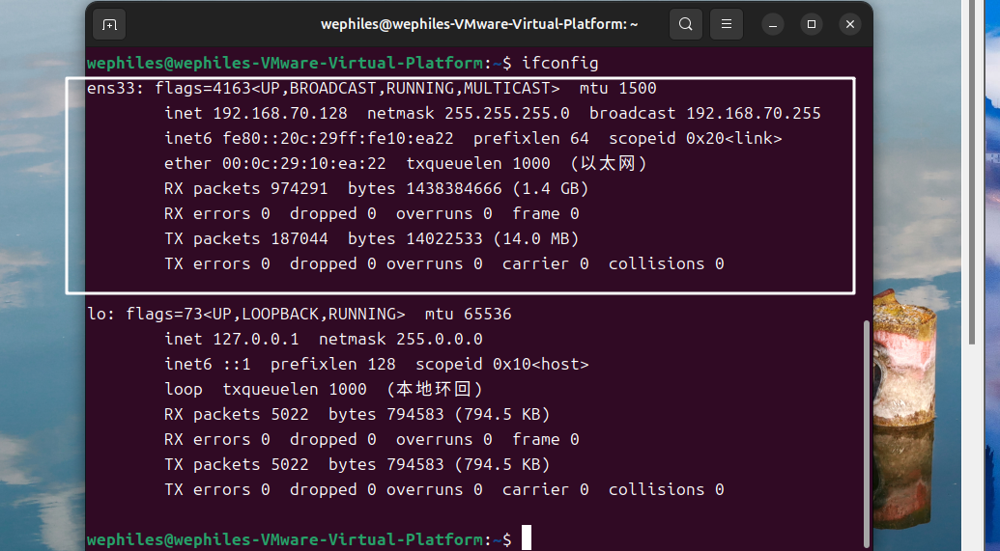

回到`finalsheell`里面

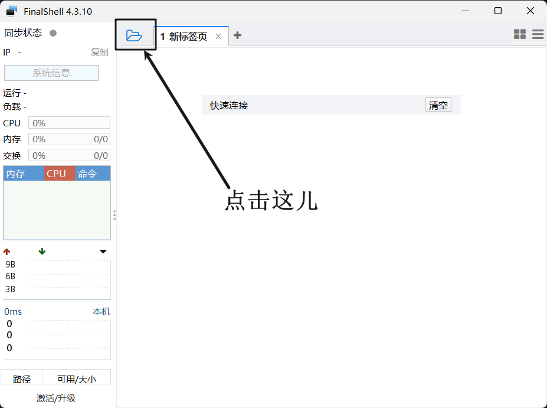

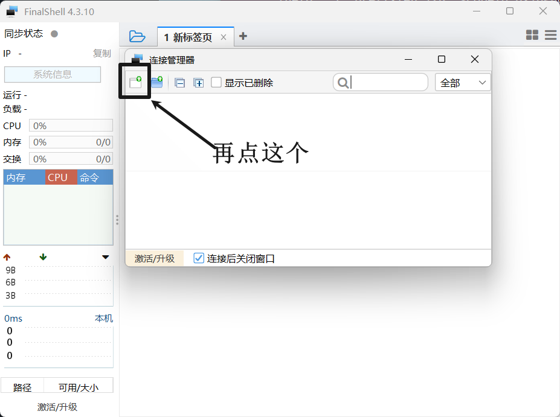

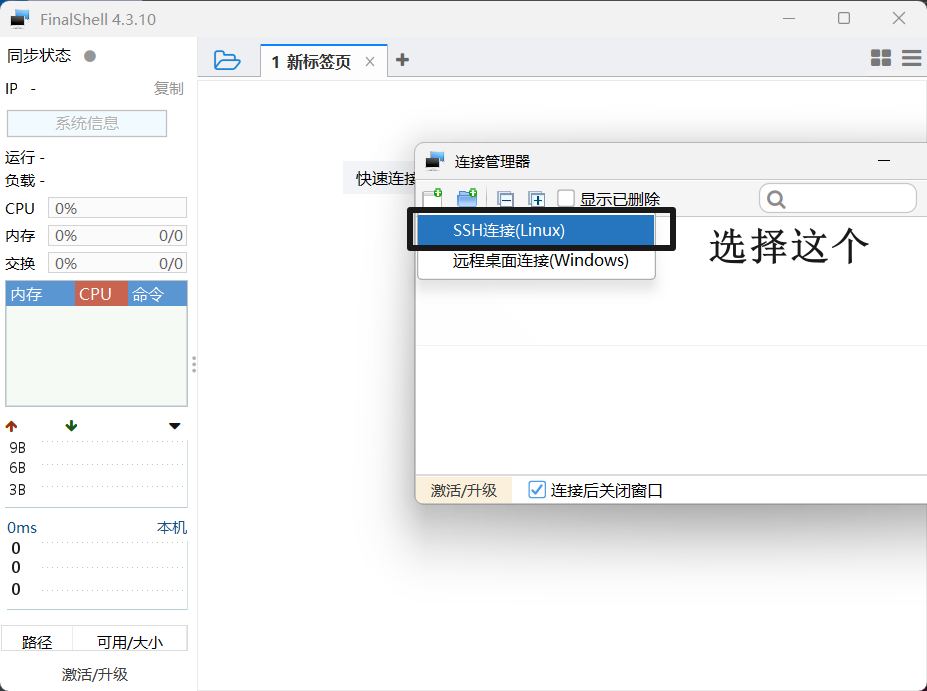

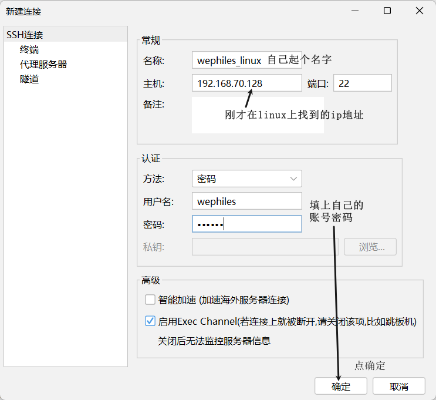

接下来就是这样了:

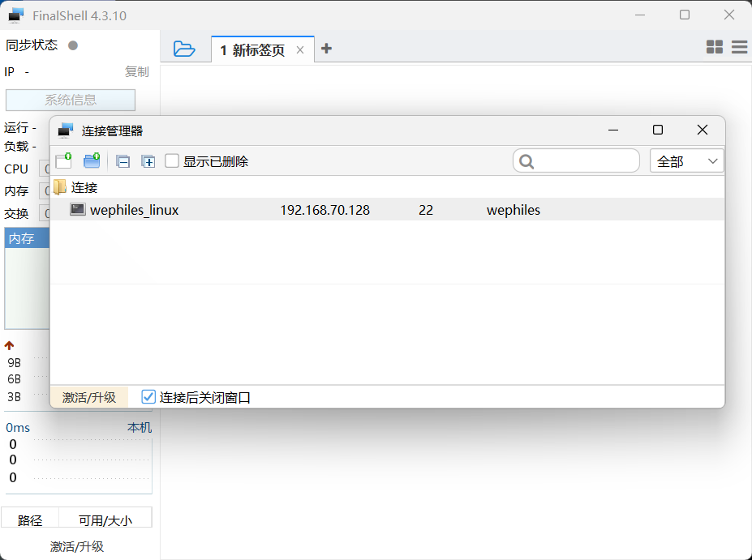

双击这个`wephiles_linux`(每个人都有自己的,双击自己的就行)

如果报错:看下面这个网址的解决方法.

`https://blog.csdn.net/weixin_56762231/article/details/130084913`

连接成功就是这样子:

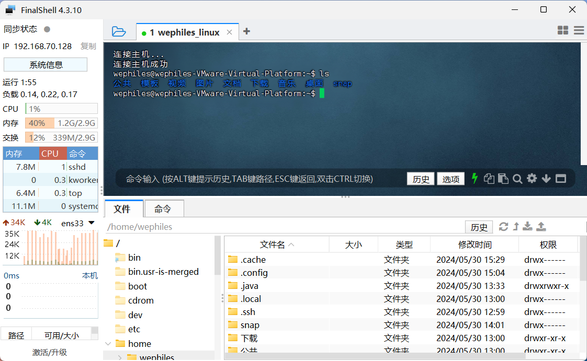

## 1.5 `Windows10`使用`unbuntu` -- `wsl`

- 开发人员都在用`WSL`
- 太方便,简单,好用,省内存

`WSL`: 用在`windows`系统下的子系统

无需虚拟一套硬件环境.

如何构建`WSL`环境

找到控制面板--搜程序和功能--点击启动或关闭`windows`功能

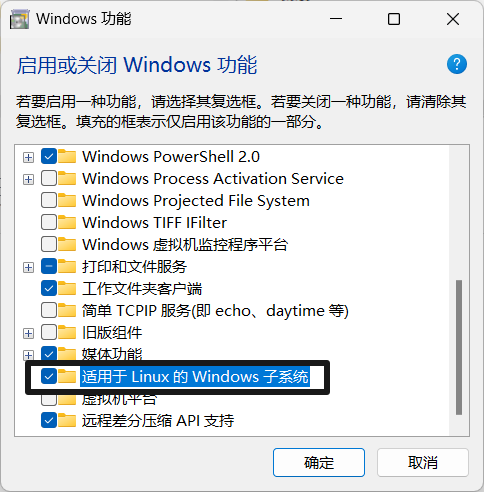


把上面那个选项勾选上.点击确定

然后完事了以后重启电脑.

接下来就是安装`WSL`操作系统了.

打开微软自带的应用商店,搜索`unbuntu`,安装.等待下载安装完成即可使用了.在商店点击打开,

输入用户名和密码,就出现了命令行,就可以使用了.

## 1.6 拓展-虚拟机快照

- 虚拟机快照

  - 将当前虚拟机的状态保存下来,以后有问题就可以通过保存的快照来恢复状态.

- 制作和还原快照:

  - 关闭虚拟机(推荐)
  - 点击虚拟机 鼠标指针放在快照那两个字上 出现一个弹出框 选中快照 点击快照管理器
    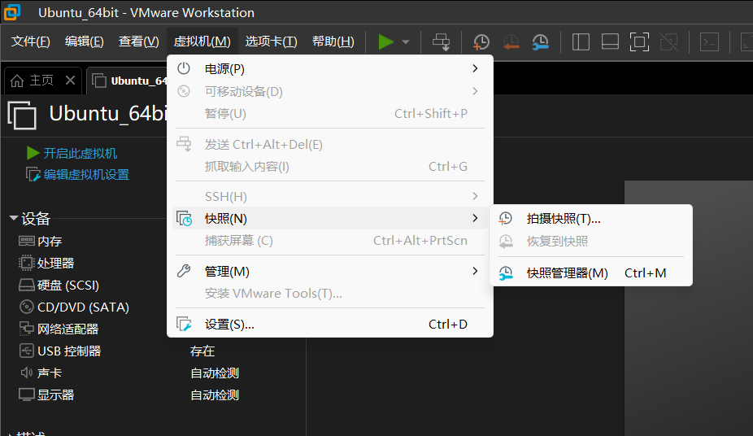

  - 点击拍摄快照
    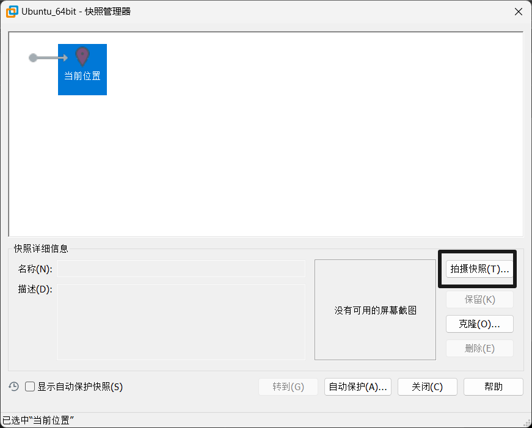
  - 输入名字和描述,点击拍摄就完成了
    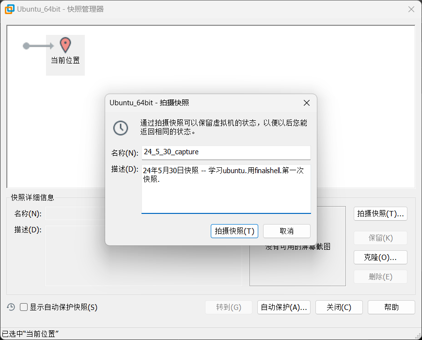

  - 如果某一天出现问题了,同样进入这个快照界面,选中转到,弹出一个提示框,点击是就行了.
    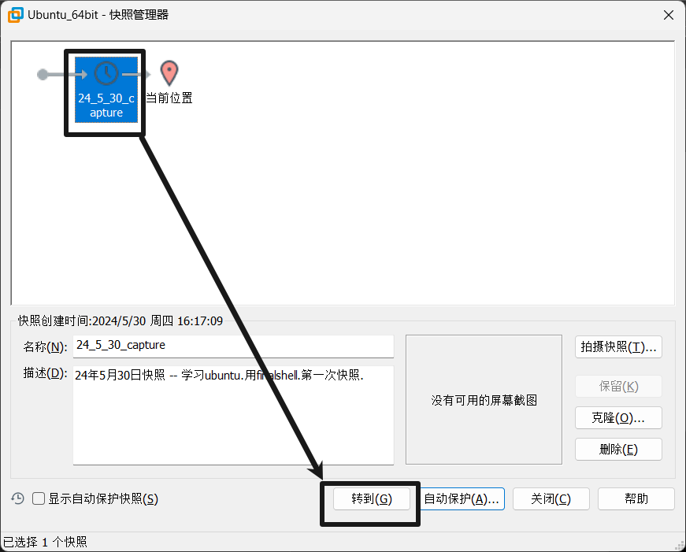

# 2 文件系统、目录结构

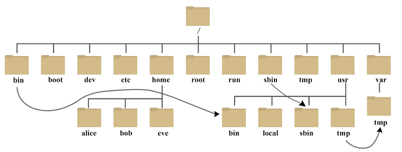


```bash
- /                 【根目录】
	- /root         【系统超级管理员的目录】
		- /root/Desktop
		- ...
	- /bin          【Binary 最经常使用的常用命令的目录】
	- /sbin         【s:system 存放的是系统管理员使用的系统管理程序】
	- /boot         【挂载点 引导分区所挂载的地方 系统启动的时候所需的东西】
	- /dev          【devices 管理设备的文件】
	- /etc          【主要放置一些系统管理的配置文件】
	- /home         【每个用户都有一个自己的主目录 都放在HOME目录下】
	- /var          【可变的东西 一般村log】
	- /opt          【optional 可选目录 第三方软件存到这儿】
	- /lib          【库 系统和应用所需要的共享库】
	- /lib64        【64位相关的库】
	- /usr          【用户所有的应用程序和所需要的文件和数据】
		- /usr/bin
		- /usr/lib
		- ...
	- /media        【识别可移动媒体设备 比如U盘等】
	- mnt           【也是一个挂载点】
	- proc          【进程管理的相关信息】
	- run           【存放当前系统云心信息】
	- srv           【和系统服务相关】
	- sys           【系统相关的信息】
	- tmp           【临时目录 可以删除】
```

什么是挂载点？

就是说，`Linux`把所有文件都放在根目录下面，但并不是说要将所有文件也要放到根目录所在的那个根分区

我们可以把某一个分区（比如说启动操作系统的分区放到`/boot`目录下面（挂载））

将其他剩余的分区挂载到`/`下面


