[TOC]


# `linux`基础命令的学习路径

- `linux`目录结构
- `Linux`命令入门
- 目录切换相关命令(`cd/pwd`)
- 相对路径/绝对路径/特殊路径符
- 创建目录命令
- 文件操作命令`part1`(`touch/cat/more`)
- 文件操作命令`part1`(`cp/mv`)
- 查找命令(`which/find`)
- `gerp/wc`和管道符
- `echo`和重定向

# 1 目录结构

- 一般都是树形结构.

- `windows`有多个顶级目录.

- `linux`只有一个根目录:`/` 所有文件都在它下面

- 在`linux`系统中,路径层级关系使用`/`表示
  ```text
  /usr/local/user.txt
  ```

- 在`windows`下面,路径层级关系使用`\`表示
  ```text
  D:\data\user.txt
  ```

# 2 `linux`命令入门

## 2.1 `linux`命令基础

通用形式: `$ command [-options] [parameter]`

- `command`: 命令本身

- `-options`: [可选 非必填]命令的一些选项,可以通过选项控制命令的行为细节

- `parameter`: [可选 非必填] 命令的参数 多数用于命令的指向目标等

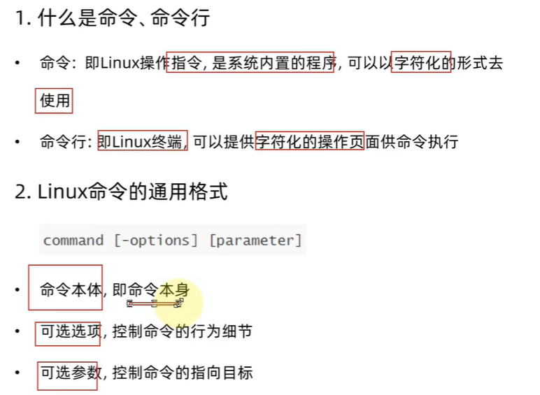

## 2.2 `ls`命令入门

- `ls`命令:如果不包含参数,那么就是打印出当前工作目录的内容,即用户的`home`目录

```text
$ ls [-a -l -h] [linux路径]
```

- `-a` `-l` `-h`是可选项

- `Linux`路径是此命令可选的参数

- 如果直接使用`ls`:等同于双击打开文件夹

  

  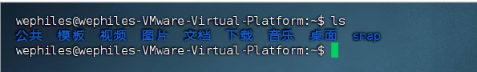
  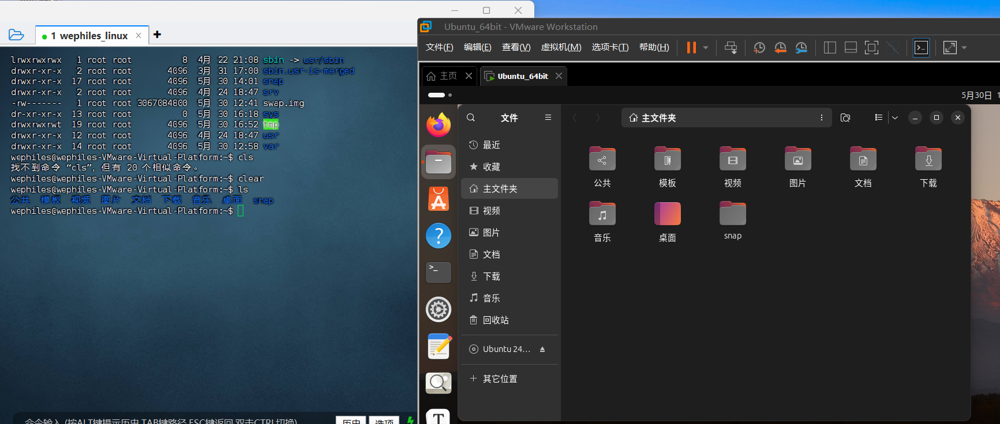

- **当前工作目录**:默认加载当前登录用户的额`home`目录为前工作目录.`linux`作为多用户的操作系统,每个用户都有自己的`home`目录

- `home`目录:是根目录下的`home`目录

- 每一个用户在`linux`系统的专属目录,默认在`/home/用户名`

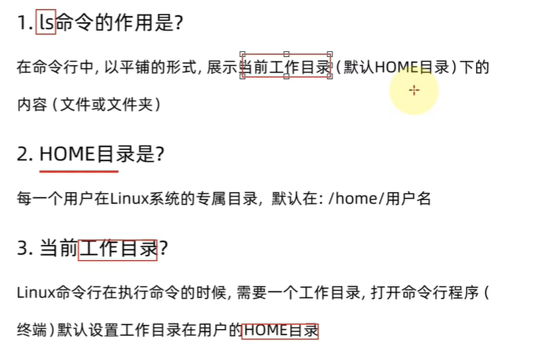

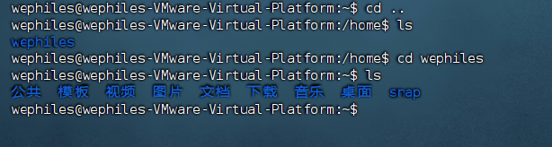

## 2.3 `ls`命令的选项和参数

参数:`linux`路径

下面展示了查看根目录下文件目录的命令

```text
$ ls /
```

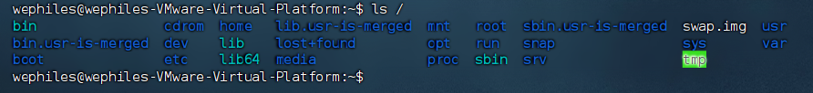

选项:

- `-a`表示all的意思,列出全部文件(隐藏的文件和文件夹)
  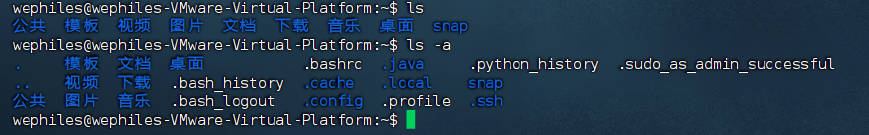

- `-l` 表示以列表的形式列出全部文件(不包含隐藏文件),并显示更多信息
  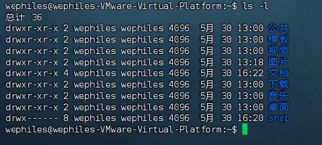

- 也可以混合使用:

  - `ls -a -l`
    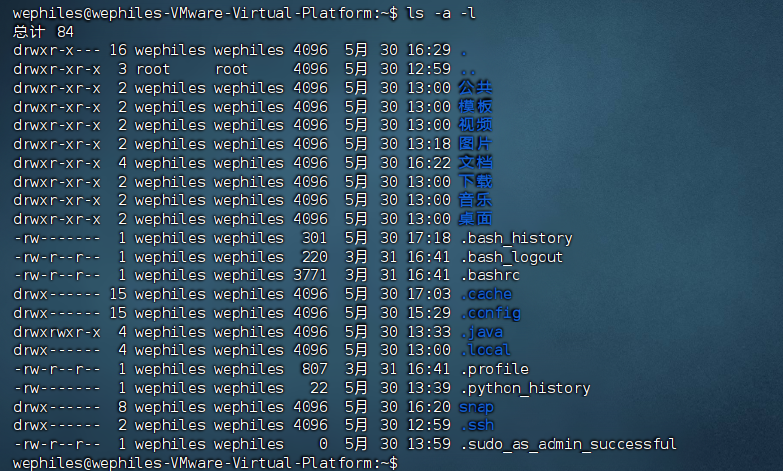
  - `ls -al `
  - `ls -la`

  - 选项和参数都可以一起组合使用
    ```
    $ ls -a -l /
    ```

    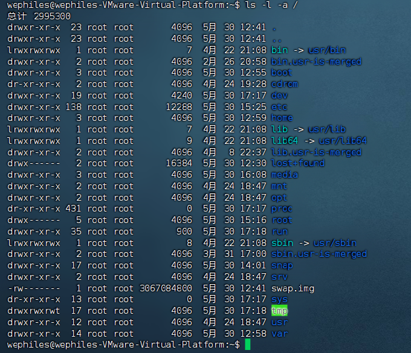

  - `-h` -- 以易于阅读的形式列出文件的大小信息 注意这个选项要和`-l`混合使用,单独使用没有任何作用

    ```
    $ ls -lh
    ```

    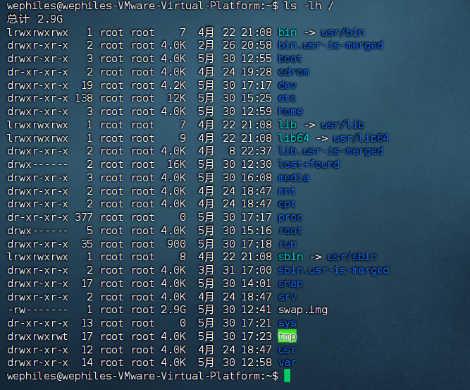

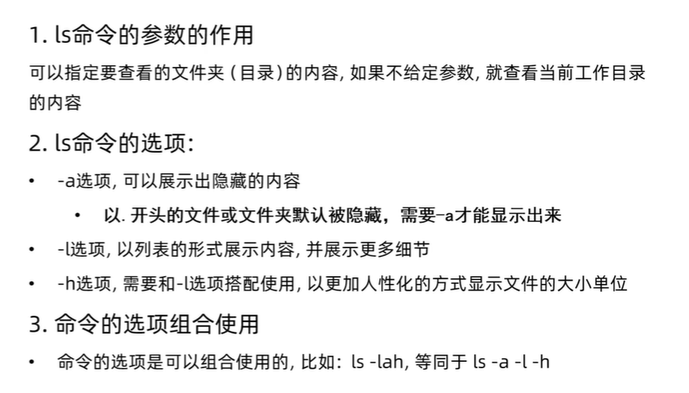


# 3 目录切换相关命令

## 3.1 `cd`

`cd`: `change directory`

```text
~$ cd [linux路径]
```

`cd`只有参数 无需选项 表示要切换到哪个目录下面

`cd`命令直接执行,不写参数 表示切换回用户的`home`目录.

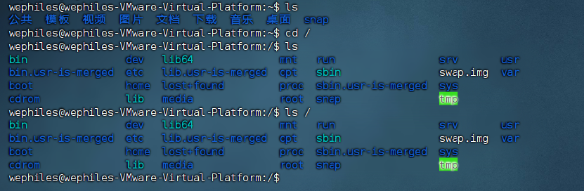

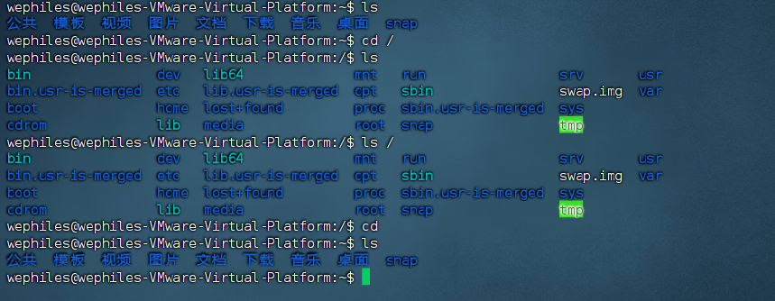

## 3.2 `pwd`

通过老师`ls`来验证当前的工作目录,其实是不恰当的.

`pwd`:作用: 查看当前工作目录

`pwd`: `print work directory`

语法: `pwd`

`pwd` : 无需参数 无需选项 直接输入`pwd`即可

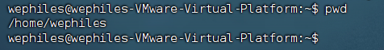

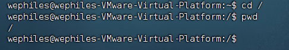


# 4 相对路径、绝对路径、特殊路径符

## 4.1 相对路径和绝对路径

要找到`desktop`目录有两种写法：

- `cd /home/wephiles/Desktop`
  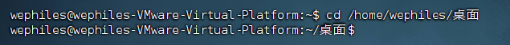
- `cd Desktop`
  

## 4.2 特殊的路径表示符

- `.`当前目录
- `..` 上级目录 `cd ../..`-->切换到上一级的上一级
- `~` `HOME`目录

# 5 创建目录命令

## 5.1 `mkdir`

创建文件夹

`mkdir`: `make directory`

`mkdir [-p] linux路径`

`-p`:可选，表示自动创建不存在的父目录，适用于创建连续多层级的目录。

`linux`路径:可以相对路径，可以绝对路径。

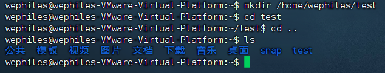

注意：创建文件夹需要修改权限，需要确保操作均在`home`目录下面进行操作，不要在`home`外面操作,涉及到权限问题,`home`外无法成功,后面会讲权限控制

# 6 文件操作命令

## 6.1 `touch`、`cat`、`more`

### 6.1.1 `touch`

`touch`创建文件

语法:`~$ touch linux路径`

`touch`命令无选项,参数必填,表示要创建的问就按路径，相对、绝对、特殊路径符均可使用。

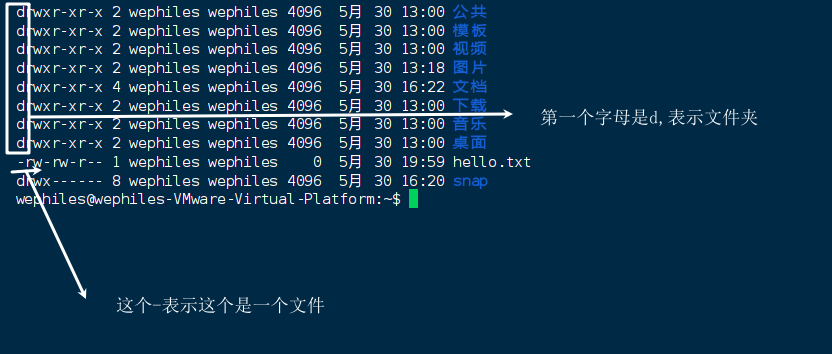


### 6.1.2  `cat`

`cat`:查看文件内容

不过我们目前还没有学习`vi`编辑器,所以先通过图形化界面来进行文字的编辑.

查看文件内容:

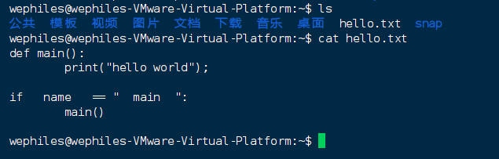

### 6.1.3 `more`

more命令同样可以查看文件内容,但是与`cat`不同的是:

- `cat`直接将文件内容全部显示出来
- more支持翻页,如果为你教案内容过多,可以一页一页显示

语法:`~$ more linux路径`

- 同样没有选项,只有必填参数,参数表示被查看文件的路径,支持相对 绝对 特殊路径符

因为自己编写的文件内容少,我们查看一下内置文件:

`/etc/services`

在查看过程中,通过空格翻页,通过`q`退出查看 

## 6.2 `cp`、`mv`、`rm`

### 6.2.1 `cp`

`cp`命令: 来自英文`copy` 复制文件/文件夹 

语法:`~$ cp [-r] 参数1 参数2`

`-r`选项: 可选,用于**复制文件夹**使用,表示递归

`参数1`: `linux`路径,表示被复制的文件或者文件夹

`参数2`: `linux`路径,表示要复制取得地方

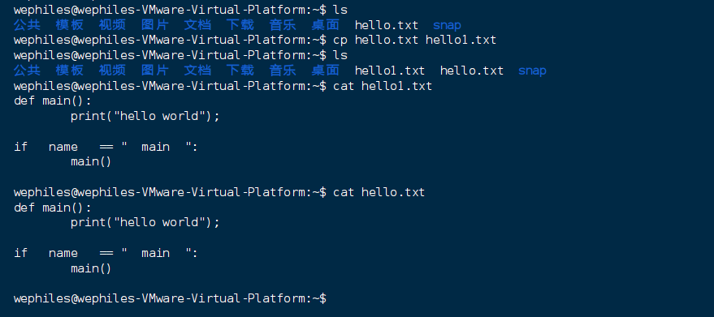

文件夹的复制:要`-r`

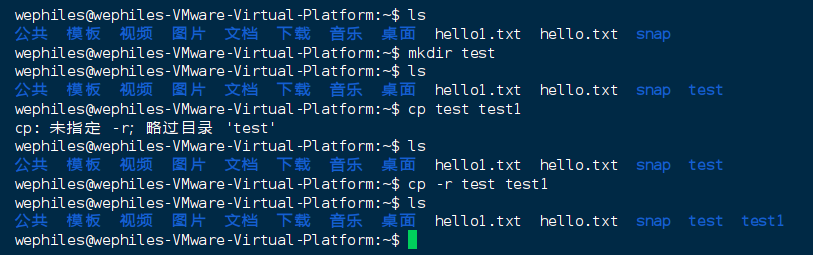


### 6.2.2 `mv`

`mv`用于文件/文件夹的移动,`mv`来自英文单词:`move`

语法:`~$ mv 参数1 参数2`

参数一:`linux`路径,表示被移动的文件/文件夹

参数二:`Linux`路径,表示要移动去的地方,如果目标不存在,则进行改名,确保目标存在

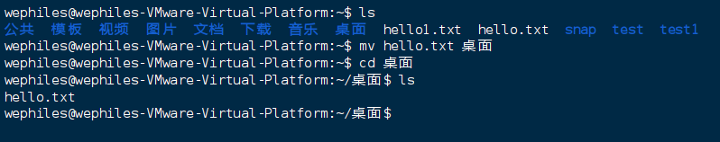

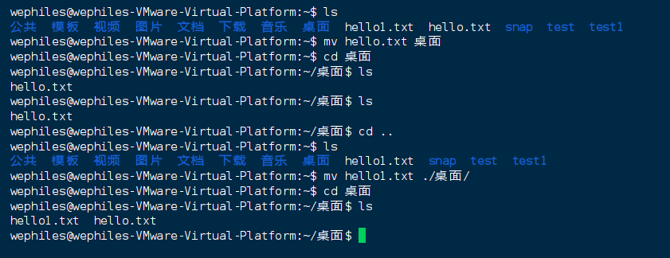

`mv`的改名功能:

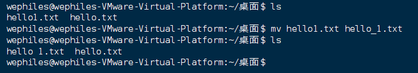

`mv`移动文件夹:

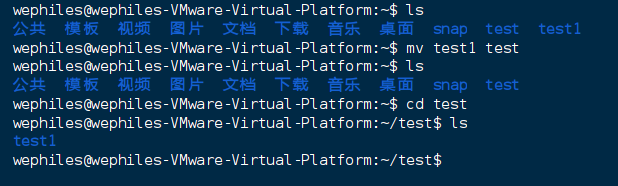

### 6.2.3 `rm`

`rm`命令可用于删除文件/文件夹

`re`来自英文单词`remove`

语法:`~$ rm [-r -f] 参数1 参数2 ... 参数n`

- 同`cp`命令一样,`-r`用于删除文件夹
- `-f`表示`force`,强制删除(不会弹出提示确认消息)
  - 普通用户删除内容不会弹出提示,只有`root`管理员用户删除内容会有提示
  - 所以一般用户用不到`-f`选项
- 参数1 参数2 ... 参数n表示要删除的文件夹/文件路径,按照空格分开

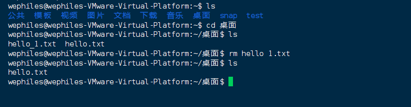


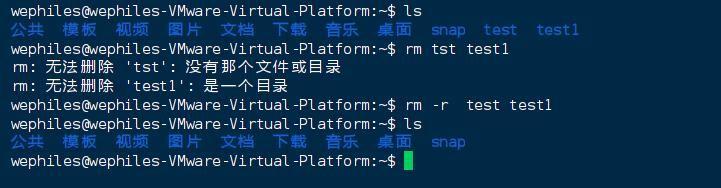

#### 6.2.3.1 `rm`通配符

rm命令支持通配符`*`,用来做模糊匹配.

- `*`表示通配符,即任意内容(包含空),eg:
  - `test*` :匹配任何以`test`开头的内容
  - `*test`: 匹配任何以`test`结尾的内容
  - `*test*`:匹配任何包含`test`的内容

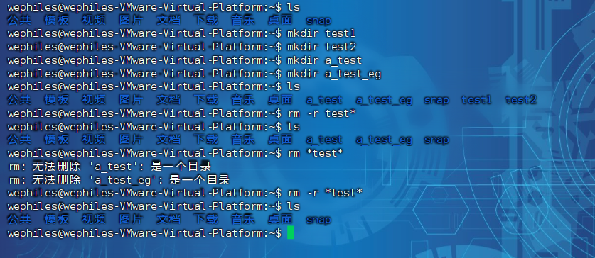

#### 6.2.3.2 `-f`强制删除选项

演示:略

- 强制删除, `-f`选项
- 可以通过`~$ su - root`并输入密码(和普通用户默认一样) 临时切换到`root`用户体验
- 通过输入`exit`命令(临时用`root`用完记得退出,关于`root`后面会讲)

# 7 查找命令

## 7.1 which

我们在前面学习的`linux`命令,在其本质上是一个个的二进制可执行文件,和`windows`的`.exe`文件是一个意思.我们可以通过`which`命令,查看所使用的一系列命的程序文件存放在哪里.

语法:`~$ which 要查找的命令` 注意:`which cd`这里面显示不出来,不知道是什么问题.


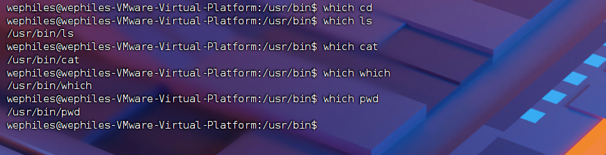

## 7.2 find

### 7.2.1 查找文件

我们使用`find`命令来查找我们的文件.

语法:`~$ find 起始路径 -name "被查找的文件名"`

为确保演示,拥有最大的权限,可以在整个系统完成搜索

可以切换到`root`用户以获得管理员权限

执行命令:`~$ su - root`输入密码进入root用户.

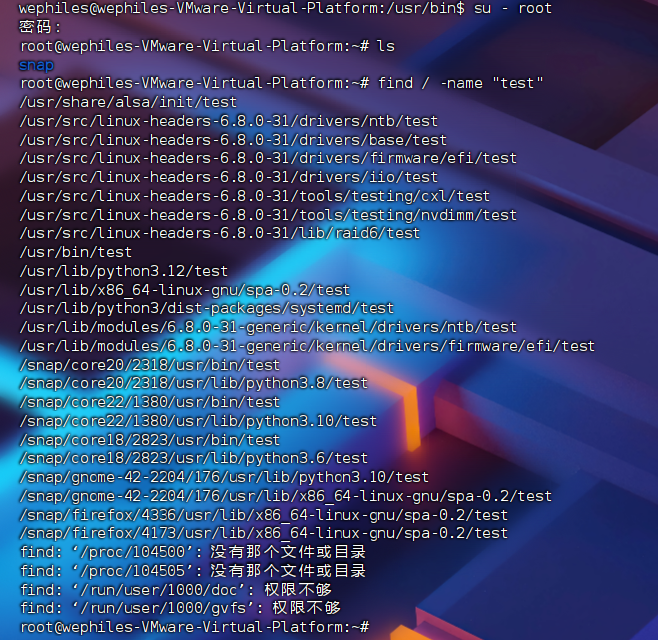

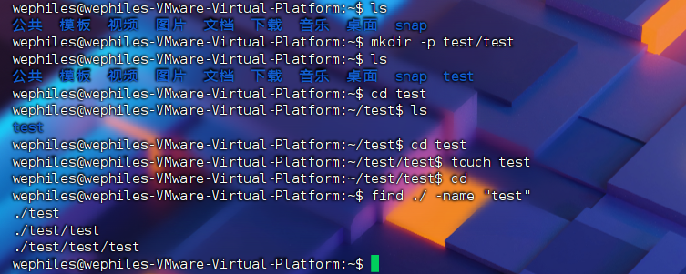

搜索也可以使用通配符.演示略.

### 7.2.2 按照大小查找文件

`~$ find 起始路径 -size +|-n[kMG]`

其中

- `+` `-`代表大于和小于
- `n`表示大小数字
- `kMG`表示大小单位,`k`(小写)表示`kB`,`M`表示`MB`,`G`表示`GB`

示例:

* 查找小于`10kB`的文件:`~$ find / -size -10k`
* 查找大于`100M`的文件:`~$ find / -size +100M`
* 查找大于`1GB`的文件:`~$ find / -size +1G`

# 8 `gerp/wc`和管道符

## 8.1 `grep`命令过滤文件内容

`grep`:从文件中通过关键字过滤文件行。

语法:`~$ grep [-n] 关键字 文件路径`

- 选项 `-n`,可选,表示在结果中显示匹配行的行号
- 参数1 关键字 必填 表示要过滤的关键字,如果带有空格或者其他特殊符号 建议使用`""`将关键字包裹起来
- 参数2 文件路径 必填 表示要过滤内容的文件路径,可作为内容给输入端口

演示:假设我们的`/home/wephiles`下面有一个`test.txt`文件,里面的内容如下:

```text
Welcome to China,
China is a beautiful country.
Let us together,
make the world a better place.
```


## 8.2 `wc`命令统计内容数量

可以通过`wc`命令统计文件的行数,单词数量等.

语法:`~$ wc [-c -m -l -w]` 文件路径

- 选项`-c`:统计`bytes`数量
- 选项`-m`:统计字符数量
- 选项`-l`:统计行数
- 选项`-w`:统计单词数量
- 参数:文件路径 被统计的文件,可作为内容输入端口


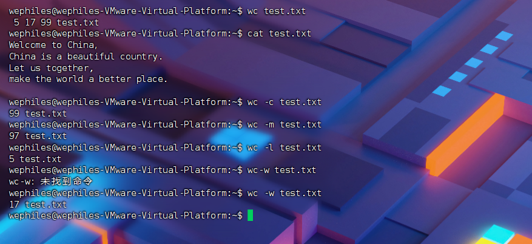

## 8.3 `|`管道符的概念和应用

管道符:`|`,将管道符左边命令的结果,作为右边命令的输入.


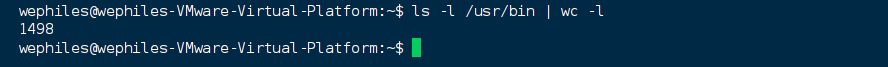

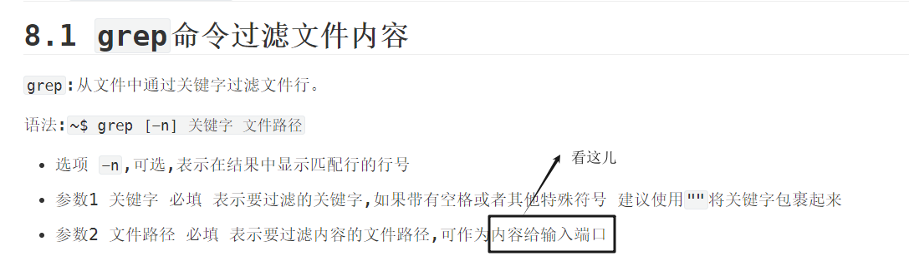

管道符也是可以嵌套的:

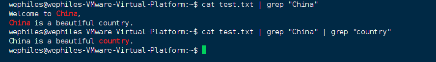

# 9 `echo`、`tail`和重定向符

## 9.1 `echo`输出内容

`echo`可以在命令行内输出指定的命令

语法:`~$ echo 输出的内容`

- 无需选项,只有一个参数,表示要输出的内容,复杂的话可用`""`包围起来

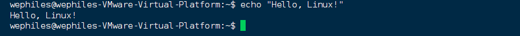

## 9.2 反引号\`的使用

如果我们这样:

```text
~$ echo pwd
```

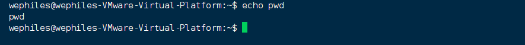

如果我们需要把`pwd`命令的结果输出,可以使用\`将命令包围:

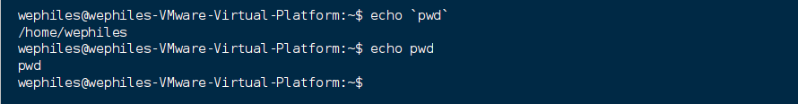

## 9.3 `tail`命令

使用`tail`命令,可以查看文件尾部内容,跟踪文件最新修改.

语法:`~$ tail [-f -num] Linux路径`

- 参数:`linux`路径,表示被跟踪的`linux`路径
- 选项
  - `-f`:表示持续跟踪,使用键盘上的`ctrl + C`快捷键结束`-f`跟踪
  - `-num`:表示查看尾部多少行,不填默认10行


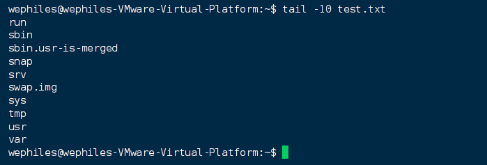

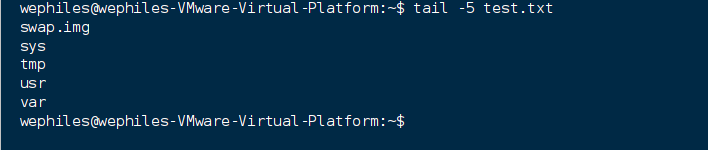

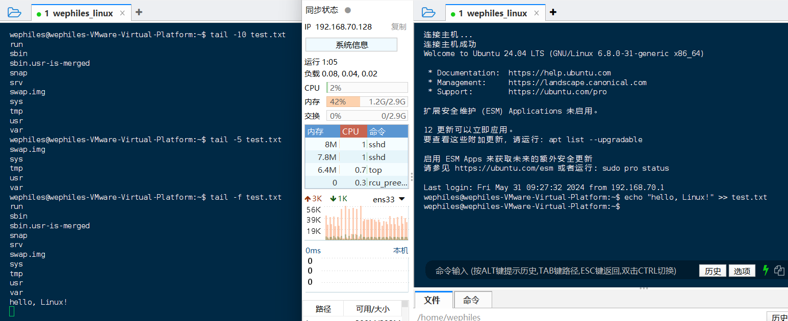

## 9.4 重定向符的使用

重定向符`>`和`>>`

- `>`:将左侧命令的结果,覆盖写入到符号右侧指定的文件中
- `>>`: 将左侧命令的结果,追加写入到符号右侧指定的文件中

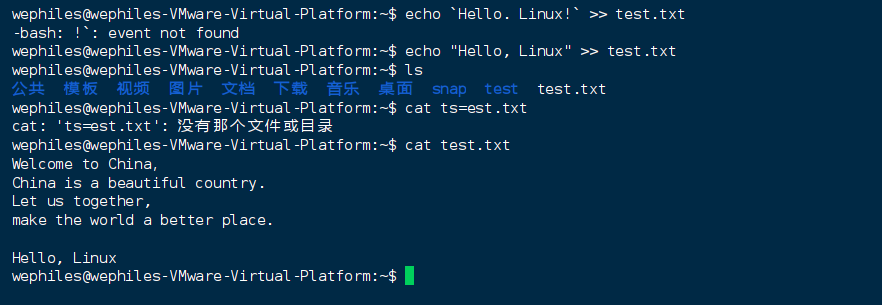

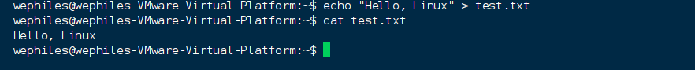

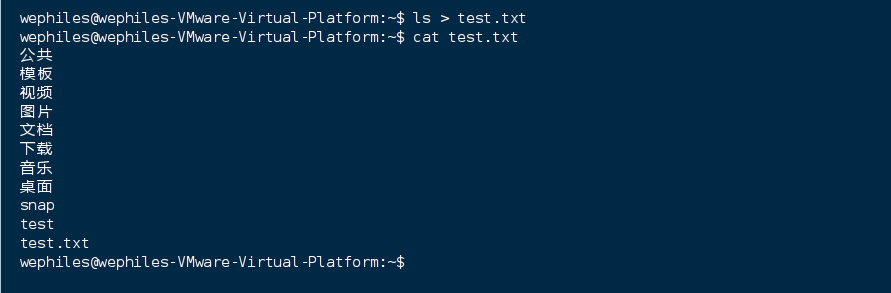

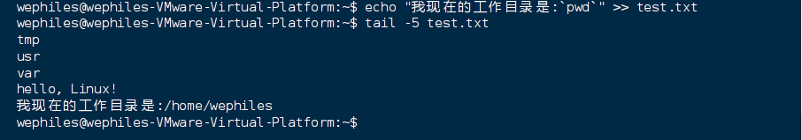


