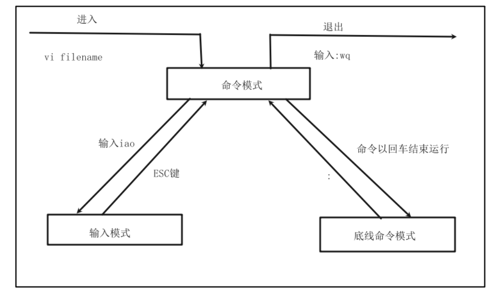

[TOC]

# `vi&vim`编辑器

# 1 `vi`/`vim`概述

`vi/vim`是`linux interface`的简称,是`Linux`中最为经典的文本编辑器

和图形化界面中的文本编辑器一样,`vi`是命令行下对文本文件进行编辑的绝佳选择

`vim`是`vi`的加强版本,兼容`vi`的所有指令,不竟能编辑文本,而且还具有`shell`程序编辑的共嗯那个,可以不同颜色的字体来辨别语法的正确性,极大方便了程序设计和编辑性.

# 2 `vi`/`vim`的三种工作模式

- 命令模式
  - 命令模式下,所敲的按键都会被编辑器理解为命令,以命令驱动执行不同的功能
- 输入模式
  - 也就是所谓的编辑模式,插入模式,此模式下,可以对文件内容进行自由编辑
- 底线命令模式
  - 以`:`开始,通常用于问就按的保存/退出

`vi/vim`工作模式:

# 3 命令模式

如果需要通过`vi/vim`编辑器编辑文件,请通过如下命令:

- `vi` 文件路径
- `vim` 文件路径

`vim`全面兼容`vi`模式,后续全部使用`vim`

- 如果文件路径不存在,那么此命令用于编辑新文件
- 如果文件路径表示的路径存在,那么此命令用于编辑已有文件.

# 4 使用

通过`vi/vim`命令编辑文件,会打开一个新的窗口,此时这个窗口就是:命令模式窗口

命令模式是`vi/vim`的入口和出口,

- 通过`vi`,进入命令模式
- 通过命令行输入键盘指令,会进入输入模式
- 输入模式需要退回到命令模式,然后通过命令可以进入底线命令模式.

使用:

- `vim hello.txt`编辑一个新文件
- 在命令模式下,输入`i`进入输入模式
- 输入模式内输入一些文字信息
- 输入完成后,按`ESC`回退到命令模式
- 在命令行模式下,按键盘`:`进入底线命令模式,在底线命令模式内输入`wq`,保存文件并退出

# 5 命令模式

命令模式一些常用的快捷键:

- `i` -- 再当前光标位置进入输入模式 
- `a` -- 在当前光标位置之后进入输入模式
- `I` -- 在当前行的开头进入输入模式
- `A` -- 在当前行的结尾进入输入模式
- `o` -- 在当前光标下一行进入输入模式
- `O` -- 在当前光标上一行进入输入模式
- `esc` -- 任何人情况下输入`esc`都能回到命令模式

