[TOC]

**`Linux`实用操作**

- 各类小技巧（快捷键）
- 软件安装
- `systemctl`
- 软链接
- 日期、时区
- `IP`地址、主机名
- 网络传输
- 进程管理
- 主机状态
- 环境变量
- 上传、下载
- 压缩、解压

# 1 各类小技巧（快捷键）

## 1.1 强制停止

- 利用`Ctrl+C`强制停止某些程序的运行
- 命令输入错误，也可以通过`Ctrl+C`来退出当前输入，重新输入

## 1.2 退出、登出

`ctrl+D`退出账户的登录,或者退出某些特定程序的专属页面.

> [!Note]
>
> 提示:不能用于退出`vi` / `vim`

## 1.3 历史命令搜索

### 1.3.1 `history`命令

可以通过`history`命令,查看历史输入过的命令.

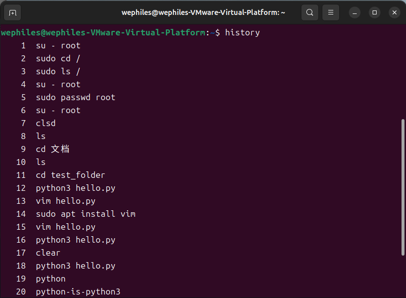

### 1.3.2 `!命令前缀`

寻找以`命令前缀`开头的离当前时间最近的命令

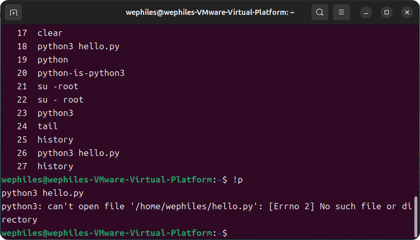

注意:不要搜索很久之前的,因为很容易造成执行错误的命令.

### 1.3.3 `ctrl+r`

通过快捷键`ctrl+r`,输入内容去匹配历史命令.

如果搜索到的命令是你需要的:那么:

- 回车,可以直接执行
- 键盘左键或者右键,可以得到此命令

## 1.4 光标移动

- `ctrl+a`:跳到命令开头
- `ctrl+e`:跳到命令结尾
- `ctrl+键盘左键`:向左跳一个单词
- `ctrl+键盘右键`:向右跳一个单词

## 1.5 清屏

`ctrl + l`或者`clear` -- 清空终端内容

# 2 软件安装

## 2.1 `yum` -- 为`CentOS`安装软件

`yum`:`RPM`包软件管理器,用于自动化安装配置`Linux`软件,并很容易自动解决依赖问题

语法:`yum [-y] [install | remove | search] 软件名称`

- 选项`-y`:自动确认,无需手动确认安装或者卸载过程
- `install`:安装
- `remove`卸载
- `search`:搜索

`yum`命令需要`root`权限,可以使用`su`命令切换到`root`或者使用`sudo`提权.

`yum`命令需要联网

## 2.2 `apt` -- 为`Ubuntu`安装软件

`Ubuntu`使用`apt`管理器.

语法:`apt [-y] [install | remove | search] 软件名称`

用法和`yum`一致,同样需要`root`权限.

- `apt install wget` 安装`wget`
- `apt remove wget` 卸载`wget`
- `apt search wget` 搜索`wget`

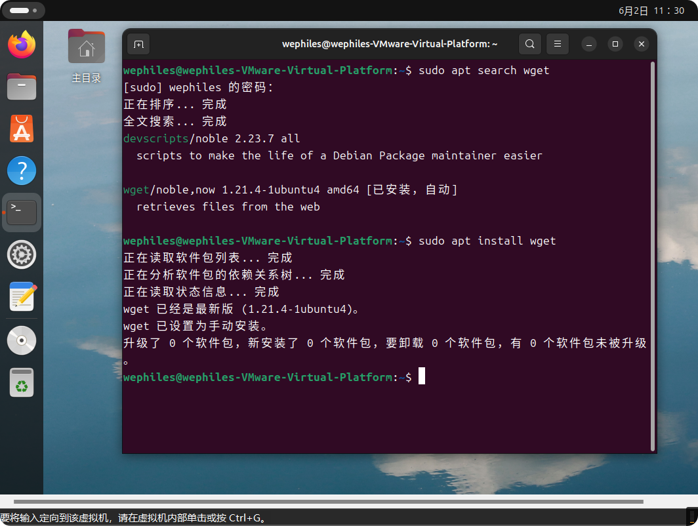

# 3 `systemctl`

`systemctl`启动软件和关闭软件:

`Linux`很多软件(内置或者第三方)均支持使用`systemctl`命令控制:启动/停止/开机自启

能够被`systemctl`管理的软件,一般称之为:服务

语法:`systemctl start|stop|status|enable|disable| 服务名`

- `start` 启动
- `stop` 关闭
- `status` 查看状态
- `enable` 开启开机自启
- `disable` 关闭开机自启

系统内置的服务比较多:比如

- `NetworkManager` 主网络服务
- `network` 副网络服务
- `firewalld` 防火墙服务
- `sshd` `ssh`服务(`finalshell`远程登录`Linux`使用的就是这个服务)

我们通过`yum/apt`安装一个`ntp`软件后,`ntp`会自动注册为一个服务,我们可以查看一下这个服务的状态:并停止一下,再看看状态:

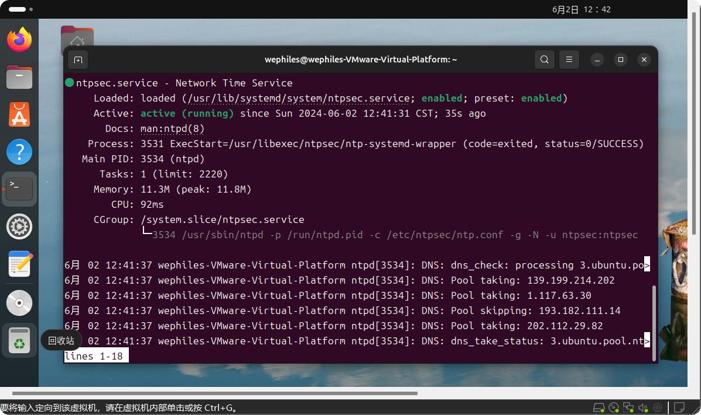

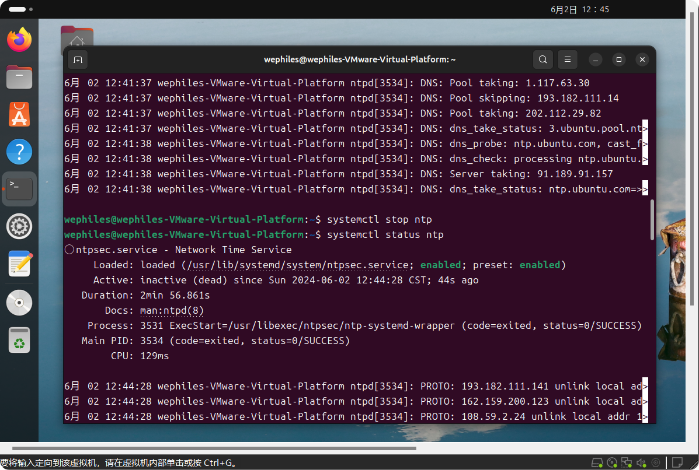

部分软件安装后没有自动集成到`systemctl`中,我们可以手动添加.后续会详细讲解.

# 4 软链接

`ln`:创建软链接

## 4.1 什么是软连接

在系统中创建软连接,可以将文件/文件夹链接到其他位置

类似`windows`系统中的快捷方式

## 4.2 `ln`

语法:`~$ ln -s 参数1 参数2`

- `-s`:创建软链接
- 参数一:被链接的文件或文件夹
- 参数二:要连接去的目的地

示例:(以`CentOS`为例)

- `ln -s /etc/yum.conf ~/yum.conf`
- `ln -s /etc/yum ~/yum`

下面案例以`Ubuntu`为例,在`~/文档/`下面新建一个软连接`add user.conf`,指向`/etc/adduser.config`

> [!Caution]
>
> 注意:也可以链接文件夹

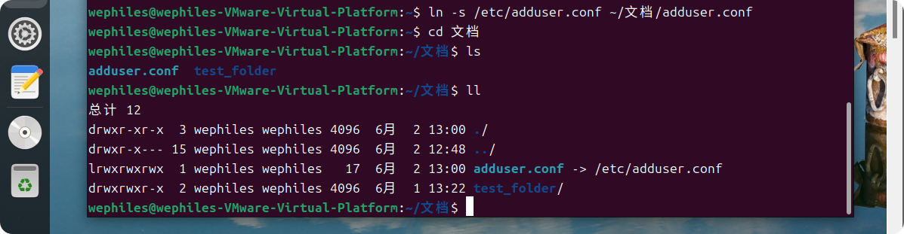

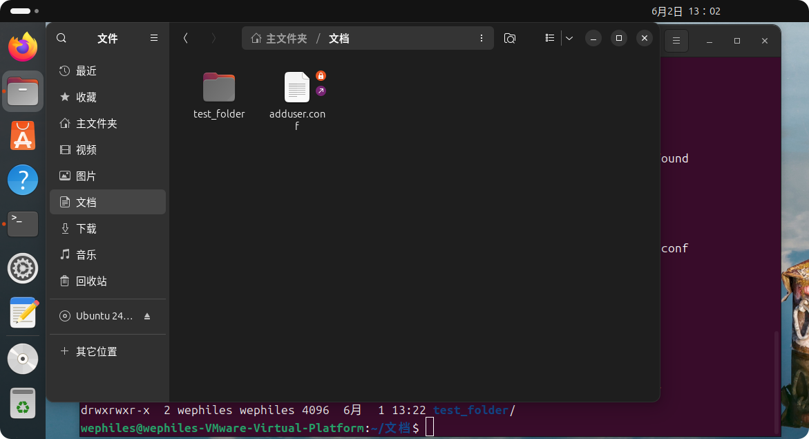

# 5 日期、时区

## 5.1 `date`

### 5.1.1 `date`普通用法

通过`date`命令可以在命令行查看系统时间

语法:`date [-d] [+格式化的字符串]`

- `-d`:按照给定字符串显示日期,一般用于日期计算
- 格式化字符串:通过特定的字符串标记,来控制显示的日期格式
  - `%Y` : 年
  - `%y` : 年份后两位数字(`00~99`)
  - `%m`: 月份
  - `%d` : 日
  - `%H` : 小时
  - `%M` : 分钟
  - `%S` : 秒
  - `%s` : 自`1970.01.01 00:00:00 UTC`到现在的秒数

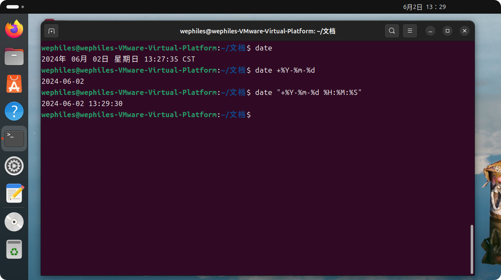

注意如果参数有空格隔开,那么要在外面加上双引号包围起来.

### 5.1.2 日期计算

- `-d`选项,可以按照给定的字符串显示日期,一般用于日期计算

- 其中支持的时间标记为:

  - `year` : 年
  - `month` : 月
  - `day` : 日
  - `hour` : 时
  - `minute` : 分
  - `second` : 秒

- `-d`可以和格式化字符串配合一起使用
  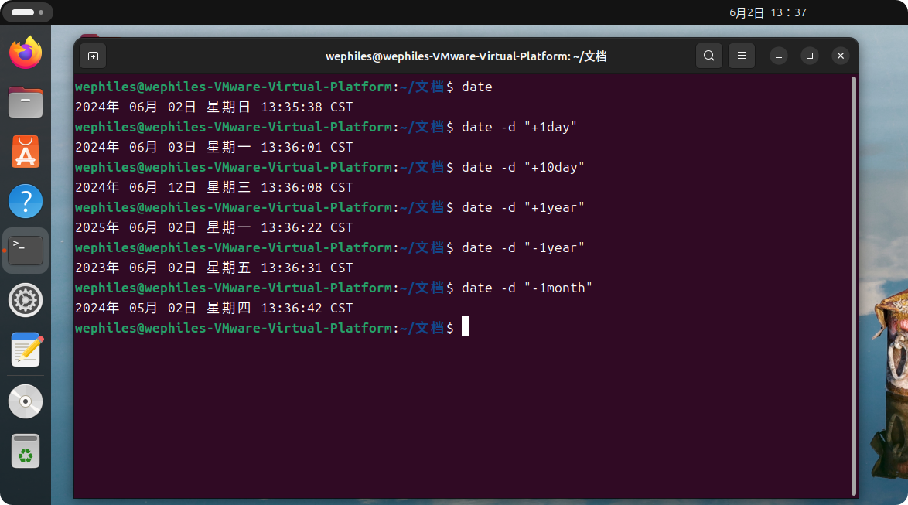

  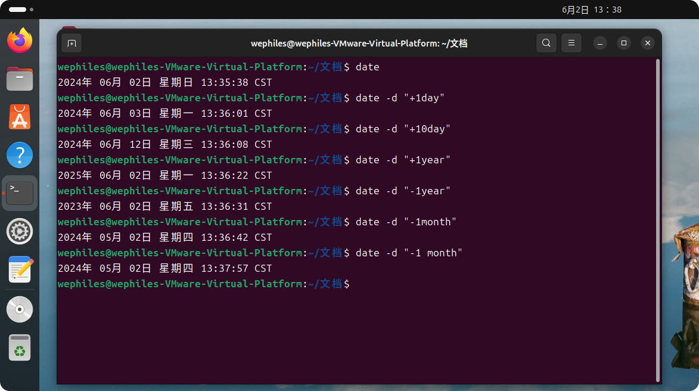
  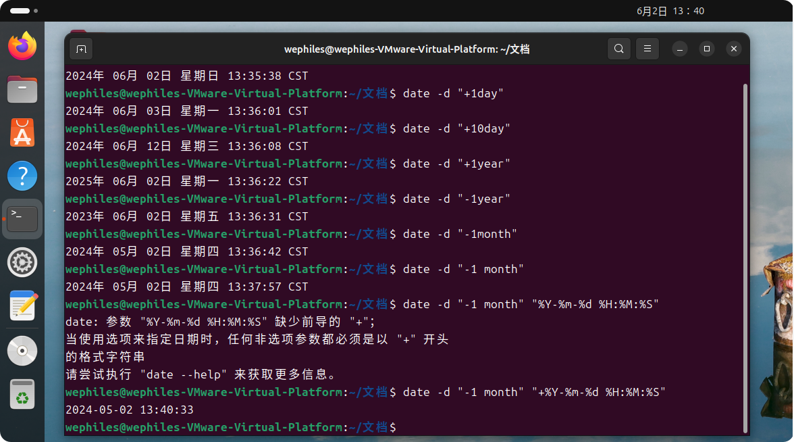

## 5.2 修改`Linux`系统时区

通过`date`查看的时间是不准的,因为系统默认时区并非是中国的东八区(中国东八区会显示`CST`).


怎么修改:

```bash
su -  # 登入root用户
rm -f /etc/localtime
ln -s /usr/share/zoneinfo/Asia/Shanghai /etc/localtime/
# 再次查看就会发现时间变成CST
```

## 5.3 掌握使用`ntp`进行时间同步和校准

我们可以通过`ntp`程序自动校准系统时间

安装:

`apt install ntp`

启动并设置开机自启:

```bash
systemctl start ntpd
systemctl enable ntpd
```

这样当`ntpd`启动后就会帮我们联网校准系统时间

> [!Important]
>
> 也可以手动校准,需要`root`权限:
>
> ```bash
> ntpdate -u ntp.aliyun.com
> ```
>
> 通过阿里云提供的服务网址配合`ntpdate`(安装`ntp`后会附带这个命令)命令自动安装

# 6 `IP`地址、主机名

## 6.1 `IP`地址和主机名

### 6.1.1 什么是`IP`地址

每一台联网的电脑都会有一个地址,用于和其他计算机进行通讯

`ip`地址主要有两个版本,`IPV4`和`IPV6`

地址格式:`a.b.c.d`

可以通过`ifconfig`查看本机`ip`地址,如果无法使用`ifconfig`命令,那么可以安装:`apt -y install net-tools`

那个`inet`后面的那个就是`IP`地址.

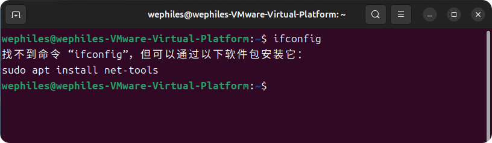

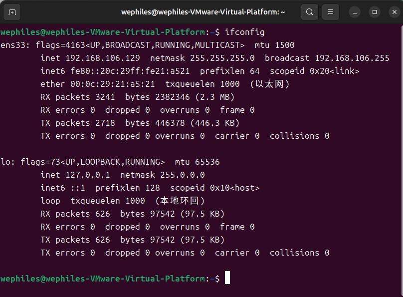

### 6.1.2 特殊`IP`地址

- `127.0.0.1` -- 代表本机
- `0.0.0.0` 
  - 可用来指代本机
  - 可以在端口绑定中用来确定绑定关系(后续讲解)
  - 在一些`IP`地址限制中,表示所有`IP`的意思,如放行规则设置为`0.0.0.0`,表示允许任意`IP`访问

### 6.1.3 什么是主机名

每一台电脑除了对外联络地址(`IP`地址)外,也可以有一个名字,称之为主机名

无论是`Windows`还是`Linux`,都可以设置主机名

- Windows系统主机名
  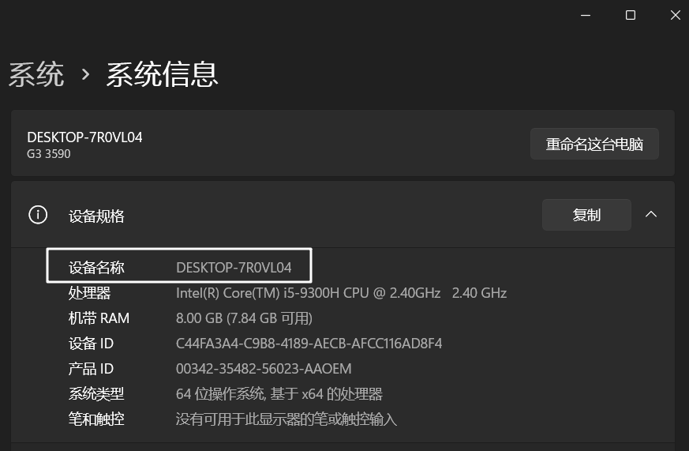

- `Linux`系统主机名 -- 通过命令`hostname`查看
  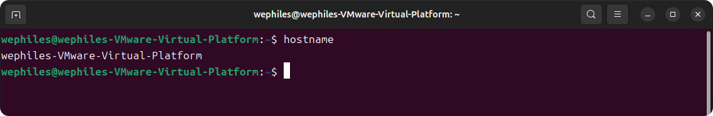

- 怎么修改主机名:修改完后重启系统就发现主机名变成我们修改的样子了.
  ```bash
  # 查看主机名
  hostname
  
  # 修改主机名 -- 需要root
  hostnamectl set-hostname 主机名
  ```

  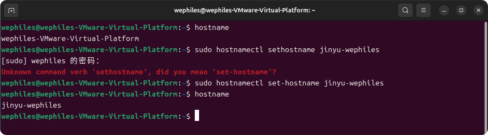
  重启一下:可以看搭配主机名已经改好了.

  

### 6.1.4 什么是域名解析

`IP`地址非常难记,有无方法可以通过主机名或替代的字符去替代数字化的`IP`地址呢?

实际上,我们一直都是通过字符化的地址去访问服务器,很少指定`IP`地址

比如我们打开百度:`https://www.baidu.com`,其中`https://www.baidu.com`就是百度的网址,我们称之为域名.

> [!Important]
>
> !!! 只能通过`IP`地址去访问服务器.


- 先查看本机的记录(私人地址本)
  - `windows` : 在 `C:\Windows\System32\drivers\etc\hosts`
  - `Linux` : 在 `/etc/hosts`
- 再联网去`DNS`服务器(如`114.114.114.114`或者`8.8.8.8`)询问.

## 6.2 虚拟机配置固定`IP`

为什么需要固定`IP`?

当前我们的虚拟机上的`Linux`操作系统,其`IP`地址是通过`DHCP`服务获取的

`DHCP`:动态获取`IP`地址,即每次重启设备后都会获取一次,可能导致`IP`频繁的变更

原因1:边工电脑的地址变化无所谓,但是如果要用`finalshell`远程链接到`Linux`系统,每次都要更换`IP`比较烦

原因2:在刚刚我们配置了虚拟机`IP`地址和主机名的映射,如果`IP`平凡变更,我们也需要频繁更新映射关系

综上,我们需要将`IP`地址固定下来,不要变换了.

- 在`VMware`里面配置固定`IP`:

  - 在`VMware`中配置`IP`地址网关和网段(`IP`地址的范围)

    1. 编辑
    2. 虚拟网络编辑器
    3. 找到`vmnet8`
       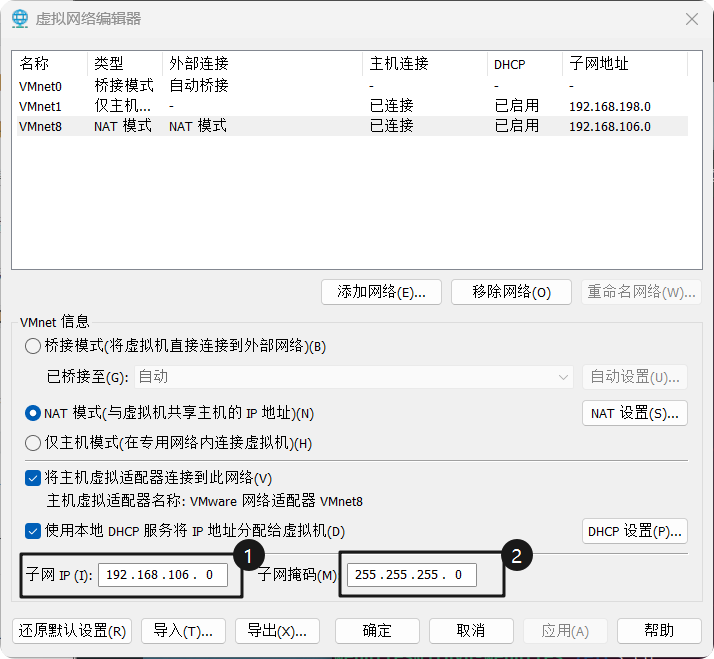
    4. 点击`NAT`设置
       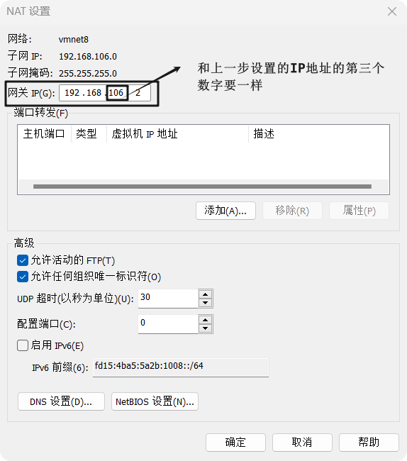

  - 在`Linux`系统中手动修改配置文件

    1. 使用`vim`编辑`/etc/sysconfig/ntework-scripts/ifcfg-ens33`,打开这个文件,输入如下内容:

       > [!Note]
       >
       > 提示:我的`Ubuntu`系统没`sysconfig`文件夹,不知道是不是因为系统差异

       ```text
       ...
       ```

       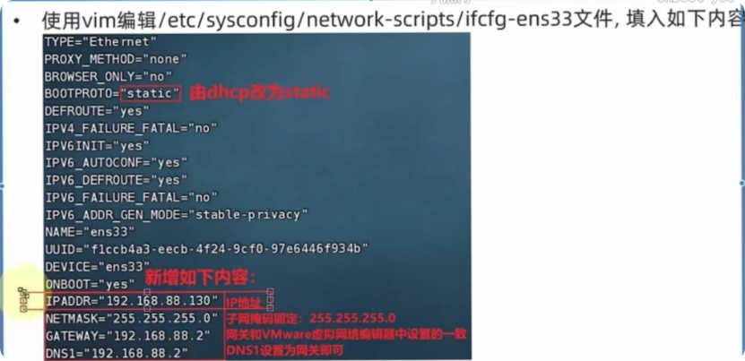

    2. 修改完成之后:通过`systemctl restart ntework`重启网卡

# 7 网络传输

## 7.1 下载和网络请求

### 7.1.1 使用`ping`命令检查服务器是否可联通

`ping`命令:可以同故宫`ping`命令检查指定的网络服务器是否处于可联通状态

语法:`~$ ping [-c num] ip或主机名`

- 选项 `-c num` ,检查的次数,不适用`-c`选项,将无限次持续检查
- 参数:`IP`或者主机名,被检查的服务器的ip地址或者主机名地址

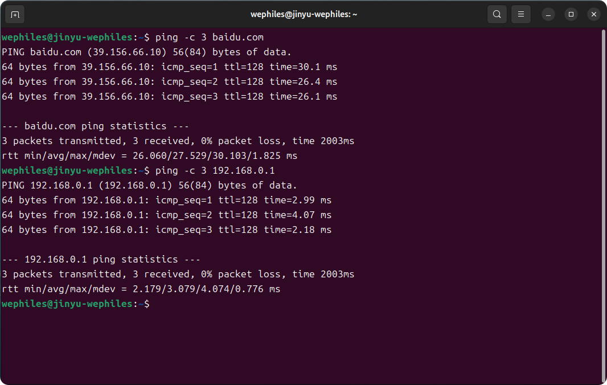

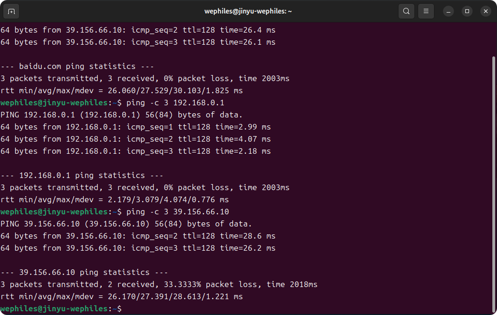

### 7.1.2 掌握`wget`命令下载文件

`wget`命令是个交互式的文件下载器,可以在命令行下载网络文件

语法: `wget [-b] url`

- 选项:`-b`可选,后台下载,会将日志写入到当前工作目录下面的`wget-log`文件
- 参数 `url`: 下载链接

示例:使用`wget`下载`apache-hadoop 3.3.0`版本:`wget http://archive.apache.org/dist/hadoop/common/hadoop-3.3.0/hardop-3.3.0.tar.gz`

在后台下载:使用`wget -b http://archive.apache.org/dist/hadoop/common/hadoop-3.3.0/hardop-3.3.0.tar.gz`,可以通过`tail`命令在后台监控下载进度:`tail -f wget.log`

### 7.1.3 掌握使用`curl`命令发起网络请求

`curl`可以发送`http`请求,可用于:下载文件,获取信息等

语法:`curl [-O] url`

- 选项:`-O`:用于下载文件,当`url`是下载链接的时候,可以使用此选项保存文件
- 参数:`url`,要发起请求的网络地址

示例:

- 向`cip.cc`发起网络请求`curl cip.cc`
  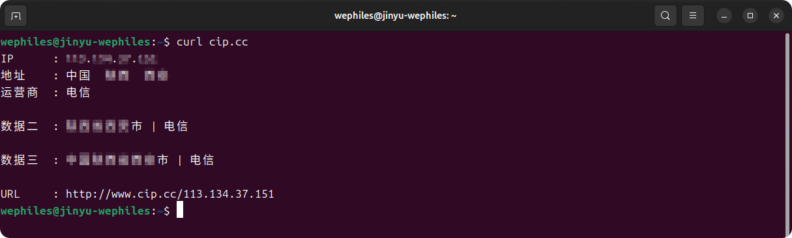

- 向`python.itheima.com`发起请求:

  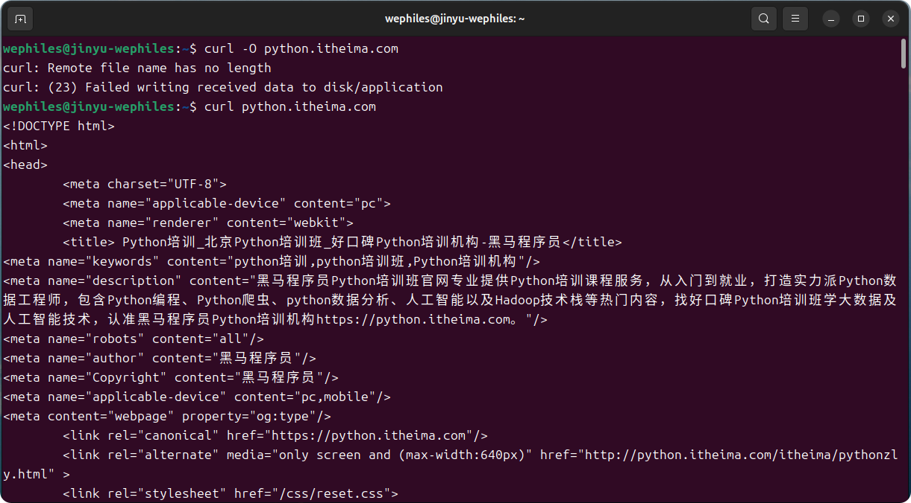

- 通过`curl`下载`hadoop-3.3.0`安装包:
  `curl -O http://archive.apache.org/dist/hadoop/common/hadoop-3.3.0/hardop-3.3.0.tar.gz`
  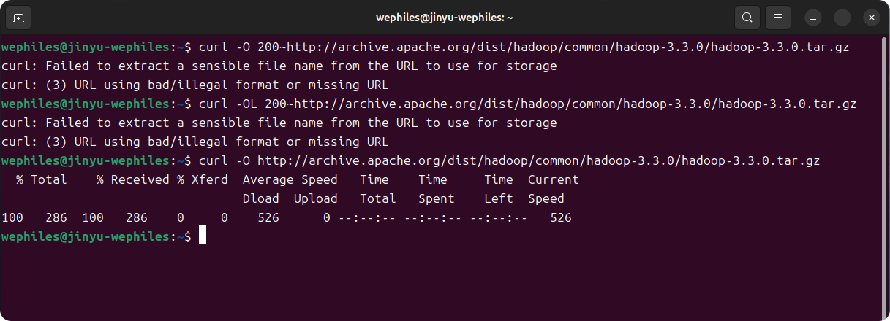

## 7.2 端口

### 7.2.1 什么是端口

端口，设备和外界通讯交流的出入口，端口可分为物理端口和虚拟端口两类

- 物理端口：又可以称之为接口，是可见的端口，如`USB`接口，`RJ45`接口，`HDMI`接口等
- 虚拟端口：是指计算机内部的端口，是不可见的，用来操作系统和外部交互使用的

`Linux`系统支持`65535`个端口，这6万多个端口分为3类使用：

- 公认端口：`1~1023`，通常用于一些系统内置或者知名程序的预留使用，如`SSH`服务的22端口，`HTTPS`服务的443端口。非特殊需要，不要占用这个范围的端口

- 注册端口：`1024 ~ 49151`，通常可以随意使用，用于松散的绑定一些程序、服务
- 动态端口：`49152 ~ 65535`，通常不会固定绑定程序，而是当程序对外进行网络连接的时候，用于临时使用。

### 7.2.2 查看端口占用 - `nmap`

可以通过`Linux`命令去查看端口的占用情况。 -- 查看对外暴露的端口

- 使用`nmap`命令，安装`nmap`：`apt -y install nmap`
- 语法：`nmap 被查看的IP地址`
- 示例：
  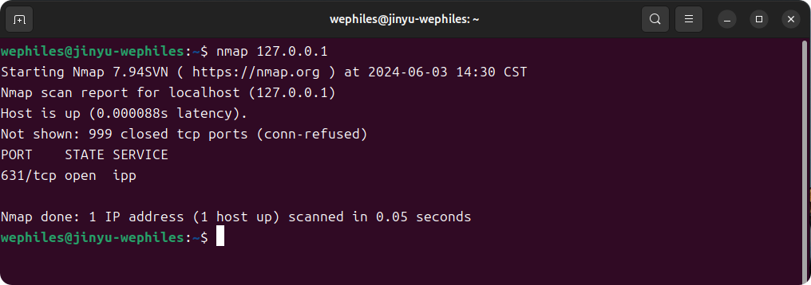

### 7.2.3 查看端口占用 - `netstat`命令

可以通过`netstat`命令查看指定端口的使用情况

语法：`netstat -anp | grep 端口号 `

安装`netstat`：`apt install net-tools`

演示：

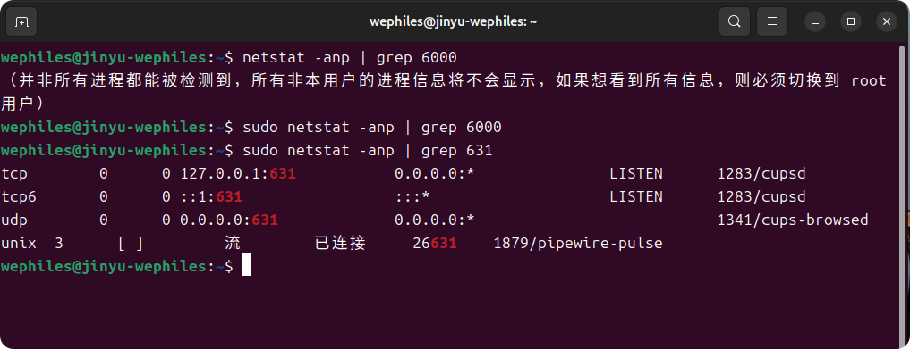


# 8 进程管理

## 8.1 什么是进程

程序运行在操作系统中，是被操作系统管理的，为了管理运行的程序，每一个程序在运行的时候，便被操作系统注册为系统中的一个==进程==

并会为每一个进程分配一个独有的 ==进程`ID`== (进程号)

## 8.2 查看、关闭进程

### 8.2.1 查看进程

可以通过`ps`命令查看`Linux`系统中的进程信息

语法：`ps [-e -f]`

- 选项 `-e`：显示出全部的进程
- 选项 `-f`：已完全格式化的形式展示信息（展示全部信息）
- 一般来说，固定用法就是：`ps -ef`，列出全部进程的全部信息

列出来以后，从左到右依次是：

`UID` `PID` `PPID` `C` `STIME` `TTY` `TIME` `CMD`

- `UID` 进程所属的用户`ID`
- `PID` 进程的进程号（进程`ID`）
- `PPID` 进程的父`ID`
- `C` 此进程的`CPU`占用率
- `STIME` 进程的启动时间
- `TTY` 启动次进程的终端序号，如果显示`？`表示非终端启动
- `TIME` 进程占用`CPU`的时间
- `CMD`  进程对应的名称或启动路径或启动命令

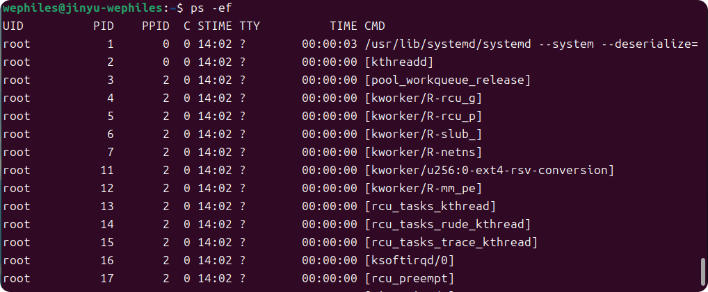

- 在`finalshell`里面，执行命令：`tail`，可以看到，此命令一直阻塞在那里
- 在`finalshell`里面，复制一个标签页，执行：`ps -ef`
- 问题:是否会发现，，列出的信息太多，无法准确找到或者很麻烦怎么办？

我们可以使用管道符配合`grep`来进行过滤：

比如，`ps -ef | grep tail`，即可准确找到`tail`命令的信息。

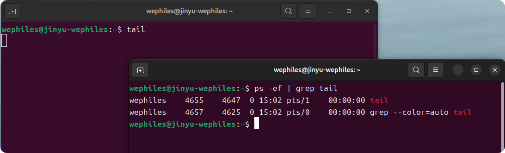

- 过滤不仅过滤名称，进程号、用户`ID`等，都可以被`grep`过滤

- 比如：`ps -ef | grep 30001`过滤带有`30001`关键字的进程信息，（一般指代过滤`30001`进程号）

  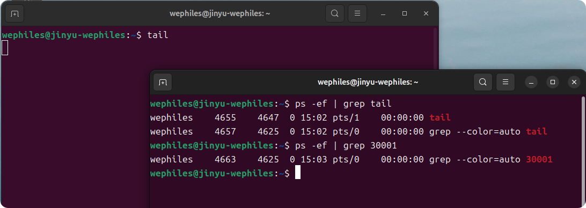

  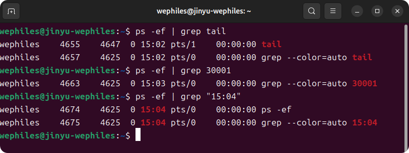

### 8.2.2 关闭进程

在`Linux`系统中，可以利用`kill`命令关闭进程

语法：`kill [-9] 进程ID`

- 选项`-9`表示强制关闭，不使用这个选项会向进程发送信号要求其关闭，但是否关闭还要看进程自身的处理机制

  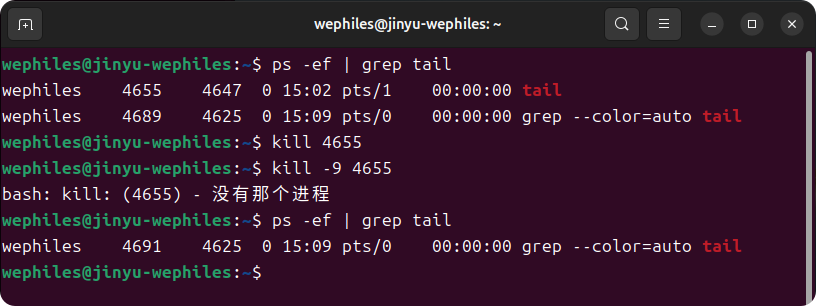

  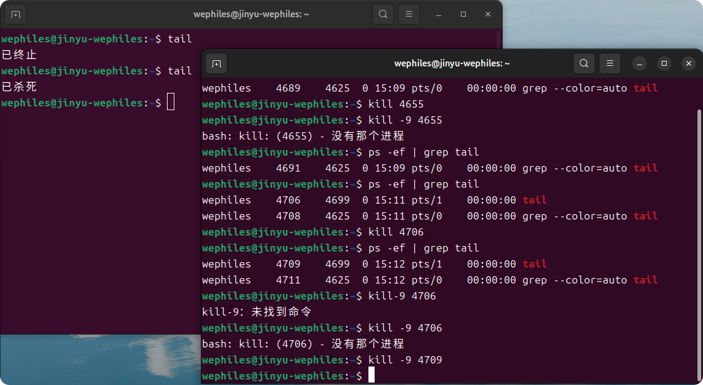

# 9 主机状态

## 9.1 查看系统资源占用

可以通过`top`命令查看`CPU`、内存使用情况，类似与`windows`的任务管理器

默认每5秒刷新一次，直接输入`top`即可，按`q`或者`ctrl + C`退出

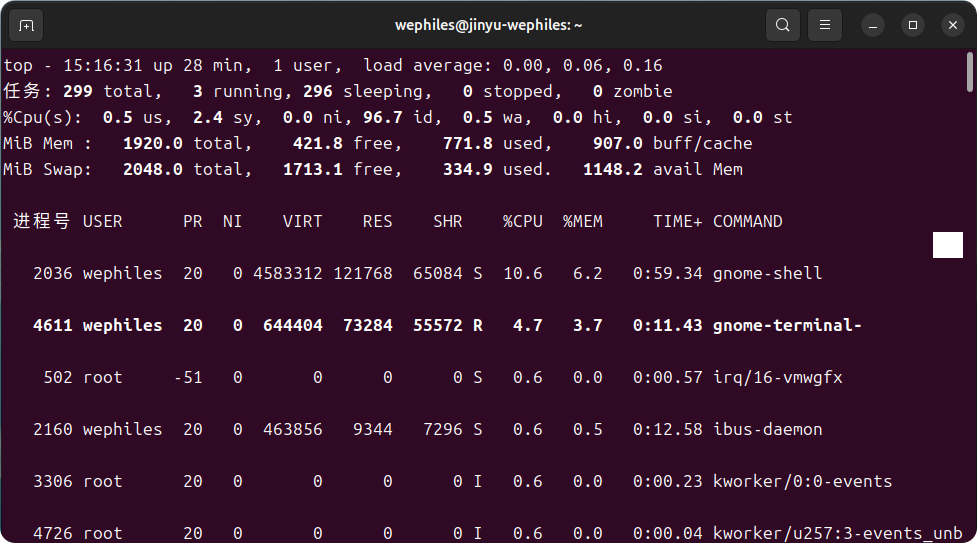

## 9.2 打印出的信息的解释

- 第一行：`top->命令名称` `15:16:31->当前系统时间` `up 28 min->启动了28分钟` `1 user->1个用户登录` `load aerage:1、5、15分钟负载`
  

- 第二行：`任务(tasks)->299个进程` `3 running->3个子进程在运行` `296 asleeping->296个进程睡眠` `0 stopped->0个停止` `0 zombie->0个僵尸进程`
  

- 第三行：`%Cpus(s): CPU使用率` `us:用户CPU使用率` `sy:系统使用率` `ni:高优先级进程占用CPU时间百分比` `id:空闲CPU率` `wa:IO等待CPU占用率` `hi:CPU硬件中断率` `si:CPU软件中断率` `st:强制等待占用CPU率`
  

- 第四五行：

  

  - `MiB Mem:物理内存` `total:总量` `free:空闲` `used:使用` `buff/cache:buff和cache占用`
  - `MiB Swap:虚拟内存(交换空间) ` `total:总量` `free:空闲` `used:使用` `avail Mem:还有多少可用`

- 后面还有一些进程相关的信息：
  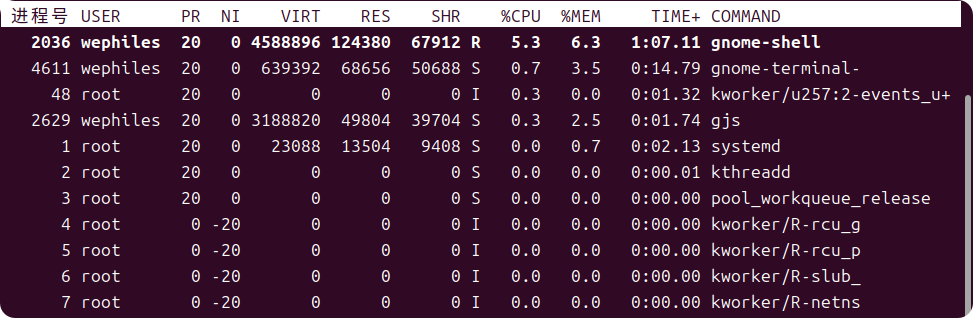

  - 进程号（`PID`）:进程`ID`
  - 我`USER`：进程所属用户
  - `PR`：进程优先级，越小越高
  - `NI`：负值表示高优先级，正值表示高优先级
  - `VIRT`： 进程使用虚拟内存，单位`kB`
  - `RES`：进程使用物理内存，单位`KB`
  - `SHR`： 进程使用共享内存，单位`KB`
  - `S`： 进程状态，（`S`休眠，`R`运行，`Z`僵死，`N`负数优先级，`I`空闲状态）
  - `%CPU`： 进程占用`CPU`率
  - `%MEM`： 进程占用内存率
  - `TIME+`： 进程使用`CPU`时间总计，单位10毫秒
  - `COMMAND`：进程的命令或名称或程序文件路径

## 9.3 `top`命令选项

- `-p`： 只显示某个进程信息
- `-d`： 设置刷新时间，默认5秒
- `-c`： 显示产生进程的完整指令，默认是进程名
- `-n`： 指定刷新次数，例如`top -n 3`刷新输出3次后退出
- `-b`： 以非交互式全屏模式运行，以批次的方式执行`top`，一般配合`-n`选项指定输出几次统计信息，将输出重定向到指定文件，比如`top -b -n 3 > /tmp/top.tmp`
- `-i`： 不显示任何闲置（`idle`）或者无用（`zombie`）进程
- `-u`： 查找特定用户启动的进程

## 9.4 top交互式选项


## 9.5 磁盘监控

### 9.5.1 `df`

使用`df`命令可以查看硬盘的使用情况

语法：`df [-h]`

选项：`-h`：以更加人性化的单位展示

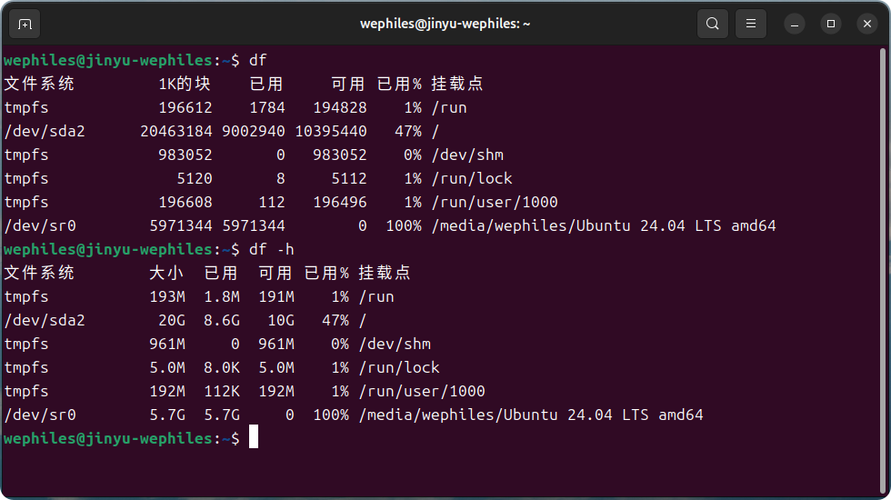

### 9.5.2 `iostat`

可以使用`iostat`查看CPU、磁盘的相关信息

语法： `iostat [-x][num1][num2]`

- 选项`-x`：显示更多信息
- `num1`：数字，刷新间隔，`num2`：刷新几次

> [!tip]
>
> `tips`:该设备每秒的传输次数（`indicate number of transfer per second that were issued to the devices`）一次传输的意思是，"一次`I/O`请求"
>
> 多个逻辑请求可能会被合并为"一次`I/O`请求"，"一次传输"请求的大小是未知的

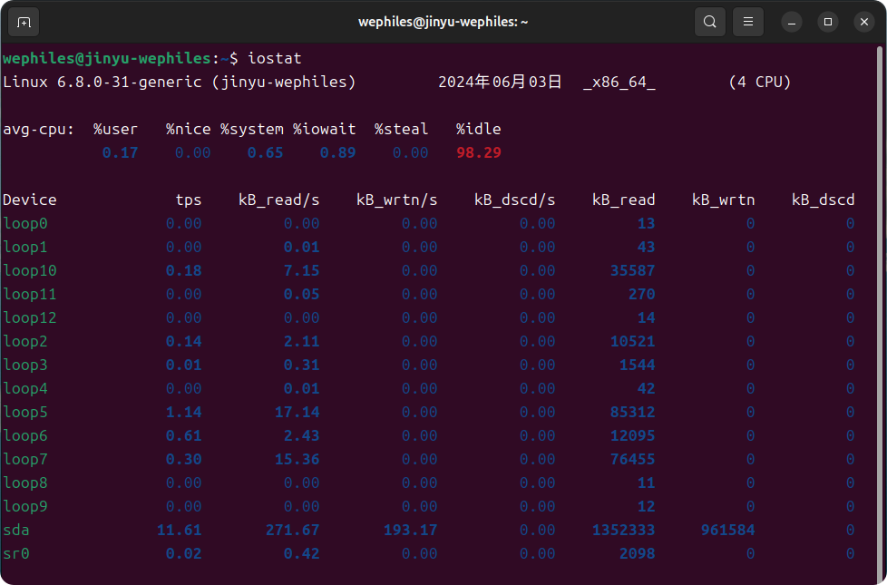

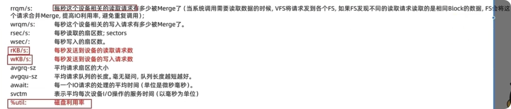

## 9.6 网络监控

- 可以使用`sar`命令查看网络的相关统计，（`sar`命令非常复杂，这里只介绍用于统计网络）
- 语法：`sar -n DEV num1 num2`
  - 选项`-n`：查看网络，`DEV`表示只查看网络接口
  - `num1`：刷新间隔
  - `num2`：查看次数

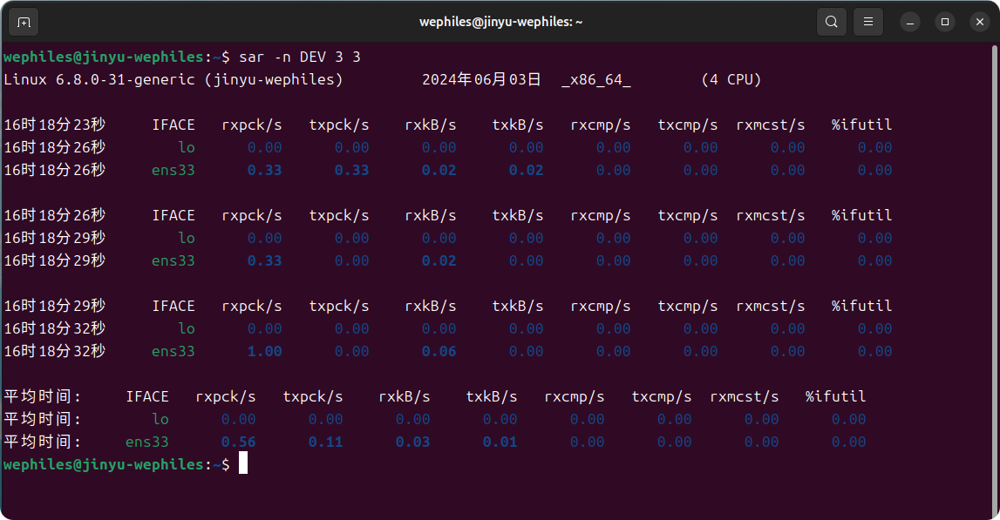

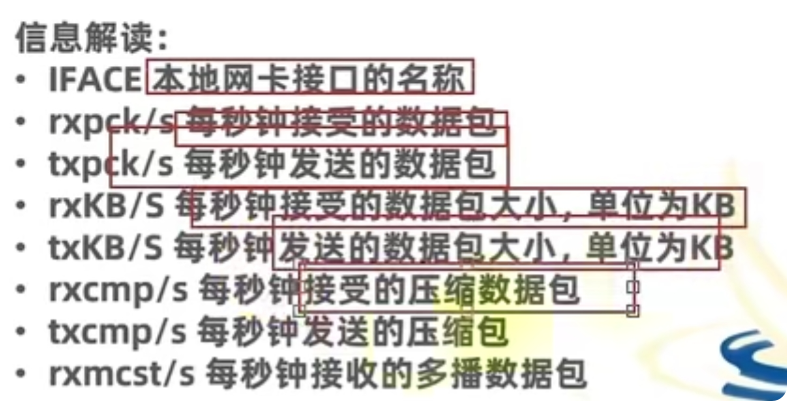

# 10 环境变量

## 10.1 环境变量的作用

### 10.1.1 环境变量

在讲解`which`命令的时候，我们知道适用的一系列命令本质上就是一个个可执行程序。

比如，`cd`命令的本体就是：`/usr/bin/cd`这个文件。

我们有个疑问，无论我们的当前工作目录在哪里，都能执行`/usr/bin/cd`这个程序呢？

环境变量就是操作系统在运行的时候，记录的一些关键信息，可以辅助系统运行

在`Linux`系统中执行`env`命令，即可查看当前系统中记录的环境变量

环境变量是一种`KeyValue`型结构，即名称和值，如下：

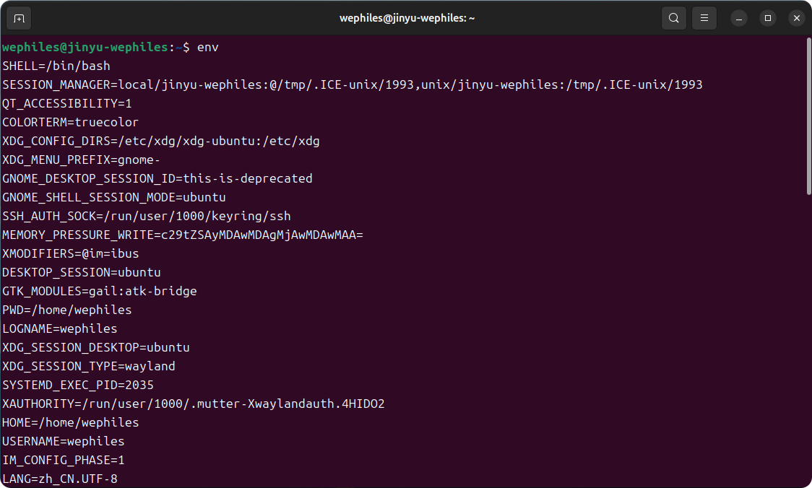

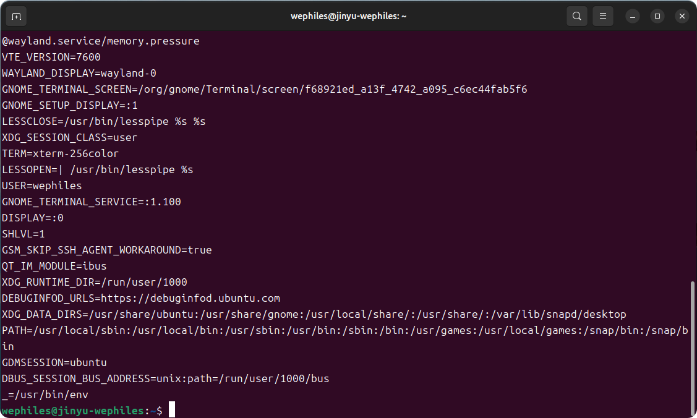

比如在图中，`HOME=/home/wephiles`：用户的`HOME`路径

`USER=wephiles`：当前的操作用户

`PWD`:当前工作路径

这些话环境变量用于辅助系统在运行的时候从环境变量中获取关键信息。

## 10.1.2 环境变量`PATH`

在前面提出的问题中，我们说无论当前工作目录是什么，都能执行`/usr/bin/cd`这个程序，这个就是借助环境变量中`PATH`这个值来做到的：

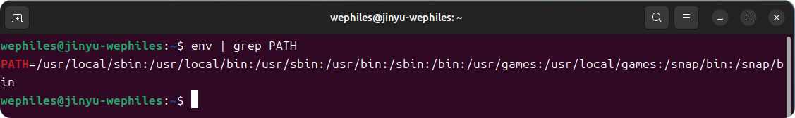

## 10.2 掌握符号`$`的应用

### 10.3.1 `$`

在`Linux`系统中，`$`符被用于取"变量"的值,

环境变量记录的信息，除了给操作系统自己使用外，如果我们想要取用，也可以使用

要想取得环境变量的值，可以通过语法`$环境变量名`来取得

比如：

`echo $PATH`

又或者：

`echo ${PATH}ABC` -- 当要和其他内容混合在一起输出的时候，可以通过`{}`来标注取得的变量是谁

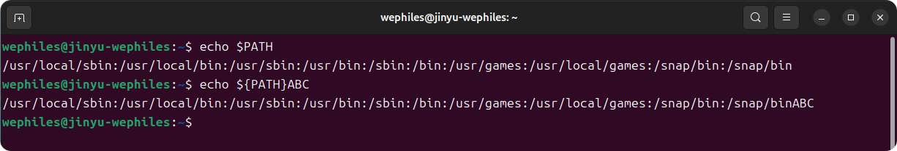

## 10.3 掌握在`Linux`中配置环境变量

`Linux`环境变量可以用户自行设置，其中分为：

- 临时设置，语法：`export 变量名=变量值`
  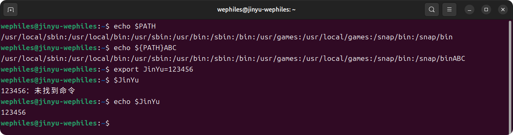

- 永久生效：

  - 针对当前用户生效，配置在当前用户的`~/bashrc`文件中
    

    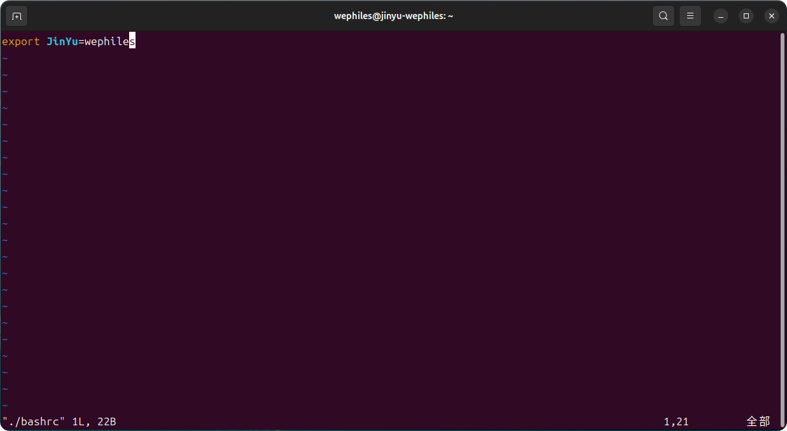

  - 针对所有用户生效，配置在系    统的`~/etc/profile`文件中

  - 并通过语法`source 配置文件`  -- 进行立即生效，或重新登陆

### 10.3.2 自定义环境变量`PATH`

环境变量`PATH`这个项目里面记录了执行系统命令的搜索路径

这些搜索路径我们也可以自行添加到`PATH`中去

测试：

- 在当前`HOME`目录下创建文件`myenv`，在文件夹内创建文件`mkhaha`
- 通过`vim`编辑器，在`mkhaha`文件中填入：echo 哈哈哈哈哈

完成上述操作后，随意切换工作目录，执行`mkhaha`命令，发现无法执行

- 修改`PATH`值
  - 临时修改`PATH`：`export PATH=$PATH:/home/wephiles/myenv`，再次执行`mkhaha`，到哪里都能执行了
  - 或将`export PATH=$PATH:/home/wephiles/myenv`填入用户环境变量文件或者系统环境变量文件中

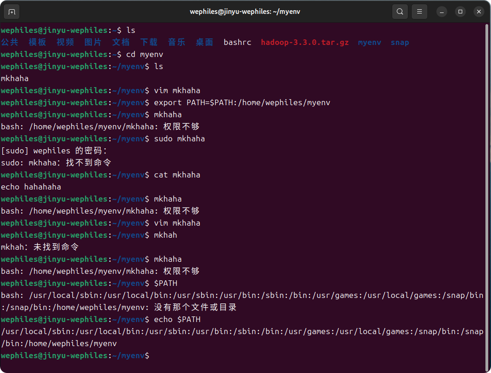


# 11 上传、下载

上传、下载

我们可以通过`finalshell`工具，方便的和虚拟机进行数据交换，

在`finalshell`软件的下方窗体中，提供了`Linux`的文件系统视图，可以方便的：

- 浏览文件系统，找到合适的文件，右键点击下载，即可传输到本地电脑
- 浏览文件系统，找到合适的目录，将本地电脑的文件拓展进入，即可方便的上传数据到`Linux`中

`rz、sz`

当然，除了通过`finalshell`下面的窗体，还可以通过`rz、sz`命令进行文件传输，

`rz、sz`需要安装，可以通过`apt install lrzsz`即可安装

- `rz`：通过`rz`进行上传，直接输入`rz`即可 `rz`
- `sz`：进行下载，语法：`sz 要下载的文件`，文件会自动下载到桌面的：`fsdownload`文件夹中

# 12 压缩、解压

## 12.1 压缩格式

市面上有很多压缩格式：

- `zip`：`linux、Windows、macOS`常用
- `7zip`：`Windows`常用
- `rar`：`Windows`常用
- `tar`：`linux、macOS`常用
- `gzip`：`linux、macOS`常用

在`Linux`系统中，今日要学习如何在`Linux`系统中操作`tar gzip zip`这三种格式的压缩格式

完成文件压缩和解压工作

## 12.2 使用`tar`命令压缩或者解压`tar/gzip`文件

### 12.2.1 `tar`命令

`linux`和`mac`系统常用有两种压缩格式，后缀分别是：

- `.tar`，称之为tarball，归档文件，即简单的将文件组装到一个`tar`文件中，并没有多大文件体积的减少，仅仅是简单的封装
- `.gz` 常见为`.tar.gz`，`gzip`格式压缩文件，即使用`gzip`压缩算法将文件压缩到一个文件内，可以极大的减少压缩后的体积

针对这两种格式，使用`tar`命令均可以进行压缩和解压缩操作

语法：`tar [-c -v -x -f -z -C] 参数1 参数2 ... 参数N`

- `-c` 创建压缩文件，用于压缩模式（`create`）
- `-v` 显示压缩，解压过程，用于查看进度(`vision`)
- `-x` 解压文件
- `-f` 要创建的文件 或者 要解压的文件，`-f`选项必须在所有选项中处于最后一个
- `-z` `gzip`模式，不使用`-z`就是普通的`tarball`格式
- `-C` 选择解压的目的地，用于解压模式

### 12.2.2 `tar`压缩命令组合

`tar`的常用组合为：

- `tar -cvf test.tar 1.txt 2.txt 3.txt` -- 将 `1.txt 2.txt 3.txt` 压缩到`test.tar`内
- `tar -zcvf test.tar.gz 1.txt 2.txt 3.txt` -- 将 `1.txt 2.txt 3.txt` 压缩到`test.tar.gz`内，并使用`gzip`模式

> [!Caution]
>
> - `-z`选项如果使用的话，一般处于选项第一个
> - `-f`选项，必须在选项最后一个

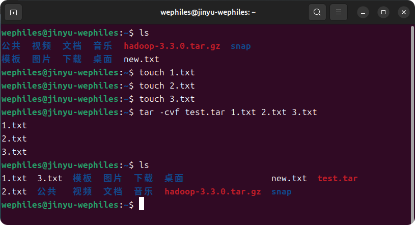


### 12.2.3 `tar`解压命令组合

常用的`tar`解压组合有：

- `tar -xvf test.tar` -- 解压文件`test.tar`，将文件解压到当前目录
  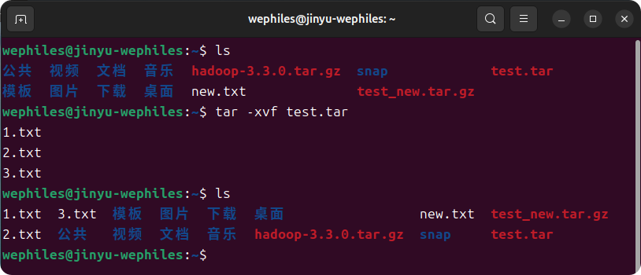

- `tar -xvf test.tar -C /home/wephiles` -- 解压文件`test.tar`，将文件解压到指定目录
  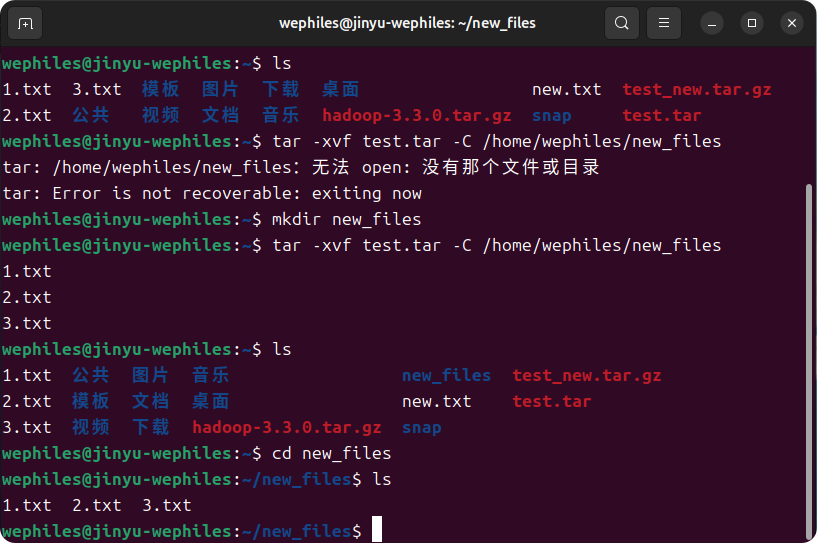

- `tar -zxvf test.tar -C /home/wephiles` -- 解压文件`test.tar`.gz，将文件解压到指定目录 以`gzip`模式解压

  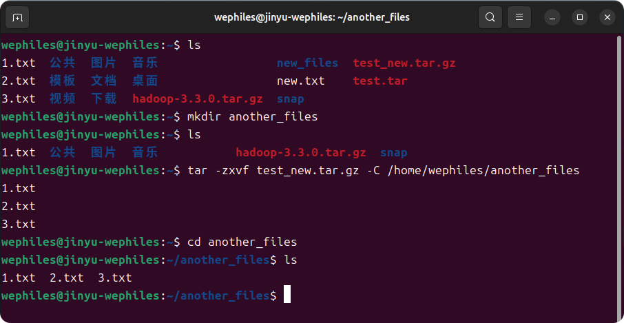

> [!Caution]
>
> - `-f`选项 -- 必须在选项组合的最后一项
> - `-z`选项 -- 建议在开头位置
> - `-C`需要单独使用，和其他解压所需的其它参数分开

## 12.3 使用`zip、unzip`命令压缩或解压`zip`文件

### 12.3.1 `zip`命令压缩文件

可以使用`zip`命令，压缩为`zip`压缩包

语法：`zip [-r] 参数1 参数2 参数3 ... 参数N`

- `-r`：被压缩的包含文件夹的时候，需要使用`-r`选项，和`rm、cp`等命令的`-r`效果一致

示例：

- `zip test.zip a.txt b.txt c.txt` -- 将`a.txt b.txt c.txt`文件压缩到`test.zip`文件内
- `zip -r test.zip test wephiles` -- 将`a.txt test wephiles`文件/文件夹压缩到`test.zip`文件内

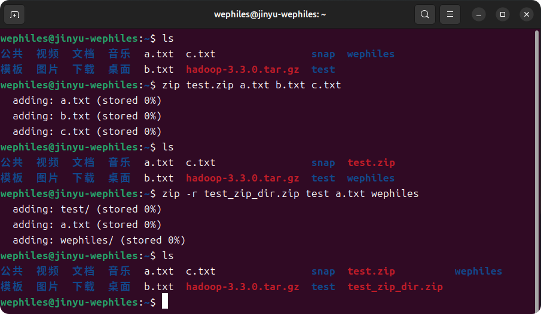

### 12.3.2 `zip`解压文件

使用`unzip`命令，可以方便的解压`zip`压缩包

语法：`unzip [-d] 参数`

- `-d`，指定要解压去的位置，同`tar`的`-C`选项
- 参数：被解压的`zip`压缩包文件

示例：

- `unzip test.zip`，将`test.zip`解压到当前目录
  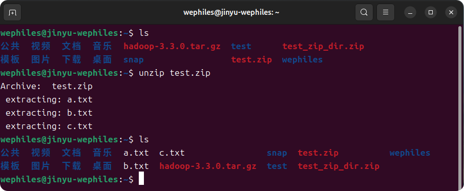
- `unzip test.zip -d /home/wephiles`，将`test.zip`解压到指定文件夹内
  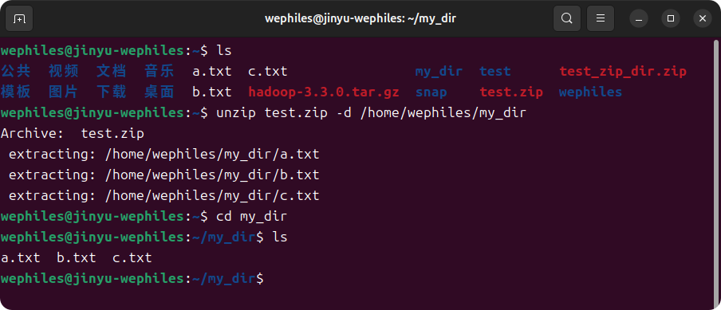

