[TOC]

# 1 `MySQL`数据库管理系统安装部署

两个版本：

- `MySQL5.7`
- `MySQL8.0`

## 1.1 `MySQL5.7`在`CentOS`上的安装

> 注意;安装数据库需要`root`权限

### 1.1.1 安装

1. 配置`yum`仓库
   ```bash
   # 更新密钥
   rpm --import https://repo.mysql.com/RPM-GPG-KEY-mysql-2022
   
   # 安装MySQL yum库
   rpm -Uvh https://repo.mysql.com//mysql57-community-release-el7-7.noarch.rpm
   ```

   > 由于`MySQL`并不在`CentOS`的官方仓库中,所以通过上述`rpm`命令:
   >
   > - 导入`MySQL`仓库的密钥
   > - 配置`MySQL`的`yum`仓库

2. 使用`yum`安装`MySQL`
   ```bash
   # yum安装MySQL
   yum -y install mysql-community-server
   ```

3. 安装完成之后,启动`MySQL`并配置开机自启动
   ```bash
   systemctl start mysqld
   systemctl enable mysqld
   ```

   > `MySQL`安装完成后,会自动配置为名称叫做`mysqld`的服务可以被`systemctl`所管理

4. 检查`MySQL`的运行状态:
   ```bash
   systemctl status mysqld
   ```

### 1.1.2 配置

主要配置管理员用户`root`密码以及允许远程登录的权限.

1. 获取`MySQL`的初始密码
   ```bash
   # grep命令,在/var/log/mysqld.log文件中,过滤temporary password关键字,得到初始密码
   grep 'temporary password' /var/log/mysqld.log
   ```

2. 登录`MySQL`数据库系统
   ```bash
   # 执行
   mysql -u root -p
   # 解释
   # -u 要登陆的用户名,MySQL数据库的管理员和Linux一样,都是root
   # -p 表示要用密码登录
   
   # 执行完毕后输入刚刚得到的初始密码,即可进入MySQL数据库
   ```

3. 修改`root`用户密码
   ```bash
   # 在MySQL控制台执行
   ALTER USER 'root'@'localhost' IDENTIFIED BY '新的密码'; -- 密码需要符合:大于8位,有大写字母,有特殊符号,布恩那个是连续的简单的语句比如132/abc
   ```

4. 【扩展】配置`root`的简单密码

   > 我们可以给`root`设置简单密码,比如`123456`,
   >
   > 请注意,此配置仅仅适用于测试环境或者学习环境的`MySQL`,如果是正式使用,请勿设置简单密码

   ```bash
   # 如果你要设置简单密码,需要降低MySQL的密码安全级别
   set global validate_password_policy=LOW;  # 安全级别为LOW
   set global validate_password_length=4;  # 密码长度最低四位即可
   
   # 然后就可以用简单密码了(课程中为了简单使用简单密码,为了方便,但是生产中不要这样)
   ALTER USER 'root'@'localhost' IDENTIFIED BY '简单密码';
   ```

5. 【扩展】配置`root`运行远程登录

   > 默认情况下,`root`用户是不运行远程登录的,只允许在`MySQL`所在的Linux服务器扽附录`MySQL`服务器
   >
   > 请注意,允许`root`用户远程登录会带来安全风险

   ```bash
   # 授权root远程登陆
   grant all privileges on *.* to root@'IP地址' identified by '密码' with grant option;
   # IP地址即允许登录的IP地址,也可以填写%,表示允许任何地址
   # 密码是给远程登录设置独立密码,和本地登陆的密码可以不同
   
   # 刷新权限,生效
   flush privileges;
   ```

6. 退出`MySQL`控制台页面
   ```bash
   # 退出命令
   exit
   
   # 或者通过快捷键 ctrl + d
   ```

7. 检查端口

   `MySQL`默认绑定了`3306`端口,可以通过端口占用检查`MySQL`的网路端口

   ```bash
   netstat -anp | grep 3306
   ```

8. 安装已经全部完成,记得保存好`root`登录密码.

## 1.2 `MySQL8.0`在`CentOS`上的安装

> 注意:安装需要`root`权限

### 1.2.1 安装

1. 配置`yum`仓库

   ```bash
   rpm --import https://repo.mysql.com/RPM-GPG-KEY-mysql-2022
   rpm -Uvh https://dev.mysql.com/get/mysql80-community-release-el7-2.noarch.rpm
   ```

2. 使用`yum`安装`MySQL`

   ```bash
   yum -y install mysql-community-server
   ```

3. 安装完成后,启动`MySQL`并配置开机自启动

   ```bash
   systemctl start mysqld
   systemctl enable mysqld
   ```

4. 检查`MySQL`的运行状态

   ```bash
   systemctl status mysqld
   ```

### 1.2.2 配置

> 主要修改`root`密码和允许`root`远程登陆

1. 获取`MySQL`初始密码

   ```bash
   grep 'temporary password' /var/log/mysqld.log
   ```

2. 登录`MySQL`数据库

   ```bash
   mysql -u root -p
   ```

3. 修改`root`密码

   ```bash
   ALTER USER 'root'@'localhost' IDENTIFIED BY '新的密码'; -- 密码需要符合:大于8位,有大写字母,有特殊符号,布恩那个是连续的简单的语句比如132/abc
   ```

4. 【扩展】配置`root`简单密码

   ```bash
   set global validate_password_policy=0;  # 安全级别为低
   set global validate_password_length=4;  # 密码长度最低四位即可
   
   # 然后就可以用简单密码了(课程中为了简单使用简单密码,为了方便,但是生产中不要这样)
   ALTER USER 'root'@'localhost' IDENTIFIED BY '简单密码';
   ```

5. 允许`root`远程登录，并设置远程登录密码

   ```bash
   # 第一次配置
   create user 'root'@'%' IDENTIFIED WITH mysql_native_password BY '密码'; -- 密码需要符合:大于8位,有大写字母,有特殊符号,布恩那个是连续的简单的语句比如132/abc
   
   # 非第一次配置 后续需要修改
   ALTER USER 'root'@'%' IDENTIFIED WITH mysql_native_passwordBY '密码';
   ```

6. 退出`MySQL`控制台页面

   ```bash
   # 同CentOS上MySQL5.7退出方式
   ```

## 1.3 `MySQL5.7`在`Ubuntu`上的安装

> 课程中配置的`WSL`环境是最新的`Ubuntu22.04`版本,这个版本的软件商店内置的`MySQL`是`8.0`版本
>
> 所以我们需要额外的步骤才可以安装`5.7`版本的`MySQL`

> 安装需要root权限

### 1.3.1 安装

1. 下载`apt`仓库文件

   ```bash
   # 下载apt仓库的安装包 Ubuntu是.deb文件
   wget https://dev.mysql.com/get/mysql-apt-config_0.8.12-1_all.deb
   ```

2. 配置`apt`仓库

   ```bash
   # 使用dpkg命令安装仓库
   dpkg -i mysql-apt-config_0.8.12-1_all.deb
   ```

   在弹出的框中选择:`ubuntu bionic`(`Ubuntu18.04`系统的代号是`bionic`,选择`18.04`的版本来进行安装)

   选择第一个`MySQL server`,回车再选择`MySQL5.7`,然后再选第一个`MySQL server`

3. 更新`apt`仓库的信息

   ```bash
   # 导入仓库的密钥信息
   apt -key adv --keyserver keyserver.ubuntu.com --recv-keys 467B942D3A79BD29
   ```

4. 检查是否成功配置`MySQL5.7`的仓库

   ```bash
   apt-cache policy mysql-server
   ```

   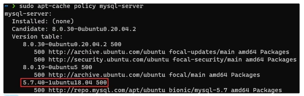

   看到类似上图的信息就说明配置成功了.

5. 安装`MySQL5.7`

   ```bash
   apt install -f -y mysql-client=5.7* mysql-community-server=5.7*
   ```

   弹出框中输入root密码并选择OK,密码任意

   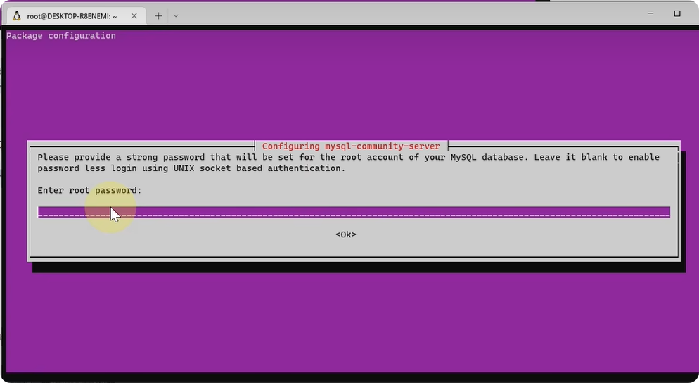

6. 启动`MySQL`

   ```bash
   /etc/init.d/mysql startm  # 启动
   /etc/init.d/mysql stop  # 停止
   /etc/init.d/mysql status  # 查看状态
   ```

7. 对`MySQL`进行初始化

   ```bash
   # 执行如下命令:此命令是MySQL安装后自带的配置程序
   mysql_secure_installation
   # 可以通过which命令查看这个自带程序所在的位置
   which mysql_secure_installation
   ```

   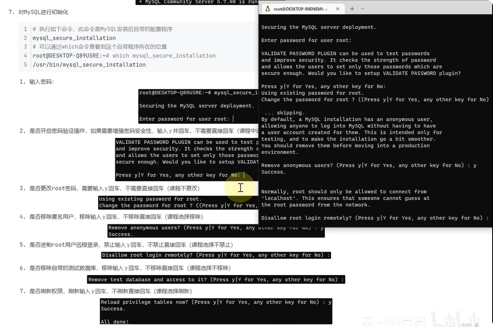

   1. 输入密码:

      

      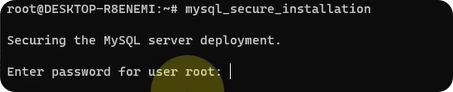

   2. 是否开启密码验证插件,如果需要增强安全性,选`yes`,否则选`no`

   3. 是否更改`root`密码,输入`y`回车,不更改直接回车

   4. 是否移除匿名用户,移除输入`y`回车,不移除直接回车

   5. 是否刷新权限,刷新输入`y`回车,不刷新直接回车

8. 登录`MySQL`

   ```bash
   mysql -u root -p
   ```

   至此,安装成功.

## 1.4 `MySQL8.0`在`Ubuntu`上的安装

> 课程中配置的`WSL`环境是最新的`Ubuntu22.04`版本,这个版本的软件商店内置的`MySQL`版本是`8.0`版本的
>
> 所以直接通过`apt`安装即可

> 注意,课程是以`WSL`获取`Ubuntu`环境的
>
> 吴国通过`VMware`虚拟机方式获取的`Ubuntu`操作系统环境,操作步骤不用担心,和课程中使用`WSL`是一模一样的

> 安装需要`root`权限

### 1.4.1 安装

1. 如果已经安装`MySQL5.7`版本,需要卸载先

   ```bash
   # 卸载MySQL5.7版本
   apt remove -y mysql-client=5.7* mysql-community-server=5.7*
   
   # 卸载5.7的仓库信息
   dpkg -l | grep mysql | awk '{print $2}' | xargs dpkg -P
   ```

2. 更新`apt`仓库信息

   ```bash
   apt update
   ```

3. 安装`MySQL`

   ```bash
   apt install -y mysql-server
   ```

4. 启动`MySQL`

   ```bash
   /etc/init.d/mysql start  # 启动
   /etc/init.d/mysql stop  # 停止
   /etc/init.d/mysql status  # 查看状态
   ```

5. 登录`MySQL`设置密码 -- 需要`root`权限

   ```bash
   mysql
   ```

6. 设置密码

   ```bash
   ALTER USER 'root'@'localhost' IDENTIFIED WITH mysql_native_password BY '密码';
   ```

7. 退出控制台

   ```bash
   exit
   ```

8. 对`MySQL`初始化

   ```bash
   # 执行如下命令,此命令是MySQL自动安装后自带的配置程序
   mysql_secure_installation
   # 可以通过which命令查看这个自带程序所在的位置
   which mysql_secure_installation
   ```

   1. 输入密码:

      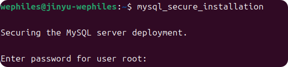

   2. 是否开启密码验证插件,如果需要增强安全性,选`yes`,否则选`no`

      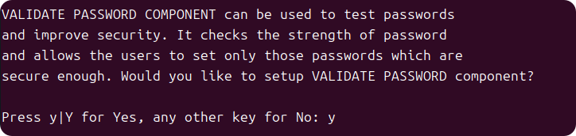

      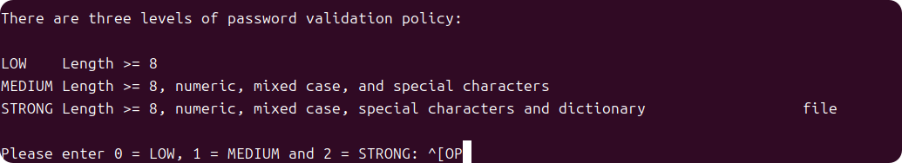

   3. 是否更改`root`密码,输入`y`回车,不更改直接回车

      

   4. 是否移除匿名用户,移除输入`y`回车,不移除直接回车

      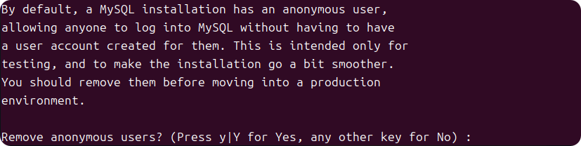

   5. 是否限制root远程登陆?禁止输入y回车,不禁止直接回车

      

   6. 是否移除自带的数据库,移除输入y,不移除按回车

      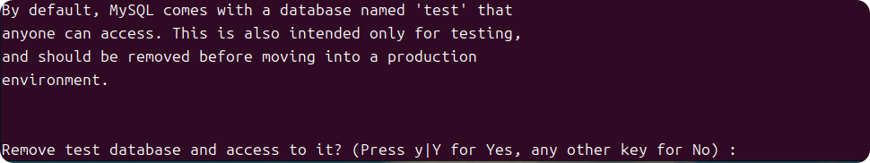

   7. 是否刷新权限,刷新输入`y`回车,不刷新直接回车

      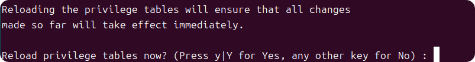

   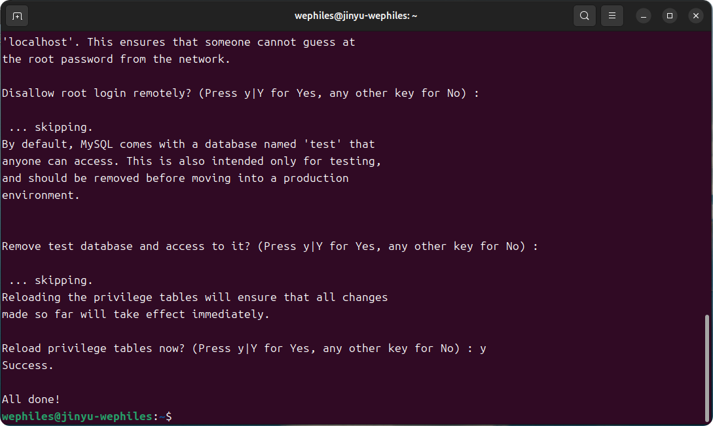

9. 重新登录`MySQL`,用更改后的密码

   ```bash
   mysql -u root -p
   ```

   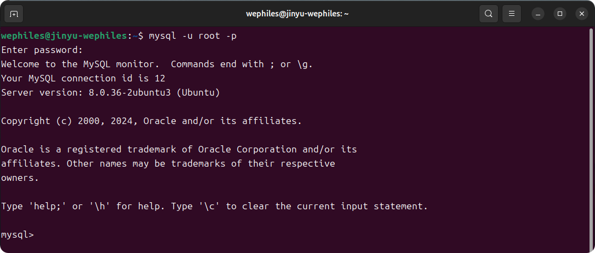


