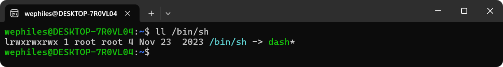
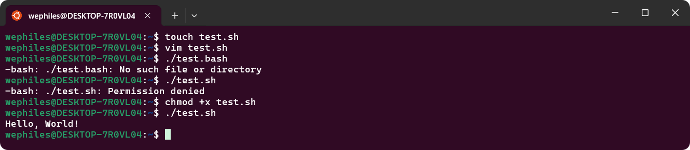
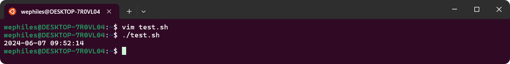
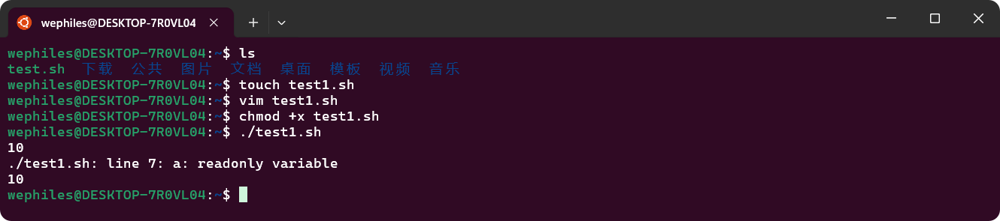

[TOC]

# 1 `shell`基础

## 1.1 什么是`shell`

翻译成中文，就是外壳，

是一个用`C`语言编写的程序，是用户操作`Linux`的桥梁，即是一种命令语言，又是一种程序设计语言

`shell`是一种应用车程序，这个应用提供了一个界面，用户通过这个页面访问`Linux`内核

## 1.2 什么是脚本

脚本简单的说就是一条条的文字命令，这些文字命令式可以看到的

常见的脚本：`JavaScript ` `VBScript ` `PHP ` `Python `...

## 1.3 学习`shell`的用处

程序开发效率非常高 依赖于强大的命令可以迅速地完成开发任务.批处理

语法简单 代码简单易学 写起来轻松 

## 1.4 常见的`shell`种类

在`Linux`中有很多类型的`shell`，不同的`shell`设计不同的功能，`shell`还决定了脚本中函数的语法，`linux`中默认的`shell`是`/bin/bash`，流行的`shell`有`ash` `bash` `ksh` `csh` `zsh` `Shell`等

### 1.4.1 `csh`

`C shell`使用`类C`语法，`csh`是具有`C`语言风格的一种`shell`，其内部命令有命令`52`个，较为庞大，目前用的并不多，被`/bin/bash`取代

### 1.4.2 `ksh`

...

### 1.4.3 `tcsh`

...

### 1.4.4 `sh`

...

### 1.4.5 `zsh`

...

### 1.4.6 `nologin`

...

### 1.4.7 `bash`

大多数`Linux`系统默认使用的`shell`

# 2 `shell`入门

## 2.1 编写规范

### 2.1.1 代码规范

```bash
#!/bin/bash 
shell相关指令
```

### 2.1.2 文件命令规范

```bash
文件名.sh
```

## 2.2 使用流程

1. 创建一个`shell`文件  -- `touch` / `vim`

2. 编写`shell`代码

3. 执行`shell`脚本

   ```bash
   这个脚本必须要有执行权限
   ```

案例：创建`test.sh`，实现第一个`shell`脚本程序，输出`hello world`

```bash
touch ./test.sh

# 编辑，在文件里面输入
#!/bin/bash
echo "Hello, world!"  # 注意，如果输出的东西包含字母和符号 需要用引号包围起来 只有数字，那么可以包可以不包
# 分号可加可不加

# 修改权限 使可执行
chomod 777 test.sh
# 或者chmod +x test.sh

# 执行脚本 如果没加入到环境变量 那么就不要直接写test.sh
./test.sh
```

案例2：使用`root`账户创建并执行`test2.sh`，实现创建一个`shelltest`用户，并在其家目录里面新建文件`try.html`

````bash
su - root

touch test2.sh

vim test2.sh
```vim

#!/bin/bash
useradd -m shelltest
touch /home/shelltest/try.html

```

chmod +x test2.sh
./test2.sh
````

脚本执行的另外一种方式：

`/bin/bash 脚本路径`

`/bin/bash test2.sh`	

注意：`/bin/sh`也可以执行可执行文件，因为这是个软连接。



> [!Note]
>
> `shell`脚本分为简单的写法（简单命令的堆积）和复杂的写法（程序的设计）。

# 3 `shell`进阶

## 3.1 **变量

### 3.1.1 变量的含义

什么是量？ -- 量就是数据

什么是变量？ -- 数据可以发生改变就是变量 -- 在一个脚本周期内其值会发生改变的量就是变量。

什么叫一个脚本周期？ -- 一个脚本周期为可以简单的理解为当前的`shell`文件

变量是shell中不可或缺的一部分，也是最基础、最重要的组成部分。

### 3.1.2 变量的定义和使用

> [!Caution]
>
> `shell`中单引号和双引号不一样，双引号包围的变量可以被识别变量，而单引号包围的只会输出字符串。
>
> 此外，双引号能实现转义，但是单引号不行。

** 先定义后使用

定义：

```bash
class_name = "computer"
```

使用：

```bash
echo $class_name
```

- 变量是由两部分组成的
  - 变量名
  - 值
- 变量名的规范
  - 变量名后面的等号左右不能有空格
  - 命名中只能使用英文字母、数字和下划线，收首个字符不能以数字开头
  - 中间不能有空格可以使用下划线`_`
  - 不能使用`bash`里面的关键字（可用help命令查看关键字）

案例1：使用变量改写第一个脚本 -- 输出`hello world`

```bash
#!/bin/bash
class_name="Hello, World!"
echo $class_name
```



案例2：定义一个变量，输出当前时间，要求格式为 `年-月-日 时:分:秒`

```bash
#!/bin/bash
time_=`date+"%F %T"`
echo $time_
```



注意：需要在脚本中执行一些指令的时候，并且要将执行结果赋值给变量的时候，就需要加反引号 `

### 3.1.3 只读变量(了解)

语法：`readonly 变量名`

案例：定义变量`a`，并且其值为10，随后设置其为只读变量，再去尝试重新赋值

```bash
#!/bin/bash

a=10
readonly a
echo $a

a=100
echo $a
```



### 3.1.4 接受用户输入


