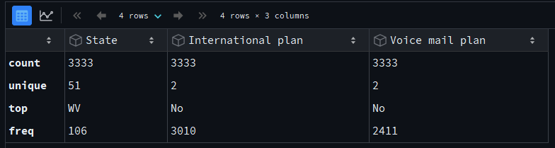
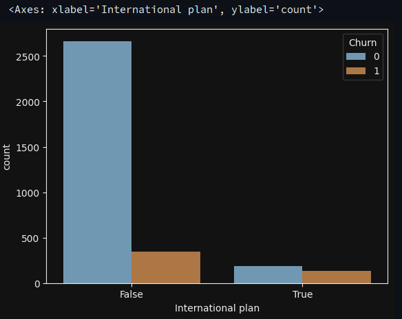
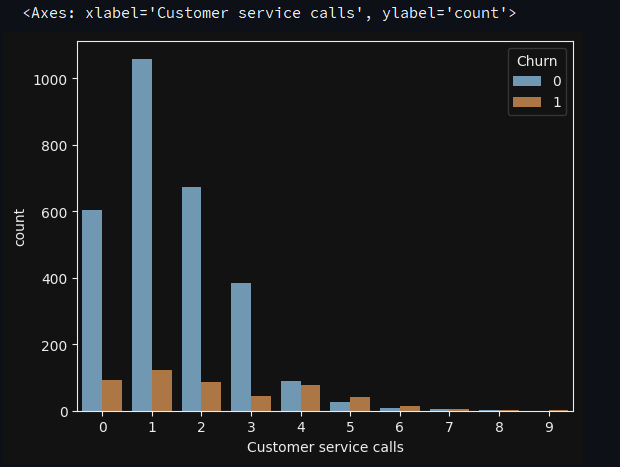
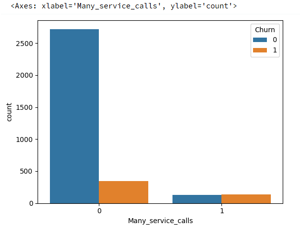
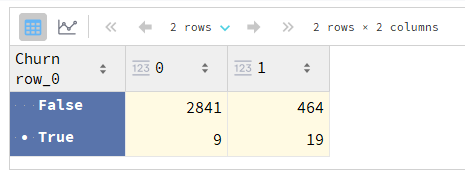
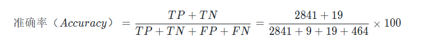

# 1、 pandas的主要用法

Pandas 是基于 NumPy 的一种工具，提供了大量数据探索的方法。Pandas 可以使用类似 SQL 的方式对 .csv、.tsv、.xlsx 等格式的数据进行处理分析。

Pandas 主要使用的数据结构是 Series 和 DataFrame 类。下面简要介绍下这两类：

-   Series 是一种类似于一维数组的对象，它由一组数据（各种 NumPy 数据类型）及一组与之相关的数据标签（即索引）组成。
-   DataFrame 是一个二维数据结构，即一张表格，其中每列数据的类型相同。你可以把它看成由 Series 实例构成的字典。

## 1.1 导入需要的第三方库

```python
import pandas as pd
import numpy as np
import warnings
```

```python
# 在 Python 程序中，某些操作或条件可能会触发警告，而不是抛出异常。例如，使用废弃的 API 或潜在的性能问题。warnings 模块提供了一种机制来控制这些警告的显示行为。filterwarnings() 允许你定义对不同类别的警告采取什么措施。

# 'ignore' 作为参数传递时，会告诉 Python 忽略所有符合条件的警告，从而不显示它们。常见用法是忽略不重要的警告，以保持输出简洁。
warnings.filterwarnings('ignore')
```

## 1.2 `read_csv`方法

通过 `read_csv()` 方法读取数据，然后使用 `head()` 方法查看前 5 行数据。head方法传入的参数代表输出几条数据。

```python
df = pd.read_csv('https://labfile.oss.aliyuncs.com/courses/1283/telecom_churn.csv')
df.head()
```

## 1.3 查看df的数据库特征 `df.shape`

```python
df.shape  #(3333, 20)
```

从上述结果来看，我们一共有3333行，20列

## 1.4 打印列名 `df.columns`

```python
df.columns
# Index(['State', 'Account length', 'Area code', 'International plan',
#      'Voice mail plan', 'Number vmail messages', 'Total day minutes',
#      'Total day calls', 'Total day charge', 'Total eve minutes',
#      'Total eve calls', 'Total eve charge', 'Total night minutes',
#      'Total night calls', 'Total night charge', 'Total intl minutes',
#      'Total intl calls', 'Total intl charge', 'Customer service calls',
#      'Churn'],
#     dtype='object')
```

## 1.5 `df.info()` 打印总体信息

```python
df.info()
# 10  Total eve calls         3333 non-null   int64  
# 11  Total eve charge        3333 non-null   float64
# 12  Total night minutes     3333 non-null   float64
# 13  Total night calls       3333 non-null   int64  
# 14  Total night charge      3333 non-null   float64
# 15  Total intl minutes      3333 non-null   float64
# 16  Total intl calls        3333 non-null   int64  
# 17  Total intl charge       3333 non-null   float64
# 18  Customer service calls  3333 non-null   int64  
# 19  Churn                   3333 non-null   bool   
# dtypes: bool(1), float64(8), int64(8), object(3)
# memory usage: 498.1+ KB
```

`bool`、`int64`、`float64` 和 `object` 是该数据库特征的数据类型。这一方法同时也会显示是否有缺失值，上述结果表明在该数据集中不存在缺失值，因为每列都包含 3333 个观测，和我们之前使用 `shape` 方法得到的数字是一致的。

## 1.6 `astype()`

`astype()` 方法可以更改列的类型，下列公式将 `Churn` 离网率 特征修改为 `int64` 类型。

```python
df['Churn'] = df['Churn'].astype('int64')
```

## 1.7 `describe()`

`describe()` 方法可以显示数值特征（`int64` 和 `float64`）的基本统计学特性，如未缺失值的数值、均值、标准差、范围、四分位数等。

```python
df.describe()
```

通过 `include `参数显式指定包含的数据类型，可以查看非数值特征的统计数据。

```python
df.describe(include=['object', 'bool'])
```



## 1.8 `value_counts()`

`value_counts()` 方法可以查看类别（类型为 `object `）和布尔值（类型为 `bool `）特征。让我们看下 `Churn `离网率 的分布。

```python
df['Churn'].value_counts()
```

调用 `value_counts()` 函数时，加上 `normalize=True` 参数可以显示比例。

```python
df['Churn'].value_counts(normalize=True)
```


# 2、 排序

DataFrame 可以根据某个变量的值（也就是列）排序。比如，根据每日消费额排序（设置 ascending=False 倒序排列）。

```python
df.sort_values(by='Total day charge', ascending=False)
```

此外，还可以根据多个列的数值排序。下面函数实现的功能为：先按 Churn 离网率 升序排列，再按 Total day charge 每日总话费 降序排列，优先级 Churn > Tatal day charge。

```python
df.sort_values(by=['Churn', 'Total day charge'], ascending=[True, False])
```

# 3、 索引、获取数据

## 3.1 使用 `DataFrame['Name']` 可以得到一个单独的列。

```python
df['Churn'].head()
```

使用条件：

布尔值索引同样很方便，语法是 `df[P(df['Name'])]`，P 是在检查 Name 列每个元素时所使用的逻辑条件。这一索引的输出是 DataFrame 的 Name 列中满足 P 条件的行。

```python
df[df['Churn']  == 1].head()
```

```python
df[df['Churn']  == 1]['Total day minutes'].mean()
```

```python
df[ (df['Churn'] == 0) & (df['International plan'] == 'No')].head()
```

```python
df[(df['Churn'] == 0) & (df['International plan'] == 'No')][
    'Total intl minutes'].max()
```

DataFrame 可以通过列名、行名、行号进行索引。`loc` 方法为通过名称索引，`iloc` 方法为通过数字索引。

## 3.2 通过 `loc` 方法输出 0 至 5 行、State 州 至 Area code 区号 的数据。

```python
df.loc[0:5, 'State':'Area code']
```

## 3.3 通过 `iloc` 方法输出前 5 行的前 3 列数据

和典型的 Python 切片一样，不含最大值。

```python
df.iloc[0:5, 0:3]
```

## 3.4 `df[:1]` 和 `df[-1:]` 可以得到 DataFrame 的首行和末行。

```python
df[:1]
```

```python
df[-1:]
```

# 4、 应用函数到单元格、列、行

## 4.1 `apply()`

通过 `apply()` 方法应用函数 `max` 至每一列，即输出每列的最大值。

```python
df.apply(np.max)
```

`apply()` 方法也可以应用函数至每一行，指定 axis=1 即可。在这种情况下，使用 `lambda` 函数十分方便。比如，下面函数选中了所有以 W 开头的州。

```python
df[df['State'].apply(lambda state: state[0] == 'W')].head()
```

## 4.2 `map()`

`map()` 方法可以通过一个 `{old_value:new_value}` 形式的字典替换某一列中的值。

```python
d = {'No': False, 'Yes': True}
df['International plan'] = df['International plan'].map(d)
df.head()
```

## 4.3 `replace()`

当然，使用 `repalce()` 方法一样可以达到替换的目的。

```python
df = df.replace('Voice mail plan': d)
```

# 5、 分组 `groupby()`

Pandas 下分组数据的一般形式为：

```python
df.groupby(by=grouping_columns)[columns_to_show].function()
```

对上述函数的解释：

-   `groupby()` 方法根据 `grouping_columns` 的值进行分组。
-   接着，选中感兴趣的列（`columns_to_show`）。若不包括这一项，那么就会选中所有非 `groupby `列（即除 `grouping_colums `外的所有列）。
-   最后，应用一个或多个函数（`function`）。

```python
df.groupby(by='Churn').describe()
```

```python
df.groupby(by='Churn')[['Total day minutes', 'Total eve minutes', 'Total night minutes']].describe(percentiles=[])
```

```python
df.groupby(by='Churn')[
    ['Total day minutes', 'Total eve minutes', 'Total night minutes']].agg(
    [np.max, np.min, np.mean, np.std])
```

# 6、 汇总表

## 6.1 数据透视表

Pandas 中的透视表定义如下：

>   透视表(Pivot Table)是电子表格程序和其他数据探索软件中一种常见的数据汇总工具。它根据一个或多个键对数据进行聚合，并根据行和列上的分组将数据分配到各个矩形区域中。

通过 `pivot_table()` 方法可以建立透视表，其参数如下：

-   values 表示需要计算的统计数据的变量列表
-   index 表示分组数据的变量列表
-   aggfunc 表示需要计算哪些统计数据，例如，总和、均值、最大值、最小值等。

```python
df.pivot_table(
    values=['Total day calls', 'Total eve calls', 'Total night calls'],
    index=['Area code', 'State'], aggfunc='mean')
```

```python
df.pivot_table(
    values=['Total day calls', 'Total eve calls', 'Total night calls'],
    index=['Area code', 'State'], aggfunc=np.mean)
```

## 6.2 交叉表

交叉表（Cross Tabulation）是一种用于计算分组频率的特殊透视表，在 Pandas 中一般使用 `crosstab()` 方法构建交叉表。

构建一个交叉表查看样本的 Churn 离网率 和 International plan 国际套餐 的分布情况。

```python
pd.crosstab(df['Churn'], df['International plan'])
```


```python
pd.crosstab(df['Churn'], df['Voice mail plan'], normalize=True)
```


# 7、 增减 DataFrame 的行列

## 7.1  `insert()`

在 DataFrame 中新增列有很多方法，比如，使用 `insert()`方法添加列，为所有用户计算总的 Total calls 电话量。

```python
total_calls = df['Total day calls'] + df['Total eve calls'] + \
    df['Total night calls'] + df['Total intl calls']
# loc 参数是插入 Series 对象后选择的列数
# 设置为 len(df.columns)以便将计算后的 Total calls 粘贴到最后一列
df.insert(loc=len(df.columns), column='Total calls', value=total_calls)

df.head()
```

## 7.2 直接在后面加，不创建实例

```python
df['Total charge'] = df['Total day charge'] + df['Total eve charge'] + \
    df['Total night charge'] + df['Total intl charge']
df.head()
```

## 7.3 使用 `drop()` 方法删除列和行。

```python
# 移除先前创捷的列
df.drop(['Total charge', 'Total calls'], axis=1, inplace=True)
# 删除行
df.drop([1, 2]).head()
```

对上述代码的部分解释：

-   将相应的索引 `['Total charge', 'Total calls']` 和 `axis` 参数（1 表示删除列，0 表示删除行，默认值为 0）传给 `drop`。
-   `inplace` 参数表示是否修改原始 DataFrame （False 表示不修改现有 DataFrame，返回一个新 DataFrame，True 表示修改当前 DataFrame）。

# 8、 预测离网率

首先，通过上面介绍的 `crosstab()` 方法构建一个交叉表来查看 International plan 国际套餐 变量和 Churn 离网率 的相关性，同时使用 `countplot()` 方法构建计数直方图来可视化结果。

```python
# 加载模块，配置绘图
import matplotlib.pyplot as plt
import seaborn as sns
```

```python
sns.countplot(x='International plan', hue='Churn', data=df)
```

上述代码运行成功后，展示的图片如下所示：



上图表明，开通了国际套餐的用户的离网率要高很多，这是一个很有趣的观测结果。也许，国际电话高昂的话费让客户很不满意。

同理，查看 Customer service calls 客服呼叫 变量与 Chunrn 离网率 的相关性，并可视化结果。

```python
pd.crosstab(df['Churn'], df['Customer service calls'], margins=True)
```

```python
sns.countplot(x='Customer service calls', hue='Churn', data=df)
```



上图表明，在客服呼叫 4 次之后，客户的离网率显著下降。

为了更好的突出 Customer service call 客服呼叫 和 Churn 离网率 的关系，可以给 DataFrame 添加一个二元属性 Many_service_calls，即客户呼叫超过 3 次（Customer service calls > 3）。看下它与离网率的相关性，并可视化结果。

```python
df['Many_service_calls'] = (df['Customer service calls'] > 3).astype('int')
pd.crosstab(df['Many_service_calls'], df['Churn'], margins=True)
```

```python
sns.countplot(x='Many_service_calls', hue='Churn', data=df)
```



现在我们可以创建另一张交叉表，将 Churn 离网率 与 International plan 国际套餐 及新创建的 Many_service_calls 多次客服呼叫 关联起来。

```python
pd.crosstab(df['Many_service_calls'] & df['International plan'], df['Churn'])
```



上表表明，在客服呼叫次数超过 3 次并且已办理 International Plan 国际套餐 的情况下，预测一名客户不忠诚的准确率（Accuracy）可以达到 85.8％，计算公式如下：



其中，TP 表示将 True 预测为 True 的数量，TN 表示将 Flase 预测为 Flase 的数量，FP 表示将 Flase 预测为 True 的数量，FN 表示将 True 预测为 Flase 的数量。

复习一下本次实验的内容：

-   样本中忠实客户的份额为 85.5%。这意味着最简单的预测「忠实客户」的模型有 85.5% 的概率猜对。也就是说，后续模型的准确率（Accuracy）不应该比这个数字少，并且很有希望显著高于这个数字。
-   基于一个简单的「（客服呼叫次数 > 3） & （国际套餐 = True） => Churn = 1, else Churn = 0」规则的预测模型，可以得到 85.8% 的准确率。以后我们将讨论决策树，看看如何仅仅基于输入数据自动找出类似的规则，而不需要我们手工设定。我们没有应用机器学习方法就得到了两个准确率（85.5% 和 85.8%），它们可作为后续其他模型的基线。如果经过大量的努力，我们仅将准确率提高了 0.5%，那么我们努力的方向可能出现了偏差，因为仅仅使用一个包含两个限制规则的简单模型就已提升了 0.3% 的准确率。
-   在训练复杂模型之前，建议预处理一下数据，绘制一些图表，做一些简单的假设。此外，在实际任务上应用机器学习时，通常从简单的方案开始，接着尝试更复杂的方案。

# 9、 第一章练习

本次挑战中，你需要运用 Pandas 探索数据，并回答有关 [ *Adult 数据集*](https://archive.ics.uci.edu/ml/datasets/Adult) 的几个问题。Adult 数据集是一个关于人口收入普查的数据集，其包含多个特征，目标值为类别类型。

首先，我们加载并预览该数据集。

```python
import warnings
import numpy as np
import pandas as pd
import seaborn as sns
import matplotlib.pyplot as plt
%matplotlib inline
warnings.filterwarnings('ignore')
data = pd.read_csv(
    'https://labfile.oss.aliyuncs.com/courses/1283/adult.data.csv')
data.head()
```

DataFrame 前面的列均为特征，最后的 `salary` 为目标值。接下来，你需要自行补充必要的代码来回答相应的挑战问题。

------

 *问题：*数据集中有多少男性和女性？

```python

```

 *问题：*数据集中女性的平均年龄是多少？

```python

```

 *问题：*数据集中德国公民的比例是多少？

```python

```

 *问题：*年收入超过 50K 和低于 50K 人群年龄的平均值和标准差是多少？

```python

```

 *问题：*年收入超过 50K 的人群是否都接受过高中以上教育？

```python

```

 *问题：*使用 `groupby` 和 `describe` 统计不同种族和性别人群的年龄分布数据。

```python

```

 *问题：*统计男性高收入人群中已婚和未婚（包含离婚和分居）人群各自所占数量。

```python

```

 *问题：*统计数据集中最长周工作小时数及对应的人数，并计算该群体中收入超过 50K 的比例。

```python

```

 *问题：*计算各国超过和低于 50K 人群各自的平均周工作时长。

```

```


