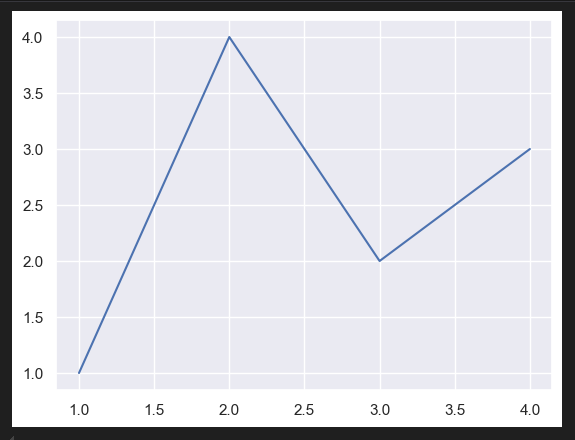
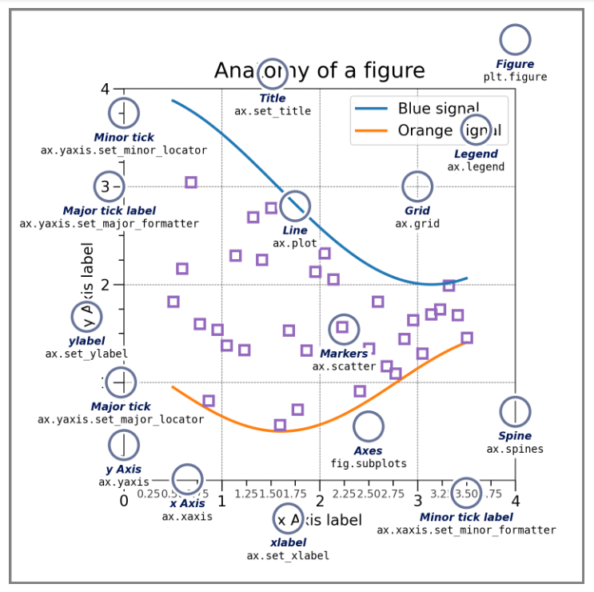

<h1 style="text-align: center;">快速入门</h1>

首先需要导入所需要的库：

```python
import matplotlib.pyplot as plt
import numpy as np
```

# 1、 快速开始

## 1.1 简单示例

Matplotlib 在图形（例如，窗口、Jupyter 小部件等）上绘制数据，每个图形可以包含一个或多个轴，一个可以用 xy 坐标（或极坐标中的 theta-r，3D 图中的 xy-z 等）指定点的区域。创建带有 Axes 的 Figure 的最简单方法是使用 pyplot.subplots。然后，我们可以使用 Axes.plot 在 Axes 上绘制一些数据，并显示图形.

eg:

```python
fig, ax = plt.subplots()  # 创建一个包含单个坐标轴的图形。
ax.plot([1, 2, 3, 4], [1, 4, 2, 3])  # 在坐标轴上绘制一些数据
plt.show()  # 画图
```



根据你正在工作的环境，`plt.show()`可以省略。例如，`Jupyter Notebook`就是这种情况，它会自动显示在代码单元中创建的所有图形。

## 1.2 图形的组成部分

下图是`matplotlib`图的组成部分:



## 1.3 图形

通常，您可以通过以下函数来创建一个新的图形：

```python
fig = plt.figure()  # 没有 Axes 的空图形
fig, ax = plt.subplots()  # 具有单个 Axes 的图形
fig, axs = plt.subplots(2, 2)  # 具有 2x2 轴网格的图形

# 一个图形，左侧有 1 个 Axes，右侧有 2 个 Axes
fig, axs = plt.subplot_mosaic([['left', 'right top'],
                              ['left', 'right_bottom']])
```


