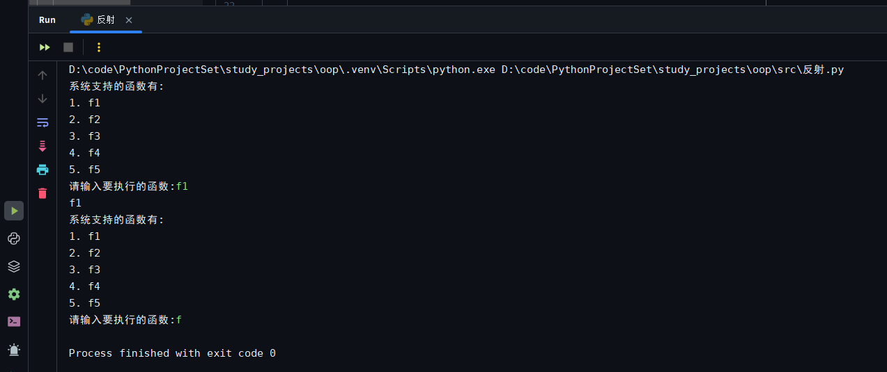
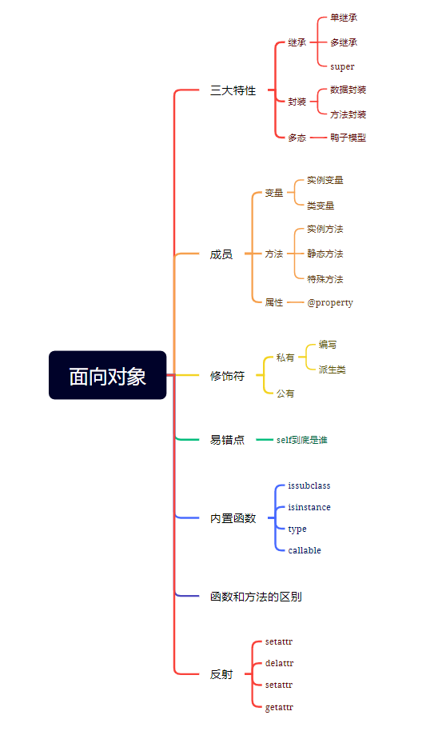
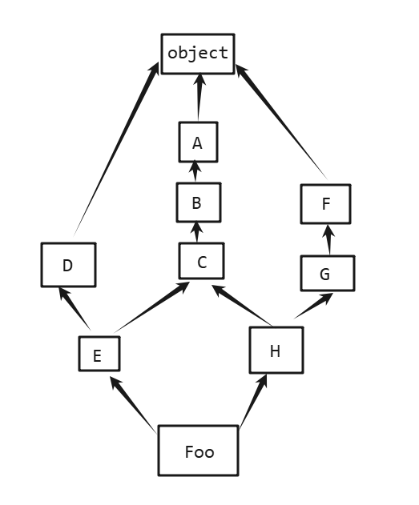

<h1 style="text-align: center; font-family: '楷体';">面向对象</h1>

# 一、 第一天

今日内容

1. 函数式编程和面向对象的对比
2. 如何编写面向对象代码
3. 面向对象三大特性
    1. 封装
    2. 继承
    3. 多态

## 1.1 函数和面向对象的对比

### 1.1.1  第一回合

假设我们要开发一个消息提醒的功能， -- 邮件、短信、微信

-   方法一：每一个功能写一个函数 -- 面向过程
    ```python
    def email(em, text):
        pass
    
    def msg(num, text):
        pass
    
    def wechat(num, text):
        pass
    
    
    if 满足发送条件:
        email('xx', 'xxxx')
        msg('xx', 'xxxx')
        wechat('xx', 'xxxx')
    ```

-   方法二：面向对象
    ```python
    class Message:
        def email(self, em, text):
        	pass
    
        def msg(self, num, text):
            pass
    
        def wechat(self, num, text):
            pass
        
        
    if 满足发送条件:
        obj = Message()
        obj.email('xx', 'xxxx')
        obj.msg('xx', 'xxxx')
        obj.wechat('xx', 'xxxx')
    ```

如上代码 -- 函数胜利

函数：好处：定义简单、调用简单。

面向对象：坏处：定义复杂、调用复杂。好处：作了一个归类

总结：

1.   函数式编程可能比面向对象更好。

2.   Python中支持函数式和面向对象方式编程。

3.   面向对象方式格式：
     ```python
     # 定义
     class 类名:  # 定义了一个类
         
         def 函数名(self):  # 在类中定义了一个方法
             ...
             
     # 调用
     x1 = 类名()  # 实例化了一个对象/创建了一个对象
     x1.函数名()  # 通过对象调用方法
     ```

### 1.1.2 第二回合

假设我们要实现一个：打印

老狗/男/上山去砍柴

老狗/男/开车去东北

老狗/男/喜欢大宝剑

-   方法一：函数式编程
    ```python
    def kanchai(name, gender):
        print(f'{name}/{gender}/上山去砍柴')
        
    def db(name, gender):
        print(f'{name}/{gender}/开车去东北')
        
    def dbj(name, gender):
        print(f'{name}/{gender}/喜欢大宝剑')
        
    kanchai('老狗', '男')
    ```

-   面向对象
    ```python
    class LaoGou:
        
        def __init__(self, name, gender):  # 构造方法 如果 类名()，该方法会被自动执行
            self.name = name
            self.gender = gender
        
        def kanchai(self):
            print(f'{self.name}/{self.gender}/上山去砍柴')
    
        def db(self):
            print(f'{self.name}/{self.gender}/开车去东北')
    
        def dbj(self):
            print(f'{self.name}/{self.gender}/喜欢大宝剑')
            
    
    obj= LaoGou('老狗', '男')
    
    print(obj.name)
    print(obj.gender)
    
    obj.kanchai()
    obj.db()
    obj.dbj()
    ```

分不出胜负。

总结：

-   构造方法`__init__(self,)` -- 进行初始化

-   应用：

    -   如果以后遇到很多的函数需要共同的参数时，就可以使用面向对象的方式。
        ```python
        class FileHandler:
            
            def __init__(self, file_path):
                self.file_path = file_path
                self.f = open(self.file_path, 'rb')
                
            def read_first(self):
                self.f.read()
                pass
                
            def read_second(self):
                self.f.read()
                pass
            
            def read_last(self):
                self.f.read()
                pass
        ```

    -   如果需要将我们的数据打包给别人用
        ```python
        # 仔细体会下面两段代码的打包思想
        def func(a, b, c, d, e, f, g, ...):
            pass
        
        def func(*args):
            args[2]
            args[3]
        
        
        def func(**kwargs):
            kwargs['d']
            kwargs['e']
            
        # ===================================
        
        def new_func(arg):
            arg.k1
            org.k2
            org.k3
        
        
        class Foo:
            
            def __init__(self, k1, k2, k3):
                self.k1 = k1
                self.k2 = k2
                self.k3 = k3
                
        obj = Foo(111, 222, 333)
        new_func(obj)
        ```

练习：个人信息管理系统

1.   用户登录
2.   显示当前用户信息
3.   查看当前用户的所有账单
4.   购买一个抱枕

```python
class Acount:
    
    def __init__(self):
        self.name = None
        
    def info(self):
        print(self.name)
    
    def login(self):
        user = iuput('请输入用户名')
        pwd = iuput('请输入密码')
        if user == 'xxx' and pwd == 'xxx':
            self.name = user
            while True:
                print('1.查看用户信息')
                print('2.查看用户账单')
                print(' 3.购买抱枕')
                print('  4.退出')
                num = input('请输入接下来的操作:')
                if num == 1:
                    self.info()  # 【注意看这儿！！！】
                elif num == 2:
                    pass
                elif num == 3:
                	pass
                else:
                    break
        else:
            print('登录失败')
    
            
obj = Account()
obj.login()
```

总结：在方法内部可以调用本类的方法。

问题：在什么时候写面向对象的程序呢？那又如何写呢？

## 1.2 面向对象代码如何编写

-   方式一：归类 + 提取公共值
    ```python
    def file_read(file_path):
        pass
    
    def file_update(file_path):
        pass
    
    def file_delete(file_path):
        pass
    
    def file_add(file_path):
        pass
    
    def excel_read(file_path):
        pass
    
    def excel_update(file_path):
        pass
    
    def excel_delete(file_path):
        pass
    
    def excel_add(file_path):
        pass
    ```

    ```python
    # 使用面向对象的方式归类
    class FileOperate:
        
        def file_read(self, file_path):
            pass
    
        def file_update(self, file_path):
            pass
    
        def file_delete(self, file_path):
            pass
    
        def file_add(self, file_path):
            pass
        
        
    class ExcelOperate:
        def excel_read(self, file_path):
            pass
    
        def excel_update(self, file_path):
            pass
    
        def excel_delete(self, file_path):
            pass
    
        def excel_add(self, file_path):
            pass
        
        
    # 归类后提取公共值
    class FileOperate:
        
        def __init__(self, file_path):
            self.file_path = file_path
        
        def file_read(self):
            pass
    
        def file_update(self):
            pass
    
        def file_delete(self):
            pass
    
        def file_add(self):
            pass
        
        
    class ExcelOperate:
        
        def __init__(self, file_path):
            self.file_path = file_path
        
        def excel_read(self):
            pass
    
        def excel_update(self):
            pass
    
        def excel_delete(self):
            pass
    
        def excel_add(self):
            pass
    ```

    归类的时候，仁者见仁，智者见智

-   方式二：正向编写：在指定类中编写和当前类相关的全部代码
    ```python
    class Message:
        
        def email(self):
            pass
        
    class Person:
        
        def run(self):
            pass
    ```

## 1.3 面向对象的三大特特性

### 1.3.1 封装

-   将相关功能打包到一个类中
-   将数据封装到一个对象中

### 1.3.2 继承

为了提高代码的重用性

#### 1.3.2.1 单继承

自己有就用自己的，自己没有的就从父类里面找。

```python
class SuperBase:
    
    def f3(self):
        print('f3')

class Base(SuperBase):  # 父类 基类
    
    def f2(self):
        print('f2')

class Foo(Base):  # 子类 派生类
    
    def f1(self):
        print('f1')
        

obj = Foo()
obj.f1()
obj.f2()
obj.f3()
# 原则：先在自己类中找，没有就去父类找 ...
```

```python
# 复用 假设下面两个类都有一个一模一样的方法f1
class Foo:
    
    def f1(self):
        pass
    
    def f2(self):
        pass
    
class Bar:
    
    def f1(self):
        pass
    
    def f3(self):
        pass
    
# 上面这样的，f1会多写了一遍 -- 为了减少写代码的行数 给他们两个类弄一个共同的爸爸 如下

class Base:
    
    def f1(self):
        pass
    
class Foo(Base):
    
    def f1(self):
        pass
    
    def f2(self):
        pass
    
class Bar(Base):
    
    def f1(self):
        pass
    
    def f3(self):
        pass
```

#### 1.3.2.2 多继承

```python
class Base1:
    
    def show(self):
        print('Base1.show()')


class Base2:
    def show(self):
        print('Base2.show()')


class Foo(Base1, Base2):
    pass


obj = Foo()
obj.show()  # Base1.show()
```

练习题：

```python
class Base:
    
    def f1(self):
        print('Base.f1')

class Foo(Base):
    
    def f2(self):
        print('Foo.f2')
    
obj = Foo()
obj.f2()  # Foo.f2
obj.f1()  # Base.f1


obj = Base()
obj.f1()  # Base.f1
obj.f2()  # 报错
```

```python
class Base:

    def f1(self):
        print('Base.f1')


class Foo(Base):

    def f3(self):
        print('Foo.f3')

    def f2(self):
        print('Foo.f2')
        self.f3()

obj = Foo()
obj.f2()  # obj是哪一个类，那么执行方法时就从该类开始找
# Foo.f2
# Foo.f3
```

```python
class Base:

    def f1(self):
        print('Base.f1')

    def f3(self):
        print('Base.f3')


class Foo(Base):

    def f2(self):
        print('Foo.f2')
        self.f3()

obj = Foo()
obj.f2()
# Foo.f2
# Base.f3
```

```python
class Base:

    def f1(self):
        print('Base.f1')

    def f3(self):
        self.f1()
        print('Base.f3')


class Foo(Base):

    def f2(self):
        print('Foo.f2')
        self.f3()

obj = Foo()
obj.f2()
# Foo.f2
# Base.f1
# Base.f3
```

```python
class Base:

    def f1(self):
        print('Base.f1')

    def f3(self):
        self.f1()
        print('Base.f3')


class Foo(Base):

    def f1(self):
        print('Foo.f1')

    def f2(self):
        print('Foo.f2')
        self.f3()

obj = Foo()
obj.f2()
# Foo.f2
# Foo.f1
# Base.f3
```

```python
class Base:

    def f1(self):
        print('Base.f1')

    def f3(self):
        self.f1()
        print('Base.f3')


class Foo(Base):

    def f1(self):
        print('Foo.f1')

    def f2(self):
        print('Foo.f2')
        self.f3()


obj = Foo()
obj.f2()
# Foo.f2
# Foo.f1
# Base.f3

obj1 = Base()
obj1.f3()
# Base.f1
# Base.f3
```

```python
class Base1:

    def f1(self):
        print('base1.f1')

    def f2(self):
        print('base1.f2')


class Base2:
    def f1(self):
        print('base2.f1')

    def f2(self):
        print('base2.f2')

    def f3(self):
        print('base2.f3')
        self.f1()


class Foo(Base1, Base2):
    def f0(self):
        print('Foo.f0')
        self.f3()

obj = Foo()
obj.f0()
# Foo.f0
# base2.f3
# base1.f1
```

#### 1.3.2.3 总结

支持多继承，先找左，再找右

为什么写多继承 -- 提高代码重用性

`self`是哪个类的对象，那么就从该类开始找。没有找到从父类中找

### 1.3.3 多态

`Python原生支持多态` -- 在传参的时候，无需指定类型。

多态：多种形态和多种状态

鸭子模型：只要可以嘎嘎叫的就认为是鸭子

```python
def func(arg):
    arg[0]
```

如上代码段，`arg`有多种形态(`arg`可以是列表/元组/字符串等 -- 就是多种形态，只要支持`[0]`即可)

由于`Python`原生支持多态 ，但是在`java`中，却是不一样的。

```python
class Foo1:
    def f1(self):
        pass
    

class Foo2:
    def f1(self):
        pass
    

class Foo3:
    def f1(self):
        pass
    
    
def func(arg):  # arg可以是多种形态
    arg.f1()
    
obj1 = Foo1()
obj2 = Foo2()
obj3 = Foo3()

func(obj1)
func(obj2)
func(obj3)
```

```java
// java
public void func(list arg) {  // 以后传参的时候，arg可以是list对象/list任何子类的对象 -- 这就是java的多态
    print(arg);
}
func((11, 22, 33))
```

## 1.4 重点

-   编写方式与执行流程
-   如何归类 -- 跟着感觉走 -- 设计模式
    -   反向：归类 + 提取公共值
    -   正向：类相关的功能 + 提取公共值
-   三大特性
    -   封装
        -   将相关功能封装到一个类中
        -   将相关数据封装到一个对象中
    -   继承
        -   单继承
        -   多继承
    -   多态

# 二、 第二天

内容概要

-   成员
-   组合(建模)】

## 2.1 面向对象成员

### 2.1.1 类的成员

```python
class Foo:
	
    # 方法
    def __init__(self, name):
        self.name = name  # 实例变量 / 对象变量 / 字段
        
    # 方法
    def func(self):
        pass

# obj -- 叫Foo类的实例/对象
obj= Foo('aaa')
```

### 2.1.2 成员分为三类

-   变量（字段）
    -   实例变量（字段）-- 不能通过类来调用
        -   公有实例变量
        -   私有实例变量
    -   类变量 （静态字段）
        -   公有类变量
        -   私有类变量

思考题：私有类型的变量，其派生类也无法访问。

```python
class Foo:
    country = 'abc'  # 类变量(静态字段) -- 如果要在每一个对象中都设置一个相同的值，就使用类变量
    
    def __init__(self, name):
        self.name = name
        
    def func(self):
        pass
    
obj = Foo('xxx')
obj1 = Foo('yyy')

# 怎么查看呢？
print(obj.country)  # abc
print(obj1.country)  # abc

obj.country = 'def'

print(obj.country)  # def
print(obj1.country)  # abc
```

```python
class Foo:
    country = 'abc'  # 类变量(静态字段) -- 如果要在每一个对象中都设置一个相同的值，就使用类变量
    
    def __init__(self, name):
        self.name = name
        
    def func(self):
        pass
    
obj = Foo('xxx')
obj1 = Foo('yyy')

# 怎么查看呢？
print(obj.country)  # abc
print(obj1.country)  # abc

Foo.country = 'def'

print(obj.country)  # def
print(obj1.country)  # def
```

```python
class Foo:
    
    def __init__(self, name):
        # 默认是公有的
        self.name = name
        self.age = 20
        
    def func(self):
        print(self.name)
# ==================================
class Foo:
    
    def __init__(self, name):
        # 私有的实例变量（私有字段）
        self.__name = name
        self.age = 20
        
    def func(self):
        print(self.name)
```

```python
class Foo:
    # 默认是公有的
    country = 'xxx'
    
    def __init__(self):
        pass
    
    
    def func(self):
        pass
# ================================
class Foo:
    # 私有的 -- 外部无法访问到 -- 但是非要访问也不是不行
    __country = 'xxx'
    
    def __init__(self, name):
        self.__name = name
        pass
    
    
    def func(self):
        pass
    
    
obj= Foo()
obj._Foo__name  # 可以访问
```

准则：实例变量（字段）访问时，使用对象访问 `obj1.name`，如果是对于类变量（静态字段）访问时，使用类来访问 `Foo.country`。

易错点：如果


----


### 2.1.3 方法有三种

-   实例方法
    ```python
    class Foo:
        
        def __init__(self， name):
            self.name = name
        
        # 实例方法
        def func(self):
            print(self.name)
        
    obj= Foo()
    obj.func()
    ```

-   静态方法
    ```python
    class Foo:
        
        def __init__(self， name):
            self.name = name
        
        # 实例方法 -- 通过对象去调用
        def func(self):
            print(self.name)
        
        # 静态方法 -- 可以通过类去调用 -- 建议通过类调用
        @staticmethod
        def display():
            print(666)
        
    obj= Foo()
    obj.func()
    
    Foo.display()
    ```

-   类方法
    ```python
    class Foo:
    
        def __init__(self, name):
            self.name = name
    
        # 实例方法 -- 通过对象去调用
        def func(self):
            print(self.name)
    
        # 静态方法 -- 可以通过类去调用 -- 建议通过类调用
        @staticmethod
        def display():
            print(666)
    
        # 类方法
        @classmethod
        def show(cls, x):
            print(cls, x, 999)
    
    
    # 执行类方法
    Foo.show(18)  # <class '__main__.Foo'> 18 999
    ```

面试题：类方法、静态方法和实例方法的区别？

-   定义的时候：实例方法不用加装饰器，而静态方法和类方法需要加装饰器
-   执行的时候：类方法和实例方法可以通过类名调用，而实例方法只能用实例对象调用

### 2.1.4 方法成员修饰符

```python
class Foo(object):
    
    def __init__(self):
    	pass

    # 私有实例方法
    def __display(self):
        pass
    
	# 私有静态方法
    @staticmethod
    def __show():
        pass
    
    # 私有类方法
    @classmethod
    def __func(cls):
        pass
```

### 2.1.5 属性

通过方法改造出来的。 -- 无法传除了`self`以外的任何其它参数！

属性在编写的时候在方法的上方加上:`@property`装饰器.

调用时无需加括号，直接`对象.方法名`即可.

对于简单的方法，当无需传参的时候，且有返回值时可以使用

```python
class Foo(object):
    
    def __init__(self):
        pass
    
    @property
    def start(self):
        return 1
    
    def end(self):
        return 10
    
    
obj = Foo()

# obj.start()
obj.
start

obj.end()
```

## 2.2 面向对象嵌套(组合、建模)

例如：创建三个学校并且三个学校的设施内容都是一致的

```python
class School(object):
    
    def __init__(self, name, address):
        self.name = name
        self.address = address
    
    def speak(self):
        pass
        
obj1 = School('xxx', 'aaa/bbb/ccc')
obj2 = School('yyy', 'ddd/eee/fff')
obj3 = School('zzz', 'ggg/hhh/iii')

class Teacher(object):
    
    def __init__(self, name, age, salary):
        self.name = name
        self.age = age
        self.__salary = salary
        self.school = None
        
t1 = Teacher('a', 25, 188888)
t2 = Teacher('b', 26, 155555)
t3 = Teacher('c', 24, 166668)

# 为老师分配学校
t1.school = obj1
t2.school = obj1
t3.school = obj2

# 查看t1老师所在学校的学校名称
print(t1.school.name)
# t1老师进行讲课
t1.school.speak()
```

# 三、 第三天

内容概要:

1.   组合的补充

2.   主动调用其他类的成员

3.   面向对象中的特殊成员
     ```python
     isinstance/issubclass/type
     ```

## 3.1 组合(嵌套) -- 补充

```python
"""类 / 对象能否做字典的key"""


class Foo(object):

    def __init__(self):
        pass


obj = Foo()

my_dict = {
    Foo: 12,
    obj: 123,
}

for key, value in my_dict.items():
    print(key, value)
```

```python
"""对象中到底有什么"""


class Foo(object):

    def __init__(self, age):
        self.age = age

    def display(self):
        print(self.age)


data_list = [Foo(10), Foo(11), Foo(12), Foo(13)]

for item in data_list:
    print(item.age, item.display())

"""
10
10 None
11
11 None
12
12 None
13
13 None
"""
```

```python
class StarkConfig(object):

    def __init__(self, num):
        self.num = num

    def change(self, request):
        print(self.num, request)


class RowConfig(StarkConfig):
    def change(self, request):
        print(666, request)


config_obj_list = [
    StarkConfig(123),
    StarkConfig(456),
    RowConfig(789),
]

for item in config_obj_list:
    print(item.num)
"""
123
456
789
"""
```

```python
class StarkConfig(object):

    def __init__(self, num):
        self.num = num

    def change(self, request):
        print(self.num, request)


class RowConfig(StarkConfig):
    pass


config_obj_list = [
    StarkConfig(123),
    StarkConfig(456),
    RowConfig(789),
]

for item in config_obj_list:
    print(item.change(168))
"""
123 168
None
456 168
None
789 168
None
"""
```

```python
class StarkConfig(object):

    def __init__(self, num):
        self.num = num

    def change(self, request):
        print(self.num, request)


class RowConfig(StarkConfig):
    def change(self, request):
        print(666)


config_obj_list = [
    StarkConfig(123),
    StarkConfig(456),
    RowConfig(789),
]

for item in config_obj_list:
    print(item.change(168))
"""
123 168
None
456 168
None
666
None
"""
```

```python
class StarkConfig(object):

    def __init__(self, num):
        self.num = num

    def change(self, request):
        print(self.num, request)


class RowConfig(StarkConfig):
    def change(self, request):
        print(666, self.num)


config_obj_list = [
    StarkConfig(123),
    StarkConfig(456),
    RowConfig(789),
]

for item in config_obj_list:
    print(item.change(168))
"""
123 168
None
456 168
None
666 789
None
"""
```

```python
class StarkConfig(object):

    def __init__(self, num):
        self.num = num

    def change(self, request):
        print(self.num, request)

    def run(self):
        self.change(999)


class RowConfig(StarkConfig):
    def change(self, request):
        print(666, self.num)


config_obj_list = [
    StarkConfig(123),
    StarkConfig(456),
    RowConfig(789),
]

for item in config_obj_list:
    item.run()

"""
123 999
456 999
666 789
"""
```

```python
class StarkConfig(object):

    def __init__(self, num):
        self.num = num

    def change(self, request):
        print(self.num, request)

    def run(self):
        self.change(999)


class RowConfig(StarkConfig):
    def change(self, request):
        print(666, self.num)


class AdminSite(object):

    def __init__(self):
        self._registry = dict()

    def register(self, k, v):
        self._registry[k] = v


site = AdminSite()
print(len(site._registry))  # 0
site.register('x', 666)
site.register('y', 333)
print(len(site._registry))  # 2

site.register('z', StarkConfig(19))
site.register('m', StarkConfig(20))
site.register('n', RowConfig(33))
print(len(site._registry))  # 5
```

```python
class StarkConfig(object):

    def __init__(self, num):
        self.num = num

    def change(self, request):
        print(self.num, request)

    def run(self):
        self.change(999)


class RowConfig(StarkConfig):
    def change(self, request):
        print(666, self.num)


class AdminSite(object):

    def __init__(self):
        self._registry = dict()

    def register(self, k, v):
        self._registry[k] = v


site = AdminSite()

site.register('z', StarkConfig(19))
site.register('m', StarkConfig(20))
site.register('n', RowConfig(33))
print(len(site._registry))  # 3

for row in site._registry.keys():
    print(row)

"""
z
m
n
"""

for key, row in site._registry.items():
    row.change(5)
"""
19 5
20 5
666 33
"""
```

```python
class StarkConfig(object):

    def __init__(self, num):
        self.num = num

    def change(self, request):
        print(self.num, request)

    def run(self):
        self.change(999)


class RowConfig(StarkConfig):
    def change(self, request):
        print(666, self.num)


class AdminSite(object):

    def __init__(self):
        self._registry = dict()

    def register(self, k, v):
        self._registry[k] = v


site = AdminSite()

site.register('z', StarkConfig(19))
site.register('m', StarkConfig(20))
site.register('n', RowConfig(33))
print(len(site._registry))  # 3

for row in site._registry.keys():
    print(row)

"""
z
m
n
"""

for key, row in site._registry.items():
    row.run()
"""
19 999
20 999
666 33
"""
```

```python
class UserInfo(object):
    pass


class Department(object):
    pass


class StarkConfig(object):

    def __init__(self, num):
        self.num = num

    def change(self, request):
        print(self.num, request)

    def run(self):
        self.change(999)


class RowConfig(StarkConfig):
    def change(self, request):
        print(666, self.num)


class AdminSite(object):

    def __init__(self):
        self._registry = dict()

    def register(self, k, v):
        self._registry[k] = v(k)


site = AdminSite()

site.register(UserInfo, StarkConfig)
site.register(Department, StarkConfig)

for _, row in site._registry.items():
    row.run()

"""
<class '__main__.UserInfo'> 999
<class '__main__.Department'> 999
"""
```

## 3.2 主动调用其他类的成员

方式一：与继承无关

```python
class Base(object):

    def f1(self):
        print('Base.f1 5个功能')


class Foo(Base):

    def f1(self):
        print('Foo.f1 3个功能')
        Base.f1(self)  # 主动调用 - 如果这样写的话self没办法自动传递，需要手动传递进去


obj = Foo()
obj.f1()
```

方式二：

```python
class Foo(object):

    def f1(self):
        super().f1()  # 按照继承顺序找下一个类的相关成员
        print('Foo.f1 3个功能')


class Bar(object):

    def f1(self):
        print('Bar.f1 6个功能')


class Info(Foo, Bar):
    pass


obj = Info()
obj.f1()

"""
Bar.f1 6个功能
Foo.f1 3个功能

！！！
Info没有f1，先去Foo里面找(先找左边)，找到了，执行Foo.f1函数
在执行Foo.f1函数的时候，这个函数的第一条语句需要按照继承关系找函数，
但是是按照哪个类的继承关系找呢？是按照Info类还是Foo类呢？答案是：按照Info的
继承关系去找。因为最开始是按照Info的继承关系找f1函数，那么传入的self参数肯定就只是
Info的对象obj这个对象了。
==========================================================================
总结一下，如果要执行/找到一个对象的成员，那么从始至终必须要按照这个对象的继承关系去
找。不能找到一半又去不是下一个继承关系的类里面找。并不是简单的找父类。 -- 易错点
！！！
"""
```

## 3.3 特殊成员

```python
class Foo(object):

    def __new__(cls, *args, **kwargs):  # 构造方法
        print('__new__方法', cls)
        # __new__的时候创建一个空对象。
        # 将object.__new__(cls)返回后就回去调用__init__方法，初始化对象

        # 必须要有返回值且返回值必须是object.__new__(cls)
        # 所有的对象都是由object创建的
        return object.__new__(cls)

    def __init__(self, a1, a2):  # 初始化方法
        self.a1 = a1
        self.a2 = a2
        print('__init__方法')

    def __call__(self, *args, **kwargs):
        print(111, args, kwargs)
        return 123

    def __getitem__(self, name):
        return 8

    def __setitem__(self, name, value):  # 无返回值
        print('key', 'value', name, value)

    def __delitem__(self, name):  # 无返回值
        print('del', name)


# 1. 类名() -- 自动执行__init__方法
obj = Foo(1, 2)

# 2. 对象() -- 自动执行 __call__方法
obj(1, 2, k1=10, k2=20)

# 3. 对象[] -- 自动执行 __getitem__方法
print(obj['xx'])

# 4. 对象[a] = b -- 自动执行 __setitem__方法
obj['abc'] = 123

# 5. del 对象[a] -- 自动执行 __delitem__方法
del obj['123']

# 6. __new__方法 -- 真正的构造方法
```

# 四、 第四天

内容概要

1.   isinstance、issubclass、type
2.   方法和函数
3.   反射
4.   其他

## 4.1 特殊方法补充

```python
# __str__

class Foo(object):
    def __init__(self):
        pass
    
    def func(self):
        pass
    
obj = Foo()
print(obj)  # <__main__.Foo object at 0x0000019D9ED13FA0>

# ##################### 分割线 #####################
class Foo(object):
    def __init__(self):
        pass
    
    def func(self):
        pass
    
    def __str__(self):
        return "A object from Foo class."
    
obj = Foo()
print(obj)  # A object from Foo class.
```

```python
class Foo(object):
    """This is a class docstring."""
    def __init__(self):
        pass

    def func(self):
        pass

    def __str__(self):
        return "A object from Foo class."


obj = Foo()
print(obj)
print(obj.__doc__)  # This is a class docstring.
```

```python
class Foo(object):
    """This is a class docstring."""
    def __init__(self, name, age):
        self.name = name
        self.age = age


obj = Foo('aaa', 123)
print(obj.__dict__)  # {'name': 'aaa', 'age': 123}
```

```python
class Foo(object):
    """This is a class docstring."""

    def __init__(self, name, age):
        self.name = name
        self.age = age
        self.detail = [(1, 5), (2, 6), (3, 7)]

    def __iter__(self):
        return iter(self.detail)


obj = Foo('aaa', 123)

for item in obj:
    print(item)
"""
(1, 5)
(2, 6)
(3, 7)
"""
```

## 4.2 `issubclass`/`type`/`isinstance`

-   `issubclass` -- 获取前面那个类是否是后面那个类的子子孙孙

    ```python
    class Base(object):
        pass
    
    class Foo(Base):
        pass
    
    class Bar(Foo):
        pass
    
    
    # 前面的类是不是后面类的子类
    class Base(object):
        pass
    
    
    class Foo(Base):
        pass
    
    
    class Bar(Foo):
        pass
    
    
    # 前面的类是不是后面类的子类
    print(issubclass(Foo, Base))  # True
    print(issubclass(Base, Foo))  # False
    print(issubclass(Bar, Base))  # True
    ```

-   `type` -- 获取当前对象是哪个类创建的

    ```python
    class Base(object):
        pass
    
    
    class Foo(Base):
        pass
    
    
    class Bar(Foo):
        pass
    
    
    obj1 = Base()
    obj2 = Foo()
    obj3 = Bar()
    
    # 前面的类是不是后面类的子类
    print(obj1, type(obj1))
    print(obj2, type(obj2))
    print(obj3, type(obj3))
    
    """
    <__main__.Base object at 0x000001C5B38D3FD0> <class '__main__.Base'>
    <__main__.Foo object at 0x000001C5B38D3F40> <class '__main__.Foo'>
    <__main__.Bar object at 0x000001C5B38D3F10> <class '__main__.Bar'>
    """
    ```

-   `isinstance`  - 判断第一个参数（一般是对象）是否是第二个参数（一般是类）的实例

    ```python
    class Foo(object):
        pass
    
    obj = Foo()
    
    print(isinstance(obj, Foo))  # True
    
    # ####################### 分割线 #######################
    
    class Base(object):
        pass
    
    class Foo(Base):
        pass
    
    obj = Foo()
    
    print(isinstance(obj, Base))  # True
    ```


## 4.3 函数和方法的区分

```python
from types import MethodType, FunctionType


class Foo(object):

    def func(self):
        pass

    @staticmethod
    def static_method():
        pass

    @staticmethod
    def class_method():
        pass


def func():
    pass


obj = Foo()


def if_func(arg):
    if isinstance(arg, MethodType):
        print('方法')
    if isinstance(arg, FunctionType):
        print('函数')


if_func(obj.func)
if_func(obj.static_method)
if_func(func)

"""
方法
函数
函数
"""
```

```python
from types import MethodType, FunctionType


class Foo(object):

    def func(self):
        pass

    @staticmethod
    def static_method():
        pass

    @staticmethod
    def class_method():
        pass


def func():
    pass


obj = Foo()


def if_func(arg):
    if isinstance(arg, MethodType):
        print('方法')
    if isinstance(arg, FunctionType):
        print('函数')


if_func(obj.func)
if_func(obj.static_method)
if_func(Foo.func)
if_func(Foo.static_method)
if_func(func)

"""
方法
函数
函数
函数
函数
"""
```

练习：

```python
class Foo(object):
    def f1(self):
        pass

    def f2(self):
        pass

    list_display = [f1, f2]

    def __init__(self):
        pass


obj = Foo()
for item in obj.list_display:
    print(item)

for item in Foo.list_display:
    print(item)

"""
<function Foo.f1 at 0x00000175C1341750>
<function Foo.f2 at 0x00000175C13416C0>
<function Foo.f1 at 0x00000175C1341750>
<function Foo.f2 at 0x00000175C13416C0>
"""
```

```python
class Foo(object):
    def f1(self):
        pass

    def f2(self):
        pass

    list_display = [f1, f2]

    def get_list_display(self):
        self.list_display.append(self.f3)
        return self.list_display

    def f3(self):
        pass

    def __init__(self):
        pass


obj = Foo()
obj.get_list_display()
for item in obj.list_display:
    print(item)

for item in Foo.list_display:
    print(item)

"""
<function Foo.f1 at 0x000001C41C0D1750>
<function Foo.f2 at 0x000001C41C0D16C0>
<bound method Foo.f3 of <__main__.Foo object at 0x000001C41DD13FD0>>
<function Foo.f1 at 0x000001C41C0D1750>
<function Foo.f2 at 0x000001C41C0D16C0>
<bound method Foo.f3 of <__main__.Foo object at 0x000001C41DD13FD0>>
"""
```

## 4.4 *\*\*\*\*反射

```python
from handler import f1, f2, f3, f4, f5

while True:
    print('系统支持的函数有: 1. f1 \n2. f2 \n3. f3 \n4. f4 \n5. f5')
    val = input('请输入要执行的函数:')
    if val == 'f1':
        f1()
    elif val == 'f2':
        f2()
    elif val == 'f3':
        f3()
    elif val == 'f4':
        f4()
    elif val == 'f5':
        f5()
    else:
        print('没有这个函数')
```

下面使用更好的方法：

`getattr(handler, 'f1')  # 会自动去handler模块中找名字叫f1的成员` -- 根据第二个参数(字符串)从第一个参数(对象/类)中去寻找与第二个参数同名的成员。

```python
import handler

getattr(handler, 'f1')()
```

```python
import handler

while True:
    print('系统支持的函数有: \n1. f1 \n2. f2 \n3. f3 \n4. f4 \n5. f5')
    val = input('请输入要执行的函数:')
    if val in ('f1', 'f2', 'f3', 'f4', 'f5'):
        getattr(handler, val)()
    else:
        break
```



```python
"""
反射 -- 通过面向对象实现
"""


class Foo(object):
    country = 'a'

    def func(self):
        pass


v = getattr(Foo, 'country')
print(v)

v = getattr(Foo, 'func')
print(v)

obj = Foo()
v = getattr(obj, 'func')
print(v)

"""
a
<function Foo.func at 0x00000200233C1750>
<bound method Foo.func of <__main__.Foo object at 0x0000020025013FA0>>
"""
```

```python
def function():
    name = 'abc'


v = getattr(function, 'name')
print(v)  # 报错 AttributeError: 'function' object has no attribute 'name'
```

练习：

```python
class Operate(object):

    def login(self):
        print('login')

    def logout(self):
        print('logout')

    def register(self):
        print('register')

    def run(self):
        func_list = [
            'login', 'logout', 'register'
        ]
        print('''
        请输入要执行的功能:
        1. 登录
        2. 注销
        3. 注册
        ''')
        in_val = input('请输入要执行的操作序号1/2/3 >>> ')
        fun_str = func_list[int(in_val) - 1]
        getattr(Operate, fun_str)(self)


obj = Operate()
obj.run()
```

```python
class Operate(object):

    def login(self):
        print('login')

    def logout(self):
        print('logout')

    def register(self):
        print('register')

    def run(self):
        func_list = [
            'login', 'logout', 'register'
        ]
        print('''
        请输入要执行的功能:
        1. 登录
        2. 注销
        3. 注册
        ''')
        in_val = input('请输入要执行的操作序号1/2/3 >>> ')
        fun_str = func_list[int(in_val) - 1]
        getattr(self, fun_str)()


obj = Operate()
obj.run()
```

小小的优化一下:

```python
class Operate(object):
    func_list = [
        'login', 'logout', 'register'
    ]

    def login(self):
        print('login')

    def logout(self):
        print('logout')

    def register(self):
        print('register')

    def run(self):
        print('''
        请输入要执行的功能:
        1. 登录
        2. 注销
        3. 注册
        ''')
        in_val = input('请输入要执行的操作序号1/2/3 >>> ')
        fun_str = self.func_list[int(in_val) - 1]
        getattr(self, fun_str)()


obj = Operate()
obj.run()
```

## 4.5 反射补充

```python
getattr()  # 根据字符串的形式去对象中找成员 - 内存级别
hasattr()  # 根据字符串的形式判断对象中是否有该成员 - 内存级别
setattr()  # 根据字符串的形式在对象中动态地设置一个成员 - 内存级别
delattr()  # 根据字符串的形式去对象中动态地删除一个成员 - 内存级别
```

```python
print(hasattr(handler, 'x2'))  # False
setattr(handler, 'x2', '666')
print(hasattr(handler, 'x2'))  # True

setattr(handler, 'x3', lambda x: x + 5)
print(getattr(handler, 'x3')(15))  # 20

print(hasattr(handler, 'x3'))  # True
delattr(handler, 'x3')
print(hasattr(handler, 'x3'))  # False
```

## 4.6 今日扩展

你见过的什么后面可以加括号？-- 可被调用

-   函数
-   方法
-   类
-   对象

```python
def func(arg):
    arg()  # 可被调用/被执行的成员
```

```python
def func():
    pass


class Foo(object):
    def __call__(self):
        pass


obj = Foo()

print(callable(func))
print(callable(Foo))
print(callable(obj))

"""
True
True
True
"""
```

# 五、 第五天

往期回顾：



内容概要：

1.   约束
2.   自定义异常
3.   `hashlib`模块
4.   `logging`模块

## 5.1 类的约束\*\*\*

```python
class BaseMessage(object):
    """BaseMessage类用于约束，约束其派生类，保证派生类中必须编写send方法，不然程序可能会报错"""
    def send():
        # 如果有下面这行语句，只要继承这个基类就必须要重写这个send方法用于完成具体的业务逻辑 否则会报错
        raise NotImplementedError('.send() method must be overridden!')

        
class Email(BaseMessage):
    def send(self):
        pass
    
    def f1(self):
        pass
    
    def f2(self):
        pass

class Wechat(BaseMessage):
    def send(self):
        pass
    
    def f3(self):
        pass

class Msg(BaseMessage):
    def sned(self):
        pass
    
    def f4(self):
        pass

def func(arg):
    """
    报警通知的功能...
    """
    arg.send()

    
obj = Msg()
func(obj)
```

`java`中：接口只能做约束，而抽象类可以做约束，也可以实现普通方法。

在`Python`中使用抽象类和抽象方法:

```python
from abc import ABCMeta, abstractmethod


class Base(metaclass=ABCMeta):
    """抽象类"""

    def f1(self):
        # 普通实例方法
        pass

    @abstractmethod
    def f2(self):
        # 抽象方法
        pass


class Foo(Base):
    pass


obj = Foo()
obj.f1()  # 实例化时的报错：TypeError: Can't instantiate abstract class Foo with abstract method f2
```

```python
from abc import ABCMeta, abstractmethod


class Base(metaclass=ABCMeta):
    """抽象类"""

    def f1(self):
        # 普通实例方法
        pass

    @abstractmethod
    def f2(self):
        # 抽象方法
        pass


class Foo(Base):
    def f2(self):
        pass


obj = Foo()
obj.f1()  # 成功运行
obj.f2()  # 成功运行
```

## 5.2 自定义异常 \*\*\*

```python
import os


def func(path, prev):
    """
    去path指向的文件中去寻找前缀为prev的一行数据，获取数据并返回给调用者
    Args:
        path ():
        prev ():

    Returns:

    """
    # 假设code为 1000 表示成功 1001 表示文件不存在 1002 表示关键字为空
    response = {
        'code': 1000, 'data': None
    }
    try:
        if not os.path.exists(path):
            response['code'] = 1001
            response['data'] = '文件不存在'
            return response
        if not prev:
            response['code'] = 1002
            response['data'] = '关键字为空'
            return response
    except Exception as e:
        response['code'] = 1003
        response['data'] = '未知错误'
    return response
```

上述方法可以完成。

还有另外一种思路：

```python
import os


class ExistsError(Exception):
    pass


class KeyInvalidException(Exception):
    pass


def func(path, prev):
    """
    去path指向的文件中去寻找前缀为prev的一行数据，获取数据并返回给调用者
    Args:
        path ():
        prev ():

    Returns:

    """
    # 假设code为 1000 表示成功 1001 表示文件不存在 1002 表示关键字为空
    response = {
        'code': 1000, 'data': None
    }
    try:
        if not os.path.exists(path):
            raise ExistsError('文件不存在')

        if not prev:
            raise KeyInvalidException('关键字为空')
        pass

    except ExistsError as _:
        response['code'] = 1001
        response['data'] = '文件不存在'

    except KeyInvalidException as _:
        response['code'] = 1002
        response['data'] = '关键字为空'

    except Exception as e:
        response['code'] = 1003
        response['data'] = '未知错误'
    return response
```


```python
class MyException(Exception):

    def __init__(self, code, message):
        self.code = code
        self.message = message


try:
    raise MyException(1000, 'Error')
except MyException as e:
    print(e.code)
    print(e.message)
```

## 5.3 `md5`加密 \*\*\*\*\*

```python
import hashlib

def md5(pwd):
    # 初始化对象并加盐 -- 盐别乱动 要么放到全局变量 要么放在这儿不要乱动
    obj = hashlib.md5(b'nnCdheFDuwCSAjnwksSDDCAoDdsajkDSAdADSDmfjDdoD')

    # md5加密必须要用字节
    obj.update(pwd.encode('utf-8'))

    # 获取密文
    res = obj.hexdigest()
    
    return res
```

## 5.4 `logging`日志 \*\*\*\*

日志是给开发者看的，用于排查错误。

```python
import logging
import traceback

logging.basicConfig(
    level=logging.DEBUG,
    filename='app.log',
    filemode='w',
    format='%(asctime)s - %(name)s - %(levelname)s - %(message)s')


def fun():
    try:
        a = a + 1
    except Exception as e:
        # 获取错误的堆栈信息 -- traceback.format_exc()
        logging.error(traceback.format_exc())


fun()
```

```python
logging.basicConfig(
    level=logging.DEBUG,
    filename='app.log',
    filemode='w',
    format='%(asctime)s - %(name)s - %(levelname)s - %(message)s')

logging.basicConfig(
    level=logging.DEBUG,
    filename='app1.log',
    filemode='w',
    format='%(asctime)s - %(name)s - %(levelname)s - %(message)s')

# 像以上这样写的话，只会生效第一个配置的东西 -- 那么怎么两个地方向两个文件中写日志？看下面
import logging

file_1 = logging.FileHandler('log1.log', mode='w', encoding='utf-8')
fmt1 = logging.Formatter('%(asctime)s - %(name)s - %(levelname)s - %(message)s')
file_1.setFormatter(fmt1)

logger1 = logging.Logger('logger1', level=logging.ERROR)
logger1.addHandler(file_1)

# 另外一个
file_2 = logging.FileHandler('log2.log', mode='w', encoding='utf-8')
fmt2 = logging.Formatter('%(asctime)s - %(name)s - %(levelname)s - %(message)s')
file_2.setFormatter(fmt2)

logger2 = logging.Logger('logger2', level=logging.ERROR)
logger2.addHandler(file_2)

logger1.error('error 1')
logger2.error('error 2')
```

# 六、 第六天

内容概要：

-   面向对象多继承

## 6.1 多继承

-   先找左，再找右

-   经典类和新式类

    -   经典类 -- `python2.2`以后出现了经典类和新式类
    -   新式类 -- `python3`中只有新式类
        只要自己/自己的基类继承自`object`，那么就是新式类

-   经典类和新式类的区别：查找顺序有区别

    经典类：一条道走到黑（深度优先搜索）

    新式类：`c3`算法

## 6.2 `c3`算法

对于下面的这个继承关系:

```python
class A(object):
    pass

class B(A):
    pass

class C(B):
    pass

class D(object):
    pass

class E(D, C):
    pass

class F(object):
    pass

class G(F):
    pass

class H(C, G):
    pass

class Foo(E, H):
    pass
```

用图示表示出来:



\*\*\*\*\* `c3`算法

首先要找`Foo`类的继承关系：如果要找`Foo`的继承关系，那么首先找到`E`和`H`的继承关系

```python
L(Foo + L(E) + L(H))
L(E) = L(D) + L(C)
	 = (D, object) + (C, B, A, object)
    
继承关系: E
拿第一个的表头，和后面的除了报表头以外的其他类比较，（这里拿出来D和后面的B,A,object对比），如果全都不相等，那么就可以将第一个的表头拿出来(这时候第一个表的表头就可以删除了):
继承关系: ED

再继续拿第一个的表头，继续和后面的除了头以外的对比，如果有相等的，那么不动:
L(E) = L(D) + L(C)
	 = (object) + (C, B, A, object)
再拿第二个表的表头和其他的表尾比较，如果没有，拿出来:
继承关系: EDC

拿出来后变成了:
L(E) = L(D) + L(C)
	 = (object) + (B, A, object)

再继续拿第一个的表头和其他表的表尾比较，如果有相等的，不动，那么拿下一个表的表头和其他表进行对比:
继承关系: EDCB

L(E) = L(D) + L(C)
	 = (object) + (A, object)
继承关系: EDCBA

L(E) = L(D) + L(C)
	 = (object) + (object)
继承关系:E,D,C,B,A,object


# ##########################
H 的查找关系
L(H) = L(C) + L(G)
	 = (C, B, A, object) + (G, F, object)
...
H,C,B,A,G,F,object

所以:
    L(Foo) = L(E) + L(H)
    L(E) = E,D,C,B,A,object
    L(H) = H,C,B,A,G,F,object
    
=> L(Foo) = (E,D,C,B,A,object) + (H,C,B,A,G,F,object)
		  = E,D,H,C,B,A,G,F,object
    
-> 最终结果:Foo,E,D,H,C,B,A,G,F,object
```

注意:

使用`__mro__`寻找继承关系 -- 而`super`就是遵循`__mro__`所指出的继承顺序寻找的.
