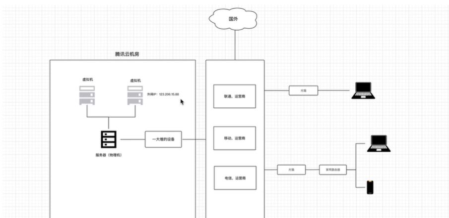

<h1 style="text-align: center;">网络编程</h1>

# 1.必备基础

## 1.1 网络架构

假设`alex`上大学买了一台电脑，电脑里存了一部小电影，整宿整宿的在宿舍反复观看。


`alex`如果想要和室友**于超**进行收发数据，可以通过一条网线来进行连接，并进行数据的传输。


但是有个问题：如果共有四台电脑，那么如果要互相之间通过网络传输数据，按照两两之间需要一根网线来连接的话，那一台电脑就至少需要有三个网络接口，显然，当计算机变多以后，接口数量就会增加，而我们的电脑只有有限个接口，无法和更多的电脑进行数据传输。

### 1.1.1 交换机

其他两位舍友如果也想和他们的电脑之间相互连接然后进行资源的共享，此时就需要一个设备（二层交换机）组建一个局域网。

```
当电脑介入交换机之后，我们需要为每台电脑分配一个IP，例如：
	- 电脑1：192.168.10.1
	- 电脑2：192.168.10.2
	- 电脑3：192.168.10.3
	- 电脑4：192.168.10.4
```

```
mac地址会烧制在网卡上，网卡一般都连接在主板上。
```


**交换机**：


一个局域网：（中间那个是交换机，交换机会自动分配`IP`），最开始交换数据的时候 交换机 会向局域网发送**广播**信息。


以后，发送数据后，交换机会记录IP和mac的对应关系，于是交换机会做一个记录，这样以后如果要发送信息，如果在能查到`mac`地址的前提下，就是单播了。

```
接口（网卡）                  mac地址
  接口1                  00-0a-a4-2a-3e-4b
  接口2                  10-0a-a4-2b-3d-4b
  接口3                  20-1a-a4-2c-3e-4b
```

此时，隔壁宿舍也有了一个交换机，组成一个小局域网，如果要求你的宿舍要和隔壁宿舍能够进行数据通信，

- 第一种方式是通过直连的方式进行连接，连接两个交换机 - 可能会发生广播风暴

- 第二种方式：借助路由器来进行一个局域网和另外一个局域网的网络通信
    


路由器：


```
需要进行IP划分
宿舍A：（10网段） 可以通过网段区分局域网 
	- 电脑1：192.168.10.1 网关：192.168.10.254
	- 电脑2：192.168.10.2 网关：192.168.10.254
	- 电脑3：192.168.10.3 网关：192.168.10.254
	- 电脑4：192.168.10.4 网关：192.168.10.254
宿舍B：（20网段） 可以通过网段区分局域网 
	- 电脑1：192.168.20.1 网关：192.168.20.254
	- 电脑2：192.168.20.2 网关：192.168.20.254
	- 电脑3：192.168.20.3 网关：192.168.20.254
	- 电脑4：192.168.20.4 网关：192.168.20.254
```

```
路由器中配置路由表（包含网段和路由器上的接口的对应关系）
 接口            IP
 eth0      192.1687.10.254(192.168.10网段)
 eth1      192.1687.20.254(192.168.20网段)
```


### 1.1.2 三层交换机


划分`VLAN`就是划分网段

### 1.1.4 小型企业基础网络架构


光猫：做信号转换，将光信号转换成模拟信号。

核心路由器：数据转发

### 1.1.5 家庭网络结构


### 1.1.6 互联网


## 1.2 网络核心词解释

### 1.2.1 子网掩码和`IP`


### 1.2.2 `DHCP`


### 1.2.3 内网和公网`IP`


### 1.2.4 云服务器


### 1.2.5 端口 


### 1.2.6 域名


# 2. 网络编程



python中内置了一个socket模块，可以快速实现网络之间的数据传输，例如：

- 服务端，放在左边云服务器中（有固定`IP`）
    ```python
    import socket
    import time
    
    # 监听本机的IP和端口
    sock = socket.socket(socket.AF_INET, socket.SOCK_STREAM)
    # sock.bind(('192.168.1.5', 8001))  # (IP, Port)
    sock.bind(('127.0.0.1', 8001))  # (IP, Port) 此IP是本地环回地址
    sock.listen(5)  # 支持排队等待五人
    
    start_time = time.time()
    
    while True:
    
        if time.time() - start_time > 20000:
            # 假设当发生某一事件我不想继续服务了就可跳出循环
            break
    
        # 等待，有人来连接（阻塞）
        conn, addr = sock.accept()  # 等待客户端来连接，如果没连接那么一直在阻塞，addr是向服务端发送连接请求的IP地址。
        # conn就是类似于一个连接的管道
    
        # 等待，连接者发送消息（阻塞）
        client_data = conn.recv(1024)  # 等待接受客户端发来的消息，如果不发那么一直阻塞
        print(client_data)  # 字节类型的数据
        print(client_data.decode('utf-8'))  # 转换成字符类型的数据
    
        # 给连接者回复消息
        conn.sendall(b'Hello, client!')
    
        # 关闭连接
        conn.close()
    
    # 停止服务端程序
    sock.close()
    ```

- 客户端
    ```python
    import socket
    
    # 向指定IP发送连接请求
    client = socket.socket()
    # client.connect(('192.168.1.5', 8001))
    client.connect(('127.0.0.1', 8001))
    
    # 连接成功后，发送消息
    client.send(b'GET / HTTP/1.0\r\n\r\nhello!')
    
    # 等待 消息的回复（阻塞）
    reply = client.recv(1024)
    print(reply)
    print(reply.decode('utf-8'))
    
    # 关闭连接
    client.close()
    ```

## 案例：智障客服

- 服务端
    ```python
    
    ```

- 客户端
    ```python
    
    ```

## 案例：文件上传


