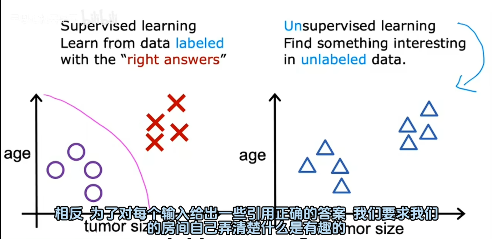

1. 什么是机器学习
   `Arthur Samue`: 让计算机在没有明确编程的情况下学习的研究领域。

2. 机器学习
    - 监督学习 Supervised learning - 许多实际中使用最多的机器学习类型 course 1 and 2
        是机器学习的一种方法，模型通过**带有标签的数据**进行训练，学习输入特征与输出标签之间的映射关系，从而对新数据做出预测。例如：图像分类（标签为物体类别）、房价预测（标签为连续价格）等任务均属于监督学习。
    - 无监督学习 Unsupervised learning  course 3
3. 强化学习 Reinforcement learning 但是监督学习和无监督学习是最常用的两种学习算法
4. Practical advice for applying learning algorithms. -- 关于应用学习算法的实用建议

# 一、 监督学习 Supervised Learning

## 1.1 第一部分 Part one -- 回归

Input  --->  output label的算法

Learn from being given "right answers" -- the correct label y for a given input x. 给定输入x的正确标签y。

通过查看输入x和输出y的正确对，学习算法最终只接受输入而无需输出标签并给出输出的合理准确的预测或者猜测。

举个例子：加入你想要根据房子的大小来预测房子的价格：

学习算法能够绘制数据的直线，并从直线上读取房子为大小为某个值的房子的大概价格

但拟合直线并不是可以使用的唯一学习算法。

这种房价预测的学习方法有一个术语：叫回归。Regression

Predict a number infinitely many possible outputs.

## 1.2 第二部分 Part two - 分类

举个例子：乳腺癌检测（分类）

benign：良性

malignant：恶性

在分类学习中，学习算法还可以输出多种类型的癌症诊断。

# 二、 无监督学习

## 2.1 第一部分 Part one

无监督学习：找到这个数据中有什么模式或者结构。

无监督学习算法可能会决定将数据分配给两个不同的组或者两个不同的集群。 -- 这种特殊的无监督学习算法称为聚类（clustering）

聚类的一个例子是：Google news

另外一个聚类的例子：

另外一个聚类的例子：

## 2.2 第二部分 Part two

还有另外两种无监督学习算法：异常检测（Anomaly detection）和降维（Dimensionality reduction）

